# Remove (KS4 June) — Question Flow

This document describes the branching question flow defined in
`src/DfE.CheckPerformanceData.Web/Data/QuestionFlows/Remove_KS4June.json`.
It is the flow a school follows when requesting that a pupil be **removed** from
the Key Stage 4 (June) performance data.

`{pupilName}` is interpolated at runtime with the selected pupil's name.

- **First page:** `reason`
- **Terminal pages** (no `nextPageId`): `evidence`, `year-group-change-evidence`,
  `not-on-roll-evidence`, `elective-home-education`, `dual-registered-moved`,
  `pupil-died`

## Flow diagram

```mermaid
flowchart TD
    reason["reason<br/>(Radio · 12 options, 1 conditional)"]

    %% --- branches off the reason question ---
    reason -->|Admitted following permanent exclusion| permanent-exclusion
    reason -->|Admitted from abroad, English not first language| english-not-first-language
    reason -->|Child missing education| child-missing-education
    reason -->|Pupil has died| pupil-died
    reason -->|Dual registered or moved school| dual-registered-moved
    reason -->|Elective home education| elective-home-education
    reason -->|Not on roll · independent schools only| not-on-roll
    reason -->|Permanently excluded from current school| permanently-excluded
    reason -->|Permanently left England| permanently-left-england-questions
    reason -->|Social care involvement| social-care
    reason -->|Life-limiting or critical illness| life-limiting-illness
    reason -->|Year group change| year-group-change-higher-lower

    %% --- intermediate / branching pages ---
    english-not-first-language --> english-not-first-language-details

    year-group-change-higher-lower -->|Higher| year-group-change-higher
    year-group-change-higher-lower -->|Lower| year-group-change-lower

    %% --- routes into the shared evidence page ---
    permanent-exclusion --> evidence
    permanently-excluded --> evidence
    child-missing-education --> evidence
    english-not-first-language-details --> evidence
    permanently-left-england-questions --> evidence
    life-limiting-illness --> evidence
    social-care --> evidence

    %% --- year-group change has its own evidence page ---
    year-group-change-higher --> year-group-change-evidence
    year-group-change-lower --> year-group-change-evidence

    %% --- not on roll has its own evidence page ---
    not-on-roll --> not-on-roll-evidence

    %% --- terminal pages ---
    pupil-died --> done([End / Check answers])
    dual-registered-moved --> done
    elective-home-education --> done
    evidence --> done
    year-group-change-evidence --> done
    not-on-roll-evidence --> done

    classDef terminal fill:#d4edda,stroke:#28a745;
    classDef start fill:#cce5ff,stroke:#004085;
    class reason start;
    class evidence,year-group-change-evidence,not-on-roll-evidence,pupil-died,dual-registered-moved,elective-home-education terminal;
```

## Page-by-page breakdown

### `reason` — *start*
Single `Radio` question driving the whole flow. `useAsRequestType: true` and
`contentKey: true`. Each option sets its own `nextPageId`:

| Option value | Label | Goes to |
|---|---|---|
| `permanent-exclusion` | Admitted following permanent exclusion (not registered independent schools) | `permanent-exclusion` |
| `english-not-first-language` | Admitted from abroad with English not first language | `english-not-first-language` |
| `child-missing-education` | Child missing education | `child-missing-education` |
| `pupil-died` | Pupil has died | `pupil-died` |
| `dual-registered-moved` | Dual registered or moved school | `dual-registered-moved` |
| `elective-home-education` | Elective home education | `elective-home-education` |
| `not-on-roll` | Not on roll — **only shown when `visibleWhen: SchoolIsIndependent`** (GIAS type id `11`) | `not-on-roll` |
| `permanently-excluded` | Permanently excluded from current school | `permanently-excluded` |
| `permanently-left-england` | Permanently left England | `permanently-left-england-questions` |
| `social-care-involvement` | Social care involvement - including police or prison | `social-care` |
| `life-limiting-illness` | Life-limiting or critical illness | `life-limiting-illness` |
| `year-group-change` | Year group change | `year-group-change-higher-lower` |

---

### `permanent-exclusion` → `evidence`
Pupil admitted following a permanent exclusion elsewhere.

| Question | Type | Notes |
|---|---|---|
| `permanent-exclusion-dfe-number` | FreeText | DfE number of the school which excluded the pupil. Includes help text linking to Get Information About Schools. |
| `date-pupil-excluded` | Date | When the pupil was excluded. |

---

### `permanently-excluded` → `evidence`
Pupil permanently excluded from the **current** school.

| Question | Type | Notes |
|---|---|---|
| `date-permanently-excluded` | Date | When the pupil was permanently excluded. |
| `permanent-exclusion-dfe-number` | FreeText (optional) | DfE number of the school the pupil went to. Includes help text. |

---

### `english-not-first-language` → `english-not-first-language-details`
First of two pages for the "admitted from abroad" reason.

| Question | Type | Notes |
|---|---|---|
| `first-language` | Radio | English / Not known but believed English / Other than English / Not known but believed other / Chose not to say / Not known. |

### `english-not-first-language-details` → `evidence`

| Question | Type | Notes |
|---|---|---|
| `country-originally-from` | Autocomplete (`countries`) | Country the pupil is originally from. |
| `date-pupil-started` | Date | When the pupil started at this school. |
| `date-pupil-started-school-in-england` | Date | When the pupil first started at any school in England. |
| `date-pupil-arrived-in-england` | Date (optional) | When the pupil arrived in England. |

---

### `child-missing-education` → `evidence`

| Question | Type | Notes |
|---|---|---|
| `why-removed` | Radio | Ground H (not returned after agreed leave) / Ground I (long absence, no agreed leave or clear reason) of the School Attendance Regulations 2024. |
| `date-removed-from-roll` | Date | When the pupil was removed from the school roll. |

---

### `pupil-died` → *end*  (terminal)

| Question | Type | Notes |
|---|---|---|
| `date-removed-from-roll` | Date | When the pupil was removed from the school roll. |

No evidence step.

---

### `dual-registered-moved` → *end*  (terminal)

| Question | Type | Notes |
|---|---|---|
| `dual-registered-moved-dfe-number` | FreeText | DfE number of the school the pupil's exam results should be transferred to. Includes help text. |

No evidence step.

---

### `elective-home-education` → *end*  (terminal)

| Question | Type | Notes |
|---|---|---|
| `date-removed-from-roll` | Date | When the pupil was removed from the school roll. |

No evidence step.

---

### `not-on-roll` → `not-on-roll-evidence`
Reached only when the `not-on-roll` reason is shown (independent schools, GIAS
type id `11` — see [conditional visibility](#notes)).

| Question | Type | Notes |
|---|---|---|
| `on-school-roll` | Radio | Was {pupilName} on your school roll in the 2025 to 2026 academic year? (Yes / No). |

### `not-on-roll-evidence` → *end*  (terminal)
`EvidenceUpload` page with `requireAtLeastOne: true`. Both questions are
**optional** individually, but at least one must be answered.

| Question | Type | Notes |
|---|---|---|
| `evidence` | FileUpload (optional) | PDF, max 6 pages across all files. |
| `how-evidence-supports` | TextArea (optional) | Explain how the evidence supports removal. 1000 char limit. |

---

### `permanently-left-england-questions` → `evidence`

| Question | Type | Notes |
|---|---|---|
| `country-moved-to` | Autocomplete (`countries`) | Country the pupil moved to. |
| `date-removed-from-roll` | Date | When the pupil was removed from the roll. |

---

### `social-care` → `evidence`

| Question | Type | Notes |
|---|---|---|
| `social-care-reason` | Radio (`contentKey: true`) | Social care situation / Police involvement / Detained in prison, remand centre or secure unit for ≥4 months. |
| `sat-exams` | Radio | Has the pupil sat any exams as a year 11 pupil? (Yes / No) |

---

### `life-limiting-illness` → `evidence`

| Question | Type | Notes |
|---|---|---|
| `life-limiting-illness-health-issue` | Radio | Life-limiting diagnosis / critically ill ≥12 months / life-changing illness / life-changing injury / investigated for serious injury ≥12 months. |
| `sat-exams` | Radio | Has the pupil sat any exams as a year 11 pupil? (Yes / No) |

---

### `year-group-change-higher-lower` (branching)
Single `Radio` whose options branch the flow:

| Option | Goes to |
|---|---|
| `higher` | `year-group-change-higher` |
| `lower` | `year-group-change-lower` |

### `year-group-change-higher` → `year-group-change-evidence`

| Question | Type | Notes |
|---|---|---|
| `year-group-higher-moved-to` | Radio | Year 12 / 13. |
| `year-group-higher-dfe-number` | FreeText | DfE number of the school where the pupil was previously reported at the year of KS4. |

### `year-group-change-lower` → `year-group-change-evidence`

| Question | Type | Notes |
|---|---|---|
| `year-group-lower-moved-to` | Radio | Year 8 / 9 / 10. |

---

### `year-group-change-evidence` → *end*  (terminal)
`EvidenceUpload` page used only by the year-group-change branch. Both questions
are **optional** here.

| Question | Type | Notes |
|---|---|---|
| `evidence` | FileUpload (optional) | PDF, max 6 pages across all files. |
| `how-evidence-supports` | TextArea (optional) | Explain how the evidence supports removal. 1000 char limit. |

---

### `evidence` → *end*  (terminal)
Shared `EvidenceUpload` page reached by most reasons. Both questions are
**required** here (contrast with `year-group-change-evidence`).

| Question | Type | Notes |
|---|---|---|
| `evidence` | FileUpload | PDF, max 6 pages across all files. |
| `how-evidence-supports` | TextArea | Explain how the evidence supports removal. 1000 char limit. |

## Notes

- **Three evidence pages exist.** `evidence` requires both upload and
  explanation; `year-group-change-evidence` makes both optional; and
  `not-on-roll-evidence` makes both optional but sets `requireAtLeastOne: true`,
  so at least one of the two must be provided. Each is used only by its
  respective branch.
- **Conditional option.** The `not-on-roll` reason carries
  `"visibleWhen": "SchoolIsIndependent"`, so it is rendered only for independent
  schools (GIAS establishment type id `11`). The gate is evaluated server-side
  by `IOptionVisibilityService` / `SchoolIsIndependentCondition`; see
  [request-journey.md → Conditional option visibility](./request-journey.md#conditional-option-visibility).
- **Three reasons skip evidence entirely** and end after a single page:
  `pupil-died`, `dual-registered-moved`, and `elective-home-education`.
- **`date-removed-from-roll`** is reused across `elective-home-education`,
  `pupil-died`, and `child-missing-education`. **`permanent-exclusion-dfe-number`**
  and **`sat-exams`** are likewise reused across pages.
- **`contentKey: true`** appears on `reason` and on `social-care`'s
  `social-care-reason` question — these map to CMS content keys.
- **`useAsRequestType: true`** on the `reason` question means the chosen reason
  determines the request type recorded for the change request.
