# CYPMD — C4 Level 2: Container

This diagram decomposes the **CYPMD** system (from the
[System Context diagram](./c4-system-context.md)) into its deployable
containers — web applications, worker services, queues, database and blob
storage — and shows how they collaborate with each other and with external
systems.

A C4 **Container** in this sense is a separately deployable/runnable unit, not a
Docker container specifically.

Source: `CYPMD Solution Design Diagram.json` (Lucidchart). This is the **target
solution design**; some containers are not yet implemented as drawn — see
[Implementation status](#implementation-status) below.

```mermaid
C4Container
    title Container diagram for CYPMD

    Person(schoolUser, "School User", "A user at the school, registered with DfE SignIn")
    Person(adminUser, "Admin User", "A user at the DfE")
    Person(scrutinyUser, "Scrutiny User", "A user who scrutinises requests that are not auto-approved or rejected")

    System_Ext(dfeSignIn, "DfE SignIn", "The DfE authorization service")
    System_Ext(lds, "LDS", "System of record for the learner and school data")
    System_Ext(zendesk, "Zendesk", "CRM for queries and non-automatically resolved requests")
    System_Ext(govNotify, "Gov Notify", "Central service to send emails / SMS")
    ContainerDb_Ext(ldsStorage, "LDS Interface Data Storage", "Azure Blob Storage", "Storage for data ingress and egress")

    Container_Boundary(cypmd, "CYPMD") {
        Container(webPortal, "Web Portal", "ASP.NET Core Web Application", "Provides all of the functionality to School Users to check and request data changes")
        Container(adminPortal, "Admin Portal", "ASP.NET Core Web Application", "Provides all of the functionality to DfE Admin Users")

        Container(rulesEngine, "Rules Engine", "Event Triggered Worker Service", "Processes change requests against a set of rules")
        Container(zendeskWorker, "Zendesk Integration Worker", "Event Triggered Worker Service", "Inserts submitted amendment requests into Zendesk")
        Container(statusUpdater, "Request Status Updater", "Time Triggered Worker Service", "Polls Zendesk for updated request statuses and updates the database")
        Container(ingress, "Data Ingress Processing", "SQL Script or Worker Service", "Extracts data from LDS-supplied tables into the schema expected by the portal")
        Container(egress, "Data Egress Processing", "SQL Script or Worker Service", "Sends approved learner changes to LDS")

        ContainerQueue(rulesQueue, "Rules Engine Queue", "Azure Service Bus or Storage Queue", "Queues requests for processing by the Rules Engine")
        ContainerQueue(zendeskQueue, "Zendesk Queue", "Azure Service Bus or Storage Queue", "Queues submitted requests for the Zendesk Integration Worker")

        ContainerDb(database, "Database", "PostgreSQL Database", "Stores checking windows, change requests and request statuses")
        ContainerDb(dataBlob, "Data Blob Storage", "Azure Blob Storage", "Stores generated pupil and school JSON files")
        ContainerDb(evidenceBlob, "Evidence Blob Storage", "Azure Blob Storage", "Stores uploaded amendment evidence")
    }

    Rel(schoolUser, webPortal, "Views school data and requests changes using")
    Rel(schoolUser, dfeSignIn, "Authorizes with")
    Rel(dfeSignIn, webPortal, "Provides authorization to")

    Rel(adminUser, adminPortal, "Administers the service using")
    Rel(adminUser, dfeSignIn, "Authorizes with")
    Rel(scrutinyUser, zendesk, "Accesses tickets in")

    BiRel(webPortal, database, "Reads and writes data to")
    Rel(dataBlob, webPortal, "Supplies learner and school data to")
    Rel(webPortal, evidenceBlob, "Stores uploaded evidence in")
    Rel(webPortal, govNotify, "Sends emails via")
    Rel(webPortal, rulesQueue, "Sends requests to")
    Rel(webPortal, zendeskQueue, "Sends submitted requests at close of window")

    Rel(rulesQueue, rulesEngine, "Is the trigger for")
    Rel(rulesEngine, database, "Updates requests with RE decision")

    Rel(zendeskQueue, zendeskWorker, "Is the trigger for")
    Rel(zendeskWorker, zendesk, "Creates and updates tickets in")

    BiRel(statusUpdater, zendesk, "Polls for request status updates")
    Rel(statusUpdater, database, "Updates request statuses in")

    Rel(lds, ldsStorage, "Provides school and learner data to")
    Rel(ldsStorage, ingress, "Supplies data to")
    Rel(ingress, dataBlob, "Stores the learner and school data in")
    Rel(database, egress, "Provides change data to")
    Rel(egress, ldsStorage, "Writes approved changes to")
    Rel(ldsStorage, lds, "Provides approved changes to")

    UpdateLayoutConfig($c4ShapeInRow="3", $c4BoundaryInRow="1")
```

## Containers

| Container | Technology | Responsibility |
|---|---|---|
| **Web Portal** | ASP.NET Core Web Application | School-facing app to check pupil data and raise change requests. |
| **Admin Portal** | ASP.NET Core Web Application | DfE admin functionality (windows, requests, rules, queues). |
| **Rules Engine** | Event-triggered worker | Processes change requests against a set of rules. |
| **Zendesk Integration Worker** | Event-triggered worker | Inserts submitted amendment requests into Zendesk. |
| **Request Status Updater** | Time-triggered worker | Polls Zendesk for status changes and updates the database. |
| **Data Ingress Processing** | SQL script / worker | Extracts LDS-supplied data into the portal schema. |
| **Data Egress Processing** | SQL script / worker | Sends approved learner changes back to LDS. |
| **Rules Engine Queue** | Azure Service Bus / Storage Queue | Queues requests for the Rules Engine. |
| **Zendesk Queue** | Azure Service Bus / Storage Queue | Queues submitted requests for the Zendesk worker. |
| **Database** | PostgreSQL | Checking windows, change requests, request statuses. |
| **Data Blob Storage** | Azure Blob Storage | Generated pupil/school JSON (one file per school). |
| **Evidence Blob Storage** | Azure Blob Storage | Uploaded amendment evidence files. |

## External dependencies

| System | Description |
|---|---|
| **DfE SignIn** | OIDC authorization for School and Admin users. |
| **LDS** | System of record for learner and school data. |
| **LDS Interface Data Storage** | Azure Blob Storage forming the ingress/egress boundary with LDS. |
| **Zendesk** | CRM for queries and manually handled requests. |
| **Gov Notify** | GOV.UK notifications (email/SMS). |

## Implementation status

The diagram is transcribed as-drawn from the solution design. The following
notes reconcile it with the current codebase so readers don't mistake target
design for as-built:

| Container(s) as drawn | Status today |
|---|---|
| Web Portal, Database, Data Blob Storage, Evidence Blob Storage, Rules Engine Queue, Zendesk Queue | **Implemented** — `DfE.CheckPerformanceData.Web`, `PortalDbContext` (PostgreSQL), `IPupilDataBlobClient`, evidence `IFileStorageService`, and the `rules-engine-queue` / `zendesk-queue` queues. |
| Rules Engine, Zendesk Integration Worker | **Implemented, co-hosted** — both are consumers (`RulesConsumer`, `ZendeskConsumer`) inside the **single `DfE.CheckPerformanceData.RulesEngineWorker`** process, not two separate deployables. |
| Gov Notify integration | **Implemented** — `INotifyService` / `NotifyEmailClient`; notifications are dispatched from the Web app via `NotificationBackgroundService`. |
| **Admin Portal** | **Not a separate app** — admin functionality currently lives **inside the Web Portal** (`Web/Admin/`, `AdminController`, `WindowAdmin`, `QueueAdmin`, `StorageAdmin`, `ShareAdmin`, `AdminRequests`, `PageTreeAdmin`). |
| **Request Status Updater** | **Planned** — no time-triggered Zendesk-polling worker exists yet (the worker currently runs only `DlqRetentionJob` / `MetricsRetentionJob`). |
| **Data Ingress / Egress Processing**, **LDS Interface Data Storage**, LDS exchange | **Planned** — the LDS pipeline is not implemented; pupil/school JSON in Data Blob Storage is currently produced by dev seeding (`SeedPupilData`). |

> Update this section as the LDS pipeline, a dedicated Admin Portal, and the
> Request Status Updater are built out, or split the workers into separate
> deployables.
