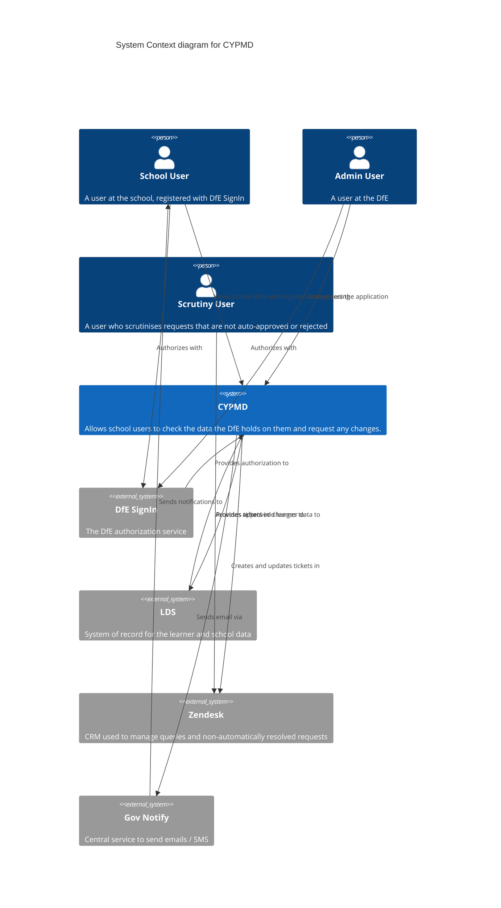

# CYPMD — C4 Level 1: System Context

Check Your Pupil / Performance Data (**CYPMD**) allows school users to check the
data the DfE holds on them and request any changes.

A C4 **System Context** diagram is the highest level of the C4 model. It shows
CYPMD as a single system and the people and external systems it interacts with —
deliberately hiding all internal detail (see the
[Container diagram](./c4-container.md) for the level below).

Source: `HLD.json` (Lucidchart).

## People

| Actor | Description |
|---|---|
| **School User** | A user at the school, registered with DfE SignIn. Checks pupil/performance data and raises amendment requests. |
| **Admin User** | A user at the DfE who administers the service. |
| **Scrutiny User** | A DfE user who reviews requests that are not automatically approved or rejected. |

## External systems

| System | Description | Interaction |
|---|---|---|
| **DfE SignIn** | The DfE authorization (OIDC) service. | Authenticates School and Admin users and provides authorization to CYPMD. |
| **LDS** | System of record for learner and school data. | Supplies data into CYPMD and receives approved changes back. |
| **Zendesk** | CRM used to manage queries and requests needing manual handling. | CYPMD creates/updates tickets; Scrutiny users work those tickets. |
| **Gov Notify** | GOV.UK central notifications service. | CYPMD sends email/SMS notifications to users via Notify. |

## Notes

- This context view is a faithful transcription of `HLD.json` and matches the
  current service: DfE SignIn OIDC auth, a Zendesk integration, GOV.UK Notify
  for notifications, and an LDS data exchange.
- The LDS data exchange is shown here as a single logical relationship. The
  containers that implement it (ingress/egress workers and interface storage)
  are shown — and annotated as planned where not yet built — in the
  [Container diagram](./c4-container.md).
