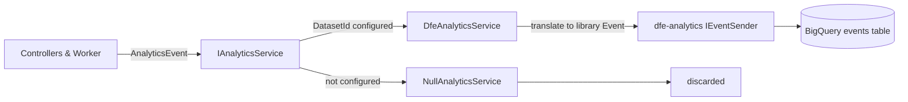
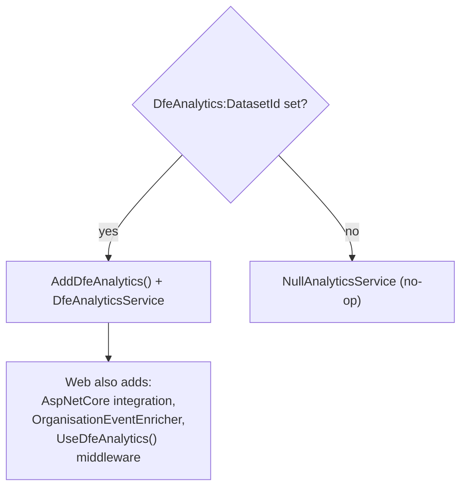
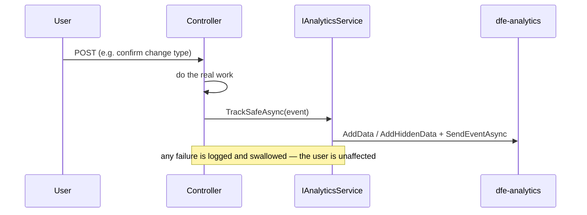
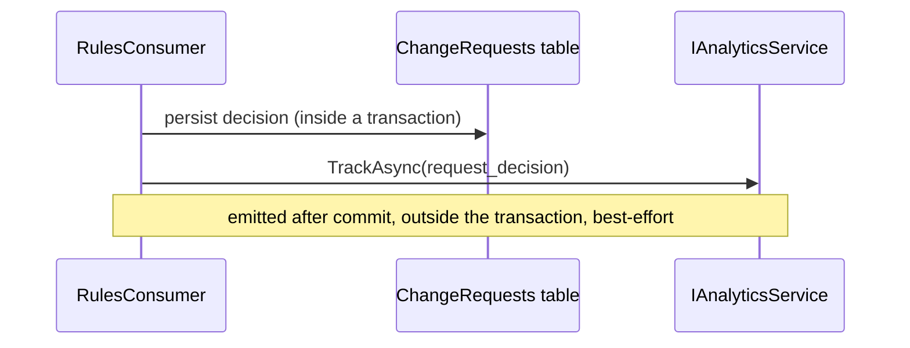
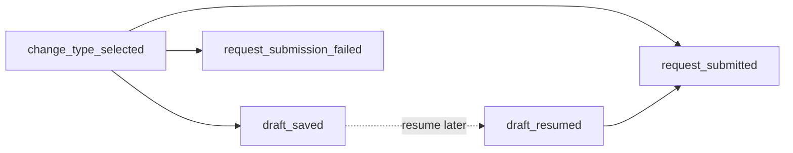
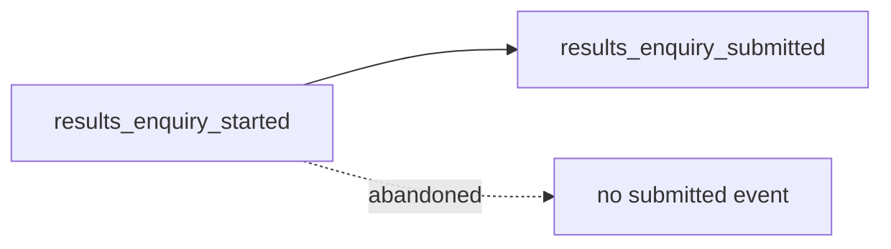

# BigQuery Analytics

How the service streams journey, funnel, and decision events to BigQuery using DfE's shared `dfe-analytics` library. This is a functional overview: a plain-English summary first, then the technical detail.

---

## What it does

The service emits structured **events** as users move through the change-request journey, so the team can measure things like: how many requests start versus finish, where validation trips users up, how evidence upload behaves, and how the rules engine's decisions split between auto-approve, reject, and scrutiny. Events are streamed to a BigQuery `events` table via the DfE-owned `dfe-analytics` library.

Two guarantees shape the whole design:

- **Best-effort.** Analytics can never break a user action. Every emission from a user-facing path is wrapped so that a failure is logged and swallowed, not propagated.
- **Off by default.** Nothing is sent unless `DfeAnalytics:DatasetId` is configured. Local dev, review apps, and tests run against a no-op implementation, so they boot without any GCP setup.

**Privacy in one line.** Fields flagged `Hidden` are sent to a separate, policy-tagged, masked `hidden_data` column in BigQuery; free text, file names, and pupil identifiers are never sent at all.

---

## Architecture

The Application layer depends only on its own contract and event types — never on the `dfe-analytics` SDK. The Infrastructure adapter is the only place that touches the library. This anti-corruption boundary means controllers and the worker stay decoupled from the analytics vendor.

- **`IAnalyticsService`** (Application) — the single contract callers use. `TrackSafeAsync` is the best-effort wrapper for user-facing paths.
- **`AnalyticsEvent` / `AnalyticsField`** (Application) — SDK-independent event records. Each field can be marked `Hidden`.
- **`DfeAnalyticsService`** (Infrastructure) — translates each event into a library `Event`: a field becomes plain `AddData`, or `AddHiddenData` when hidden; string lists become repeated fields; null values are omitted; everything is stringified (the library payload is string-only).
- **`NullAnalyticsService`** (Application) — the no-op used when analytics is disabled, so callers never have to check whether it is on.

---

## How events get sent

Both the web app and the worker register the real adapter only when `DfeAnalytics:DatasetId` is present; otherwise they register the no-op.

- `AddDfeAnalytics()` binds the `DfeAnalytics:*` config section and registers the library's `IEventSender`. Its BigQuery client is built lazily (via Workload Identity Federation or credential JSON) and is only used when an event is actually sent.
- The **web app** additionally streams a built-in `web_request` event per request through the AspNetCore middleware. `OrganisationEventEnricher` stamps the signed-in school's `organisation_urn` and `organisation_name` onto those events (the user id is added by the middleware). Health-probe requests are filtered out.
- The **worker** registers the adapter only — it has no web middleware; it emits the single decision event below.

### Two runtime paths

A user-facing event (swallow failures):

The worker's decision event (after the decision is committed):

---

## Event catalogue

All custom events carry **no PII as plain fields**; a hidden field is noted below. (Field names are the snake_case names as they land in BigQuery.)

| Event (`event_type`) | Key fields | Emitted from | Hidden field |
|---|---|---|---|
| `change_type_selected` | `what_to_change`, `checking_window_type` | `WhatToChangeController.Confirm` (valid POST) | — |
| `draft_saved` | `status`, `what_to_change`, `checking_window_type`, `reference_number` | `JourneyController.SaveDraft` | `reference_number` |
| `draft_resumed` | `reference_number`, `what_to_change`, `checking_window_type` | `AmendmentRequestsController.Edit` | `reference_number` |
| `request_submitted` | `what_to_change`, `checking_window_type`, `reference_number` | `JourneyController.SummaryConfirm` (success) | `reference_number` |
| `request_submission_failed` | `failure_reason`, `what_to_change`, `checking_window_type` | `JourneyController.SummaryConfirm` (duplicate) | — |
| `results_enquiry_started` | `enquiry_type`, `checking_window_type`, `late_results_guidance_shown` | `ResultIssueController.Confirm` (valid POST) | — |
| `results_enquiry_submitted` | `enquiry_type`, `cohort_wide`, `checking_window_type`, `reference_number` | `JourneyController.SummaryConfirm` (results-enquiry branch) | `reference_number` |
| `validation_error` | `error_count`, `error_codes`, `error_fields`, `what_to_change`, `from_summary` | `JourneyController` (pupil search, page POST), `WhatToChangeController`, `CheckYourPupilDataController` | — |
| `evidence_upload_attempted` | `outcome`, `failure_reason`, `page_count`, `file_size_bytes` | `JourneyController.UploadFile` | — |
| `evidence_continue` | `file_count`, `page_count`, `evidence_text_length` | `JourneyController.PagePost` (evidence page) | — |
| `evidence_file_removed` | `files_before`, `files_after` | `JourneyController.RemoveFile` | — |
| `pupil_data_search_results` | `result_count`, `active_tab` | `CheckYourPupilDataController` (when a search term is entered) | — |
| `correct_data_confirmed` | `reference_number`, `checking_window_type` | `ConfirmCorrectController.Confirm` (successful POST) | `reference_number` |
| `amendment_request_deleted` | `reference_number`, `was_hard_deleted` | `SubmittedRequestController.Delete` (amendment row) | `reference_number` |
| `confirmation_deleted` | `reference_number` | `SubmittedRequestController.Delete` (ConfirmCorrect row) | `reference_number` |
| `request_decision` | `decision_status`, `outcome_key`, `matched_rule_id`, `rules_version`, `request_type_code`, `checking_window_type`, `is_synthetic_fallback` | `RulesConsumer` (worker) | — |
| `search_result_count` | `result_count`, `scope` | `SearchController.Index` (query entered) | — |
| `feedback_clicked` | `page_path` | `ContactController.FeedbackLink` (via `/feedback-link`) | — |
| `help_details_expanded` | `expand_text`, `page_path` | `ClientEventsController` (JS beacon) | — |
| `external_link_clicked` | `destination`, `page_path` | `ClientEventsController` (JS beacon) | — |
| `evidence_file_selected` | `page_path` | `ClientEventsController` (JS beacon) | — |

Plus the library-provided **`web_request`** event, emitted automatically per request and enriched with the user and organisation.

**Validation error codes** are a controlled taxonomy (never the raw, PII-bearing validation messages): `no_selection`, `same_pupil`, `at_least_one`, `file_required`, and per-question `required`, `bad_date`, `too_long`, `selection_invalid`, `invalid`. See `Web/Analytics/ValidationErrorCoding.cs`.

### The submission funnel

The funnel events let analysts follow a request from start to finish. The (hidden, hashed) `reference_number` links the saved → resumed → submitted steps.

### The results-enquiry funnel

The 16-19 "report an incorrect grade" journey (AB#296648) has its own two-step funnel, linked by the
hidden, hashed `reference_number`. `late_results_guidance_shown` on the start event is the measure that
answers the question behind the guidance interstitial: is it stopping enquiries that the November late
results file would have corrected anyway?

See `docs/results-enquiry.md` for the journey these events describe.

---

## PII handling

The `reference_number` is the only identifier currently sent, and only ever as a **hidden** field, pending its DPIA classification. In BigQuery the `hidden_data` column is protected by a policy tag and a SHA256 masking rule, so the raw value is masked at rest while its hash still links the funnel steps. Everything else — free-text reasons, file names, search terms, the pupil's name — is deliberately excluded from events. Counts and lengths (e.g. `evidence_text_length`) are sent in place of the content itself.

The built-in `web_request` event's query string is also redacted: `QueryRedactionEventEnricher` strips the values of pupil-name-bearing query parameters (`includedSearch`, `nonIncludedSearch`, `query`) before the request is sent, so a pupil search term never reaches BigQuery via the request URL.

---

## Adding a new event

1. Add a sealed record under `Application/Analytics/` deriving from `AnalyticsEvent`: give it an `EventType` (snake_case) and a `Fields` list, marking any identifier `Hidden: true`.
2. Emit it from the relevant action with `analytics.TrackSafeAsync(new MyEvent { … })` (use `TrackAsync` only on non-user-facing paths like the worker, where you handle failures yourself).
3. Cover it with an xUnit event-shape test under `tests/DfE.CheckPerformanceData.UnitTests/Analytics/` (assert the `event_type`, field names/values, and `Hidden` flags).

Nothing else changes — the adapter translates any `AnalyticsEvent` generically.

---

## Current state

> **Events are fully implemented and tested; sending to BigQuery is pending GCP setup.** Because everything is guarded on `DfeAnalytics:DatasetId`, the events only leave the app in an environment where that is configured. The remaining work is infrastructure: Workload Identity Federation (WIF) auth to GCP, the `hidden_data` policy tag / taxonomy and masking rule, and Terraform provisioning the dataset per environment.
>
> Note also that `request_decision` only fires once the rules-engine queue path is un-paused — see [rules-engine.md](./rules-engine.md).

---

## Going deeper

- **The rules decision** behind `request_decision` — see [rules-engine.md](./rules-engine.md).
- **The user journey** the funnel events track — see [request-journey.md](./request-journey.md).
- **Key code**: `Application/Analytics/` (the contract + event records), `Infrastructure/Analytics/DfeAnalyticsService.cs` (the adapter), `Infrastructure/DependencyManager.cs` and `Web/Program.cs` (the config-guarded wiring), `Web/Analytics/` (`OrganisationEventEnricher.cs`, `ValidationErrorCoding.cs`).
- **GCP / BigQuery / WIF setup** is documented separately by the infrastructure team (`Google_Cloud_BigQuery_Setup.md`), not in this repo.
- **Tests** (xUnit) live under `tests/DfE.CheckPerformanceData.UnitTests/Analytics/` and `tests/DfE.CheckPerformanceData.UnitTests/Infrastructure/Analytics/`.
