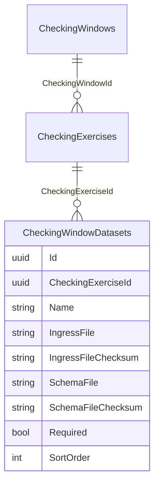
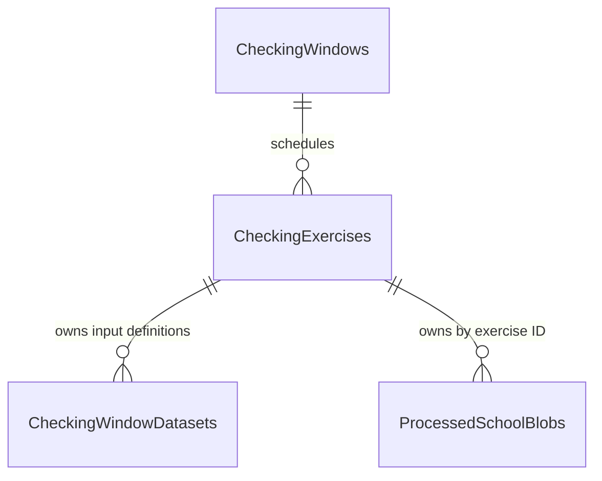

# Checking Exercise ingress: current state and retry plan

Inspected before retry implementation, 14 September 2026. This describes repository code and migrations, not a live production database. It supersedes the storage decision in the first POC document.

## Actual relationships

`CheckingExercise.Datasets` is already the generic collection of input definitions. `CheckingWindowDataset` pairs one physical CSV with one physical JSON schema and their checksums. Schemas are not reusable database entities. Dataset names are unique within an exercise. Its legacy `CheckingWindowId` column has **no foreign key**; the active foreign key is `CheckingExerciseId`. Window scalar file/schema fields also survive as rollback mirrors, not authoritative input definitions.

## KS4 and Post-16 trace

| Question | KS4 | Post-16 / 16–19 |
| --- | --- | --- |
| Creation | `CreateCheckingWindowController.Post` converts the wizard draft to exercise DTOs; `WindowService.CreateAsync` supplies defaults; `WindowRepository.CreateAsync` inserts the window, exercises and their input rows. | Same path. Defaults differ, not the relationship. |
| Pupil definitions | One `pupils` row with file/schema/checksums. Inclusion comes from supplier `P_INCL`. | Two rows, `included` and `nonincluded`, each with its **own** file/schema/checksums; both required. `Included` true/false supplies provenance. |
| Source CSV | Admin `IngressFileController.Select` reads a selected blob from the separate ingress storage account. | Same controller. |
| Working CSV | Copied to app storage, container `{windowId}`, blob `ingress/{original-basename}`; row stores basename/checksum. | Same location convention, one row per file. |
| Schema | `SchemaController.Submit` uploads validated JSON to app storage `{windowId}/schema/{original-basename}`; paired row stores basename/checksum. | Same controller and pairing. |
| Initiation | `ValidateWindowController` resolves window + exercise type and passes `target.DatasetsToIngest` to `CsvSchemaFileProcessor`. | Exactly the same generic enumeration; no secondary-file processing call. |
| Processing | Processor reads each CSV and its paired schema, verifies checksums, validates records, merges by LAESTAB. | Same loop; the two pupil populations become one per-school array. |
| Pupil output | App container `{windowId}`, `data/{LAESTAB}_pupils.json`. | Same output convention. |
| Results | Separate `ResultsEnquiry` exercise where configured. | Separate results exercise, with main/late/revised/retention input slots (optional after main), output `results-enquiry/data/{LAESTAB}_results.json`. |
| UI | Legacy `/CheckYourPupilData/{windowId}` reads by Window + PupilData type and builds inclusion tables. | Same reader, using Post16 columns; both populations appear in one Students tab. First POC `/check-data` lists exercise metadata but still loads output by Window + type. |

Relevant sources: `Persistence/Entities/CheckingExercise.cs`, `CheckingWindowDataset.cs`, `Application/WindowManagement/IWindowService.cs`, `WindowService.cs`, `Persistence/Repositories/WindowRepository.cs`, the three `Web/Controllers/WindowAdmin` upload/validate controllers, `Infrastructure/Ingress/CsvSchemaFileProcessor.cs`, `Infrastructure/BlobStorage/PupilDataBlobClient.cs`, `StudentResultsBlobClient.cs`, `CheckingDataReader.cs` and `Persistence/Repositories/CheckYourPupilDataRepository.cs`.

Development has two distinct paths: `SeedPost16Ingress` uploads the two paired sample inputs to the dedicated ingress-demo exercise, then an admin runs validation; `SeedPupilData` and `SeedStudentResults` also write synthetic output directly for other demo windows. The latter bypass ingress and explain some apparent disconnection when following seed data rather than the admin import journey.

## Historic mapping

`20260728143037_AddCheckingWindowDatasets` copied legacy window scalars into one `pupils` row per window (including any historic Post16 window; it did not invent a missing second supplier file). `20260819164322_ReparentDatasetsOntoCheckingExercise` attached each existing row to its window's PupilData exercise and removed the Window FK. Existing Post16 two-row configurations therefore already belong to one exercise. No new pair table or data duplication is necessary.

## Actual inconsistencies

- `WindowService.EnsureDatasetsMatchType` rebuilds input lists on every update from type defaults, discarding custom third/fourth definitions.
- Input basenames share a Window-level directory: two exercises or definitions choosing the same filename can overwrite one another, even though the database pairing is correct. Upload handlers check the target definition **after** uploading.
- Output and log addresses are based on Window + enum type rather than exercise identity; a unique Window/type index currently masks this limitation.
- `HasRequiredFiles` exists, but the processing endpoint does not enforce it before filtering to complete pairs. A crafted call can process an incomplete required set.
- The processor can clear old output before validating replacement inputs.
- Window dates are derived from exercise dates by the existing wizard; they are not an independent scheduling editor.

## Proposed relationship and implementation plan

Keep `CheckingWindowDataset` and `Datasets` as the existing ingress-definition collection; do not introduce a competing table or single-file fields. Defaults initialise new exercises only. Existing configured collections are authoritative and may contain N entries. Enforce completeness at the generic exercise ingress boundary. Resolve processing by exercise ID; namespace source files by exercise ID **and definition ID**, and output/logs by exercise ID. Retain explicit legacy read/storage compatibility for existing rows, without silently sharing legacy output for new exercises. Update the normal admin path and `/check-data`, not just the demo seed. Add migrations and tests for the real collection, missing inputs, pairing, N-file processing, same-window isolation and independent releases.

An `IngressRun` entity is deferred: the existing validation stamp, checksum snapshot, timestamped summaries and error logs suffice for this POC. Definitions express expectations; log artifacts describe processing attempts. A durable immutable run/file manifest and atomic publication would be production follow-up work. No new run table is needed to fix ownership.
