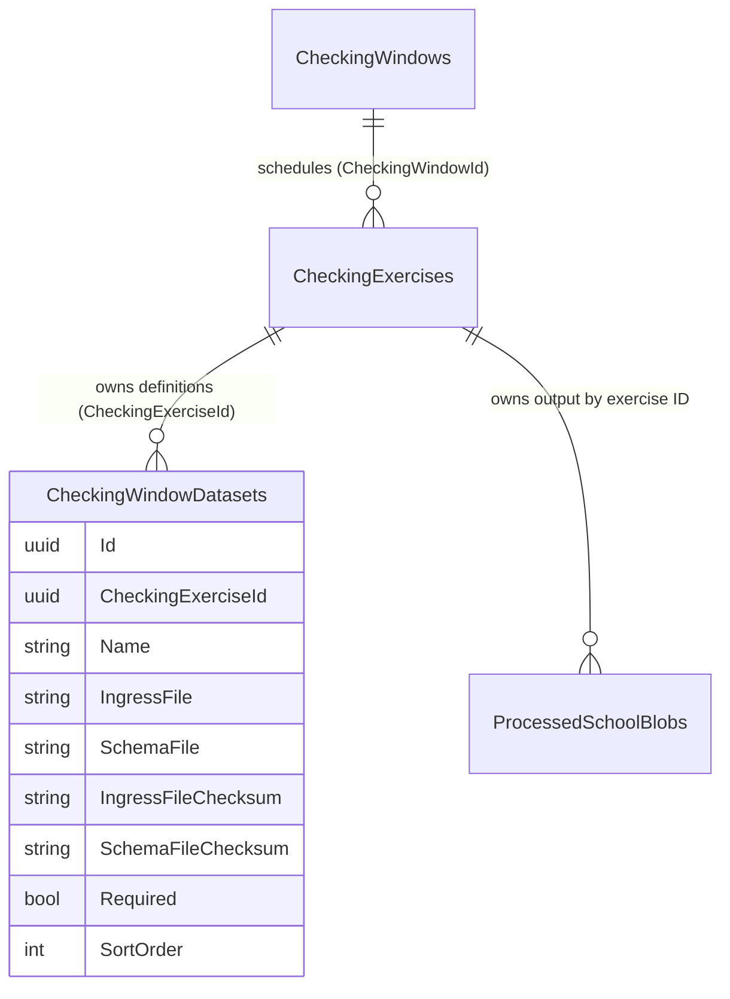

# Normalised Checking Exercise ingress POC

This retry replaces the first POC's reliance on separate Window containers. The [pre-implementation trace](checking-exercise-current-state.md) answers the KS4/Post-16 discovery questions and records the actual starting model.

## Relationship and ownership



`CheckingWindowDataset` is the existing ingress-definition entity; `CheckingExercise.Datasets` is its collection. The legacy name/table is retained to avoid creating a competing relationship or mechanically renaming existing migration history. A definition pairs exactly one CSV with its schema and checksums; blank fields represent files not yet received. Definitions are unique by exercise/name, with independent IDs. Required, order, inclusion provenance and source tags remain configurable data.

KS4's one pair and Post-16 pupils' two pairs are **initial defaults**, not entity fields or processing branches. `WindowService` preserves supplied lists and does not rebuild them when a Window type changes. Newly added exercises may receive defaults; existing definitions, including a third/fourth pair, survive ordinary updates. No schema change is required to add another definition. The wizard still creates the familiar default lists; custom lists can be supplied through the existing service/configuration/seed mechanism without building a new admin application.

## Storage

New exercises use the existing app storage account and Window container as a physical grouping only:

```text
{WindowId}/
  ingress/{ExerciseId}/{DefinitionId}/{filename}.csv
  ingress/{ExerciseId}/{DefinitionId}/{filename}.json
  exercises/{ExerciseId}/
    data/{LAESTAB}_pupils.json       # Pupil
    data/{LAESTAB}_results.json      # Results
    data/{LAESTAB}_value-added.json  # example non-pupil output
    logs/summary_{timestamp}.csv
    logs/error_log.txt
```

Both exercise AND definition IDs scope working input paths, so identical supplier filenames cannot collide across definitions or exercises. Admin file/schema selection resolves the target before writing. Each input row stores its complete blob path and checksum. The second GUID is the existing ingress definition ID, not a new ingress-run ID. File and schema sit together in that folder. Earlier relative paths still resolve against their original ingress/schema roots; existing uploads are not moved or deleted. Re-uploading uses the new layout and needs no database migration. Source files in the separate ingress account remain source material; selected working copies belong to the definition.

`CheckingExerciseBlobPaths` defines output names for Pupil, Results, PreviouslyPublished, ValueAdded and Other. One exercise's N validated inputs produce one combined array per school, not N competing outputs. `/check-data` reads that output using exercise identity and output type; it never sees the input list. It retains configured visibility, tab labels and ordering independently of action dates.

## Processing and completeness

`ICheckingExerciseDefinitionRepository.GetAsync(exerciseId)` discovers the persisted exercise, its Window, ordered definitions, received files/schemas/checksums and validation stamp. `ICheckingExerciseIngress.ProcessAsync(exerciseId)` is the normal processing boundary:

1. Load the exercise by ID.
2. Reject an empty/incomplete required set before reading or clearing output.
3. Enumerate complete configured definitions in order, preserving each file/schema pairing.
4. Use the existing generic CSV/schema processor to validate all inputs and combine records by LAESTAB.
5. Write only under this exercise's output/log prefix, then stamp successful validation with the captured input checksums.

Optional results inputs already exist in the model and remain optional. A failed checksum/schema/required-file check preserves prior output. A requested clear sweep runs only after validation succeeds and is confined to that exercise. The low-level Window/type processor signature remains as an explicit legacy adapter for existing storage/tests; normal admin processing resolves a persisted exercise ID first.

An `IngressRun` table is intentionally deferred. The definition describes expected/received inputs; the existing validation stamp and exercise-scoped timestamped summaries/error log describe processing. This is not an immutable audit ledger: the error log is the latest attempt, and files can be replaced within one definition. Immutable per-run manifests, concurrent-run coordination and atomic multi-blob publication require further work.

## Database and existing records

The first attempt's additive `AddCheckingExerciseCatalogue` migration remains. The retry adds:

- `ScopeCheckingExerciseStorage`: adds `UsesExerciseStorage` with false for existing rows and removes unconditional Window/type uniqueness.
- `ProtectLegacyExerciseStorage`: retains Window/type uniqueness **only for legacy-storage rows** through a filtered index. New rows use exercise-ID storage and may repeat a type within one Window.

The flag is storage compatibility metadata, not an output-type discriminator. New exercises created by the application use ID storage; ordinary updates do not change their storage identity. Existing records keep their old output address, with explicit reader support and no automatic copy/fallback into another exercise's data. Input selection uses definition-scoped paths for old and new exercises alike; the stored path tells the processor where to read.

No definition rows are rebuilt or deleted by these migrations. Historic KS4 single rows and Post-16 two-row configurations keep the same exercise FK and file/schema associations. The older `ReparentDatasetsOntoCheckingExercise` migration already established that relationship. Very old Post-16 windows backfilled as one `pupils` definition remain one definition; a second supplier input is not fabricated. Legacy scalar Window file fields and the old non-FK dataset Window column remain rollback mirrors, not active ownership.

Revised lineage remains `ReplacesCheckingExerciseId` only. It never copies, deletes or mutates Provisional output. Deselecting a configured release in the wizard hides it rather than deleting it. Schema downgrade after creating repeated exercise types is not automatically safe: the old unique index cannot represent them. Preserve data and plan compatibility before rolling back application/schema versions.

## Demo

Use existing local PostgreSQL, Azurite and authentication configuration. In Development:

```sh
ASPNETCORE_ENVIRONMENT=Development CheckingExercisePoc__State=ProvisionalOpen dotnet run --no-launch-profile --project src/DfE.CheckPerformanceData.Web
```

Sign in as the existing demo school `860/4070` and open `/check-data`. Keep the POC setting enabled on every restart: it bypasses the legacy destructive development seeder. Do not use Reset seed data during the demo.

The new demo uses **one Window**, `30000000-0000-4000-8000-000000000001`, containing Provisional Students, Provisional Results, Revised Students and Revised Results. Each Students exercise has two required definitions; Results has one. All files deliberately reuse basenames under different definition IDs. The normal persisted-ID ingress service builds their outputs. Existing output is not rewritten on a lifecycle restart.

Restart with these state values in sequence:

| State | Visible release | Window | Students output |
| --- | --- | --- | --- |
| `ProvisionalOpen` | Provisional | Open | A B C D |
| `ProvisionalClosed` | Provisional | Closed | A B C D |
| `RevisedClosed` | Revised | Closed | A B C |
| `RevisedOpen` | Revised | Open | A B C |
| `Fallback` | Provisional | Closed | A B C D |

Both outputs remain in the same container under different exercise IDs. Storage Admin can inspect inputs, schemas, logs and data. The normal Window summary links carry `exerciseId` through file selection, schema upload, date editing and validation. Creation defaults and the existing type chooser remain; adding arbitrary named releases/definition lists is a seed/service operation in this POC.

## Remaining dataset-specific behaviour and limits

- Post-16/KS4 pupil field mappings and inclusion rules differ because their supplier schemas differ; these are transformations/read models, not different ownership or ingress-count models.
- Results source tags and record shapes remain distinct; generic non-pupil output naming does not invent request workflows for ValueAdded/Other.
- Existing request journeys still address Window + activity type. Their adapter resolves the single currently visible exercise of the matching output type. Same-Window fallback uses the selected exercise's blob/cache identity. Ambiguous simultaneously visible releases remain readable by ID on `/check-data`, but request entry fails closed rather than choosing the wrong data. A full journey-ID refactor is production follow-up work.
- The Window controls the outer action period; existing exercise dates remain narrower action constraints. The original creation wizard still derives initial outer dates. Changing existing Window configuration no longer silently rebuilds ingress definitions or derives scheduling dates as a side effect.
- Generic supplier-column tables and JSON downloads remain the POC presentation. Browser/E2E coverage is separate from the controller/storage tests.
- Historic blobs are not migrated. Storage failures during publication are not an atomic transaction; concurrency, immutable runs, comprehensive lifecycle administration and retention policies are future work.

## Verification

`CheckingExerciseIngressCollectionTests` uses real PostgreSQL/Azurite and the normal service to test KS4 one pair, Post-16 two pairs, four pairs, and a generic ValueAdded dataset. It verifies persisted definitions, correct schemas, completeness rejection, all-input enumeration, a single combined output, validation stamps, preserved output after failure, and `/check-data` rendering without access to the input collection.

`CheckingDataPocTests` exercises same-Window Provisional/Revised imports, lineage, visibility/order, closed reads, Revised re-ingress with clearing, byte-for-byte Provisional preservation and fallback. It also checks the legacy pupil/results readers and request exercise identity across fallback. Existing migration, ingress, admin and request tests are run alongside these tests.

Final verification (14 September 2026):

- Release solution build: passed, 0 errors (existing warnings remain).
- Full non-E2E solution suite: 5,161 unit tests and 793 integration tests passed.
- Changed C# whitespace verification: passed.
- `git diff --check`: passed.
- Repository Gitleaks scan of changed files and staged diff: passed; no files staged.
- Browser/E2E tests were not run. Integration tests exercised PostgreSQL migrations and Azurite storage; no deployed database was migrated.

Commands used:

```sh
dotnet build src/DfE.CheckPerformanceData.slnx --no-restore --configuration Release
dotnet test src/DfE.CheckPerformanceData.slnx --no-build --configuration Release --filter 'FullyQualifiedName!~E2ETests'
```
