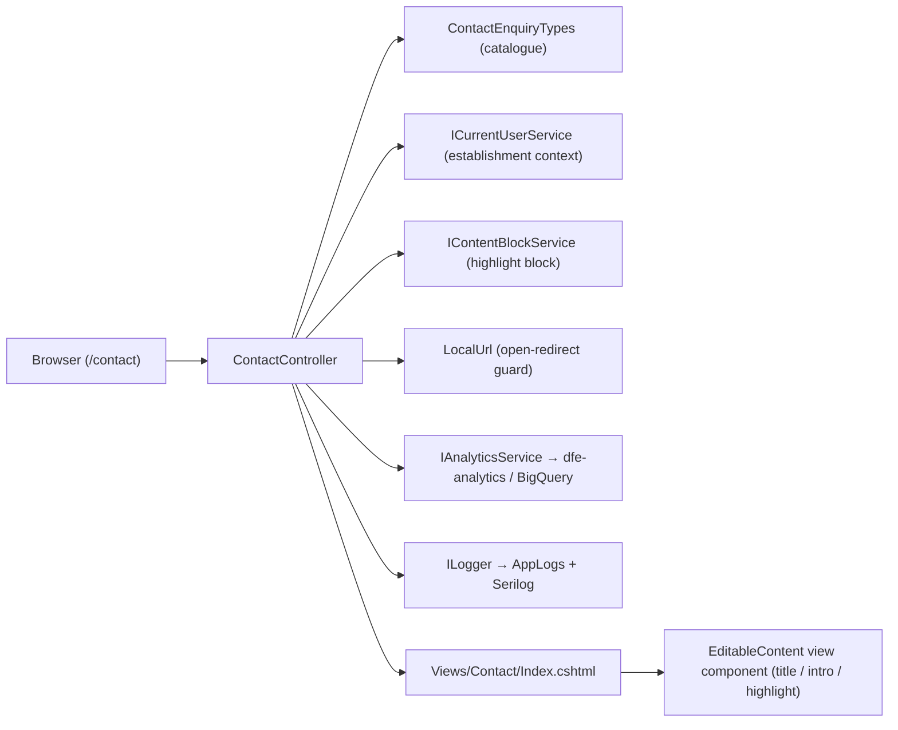
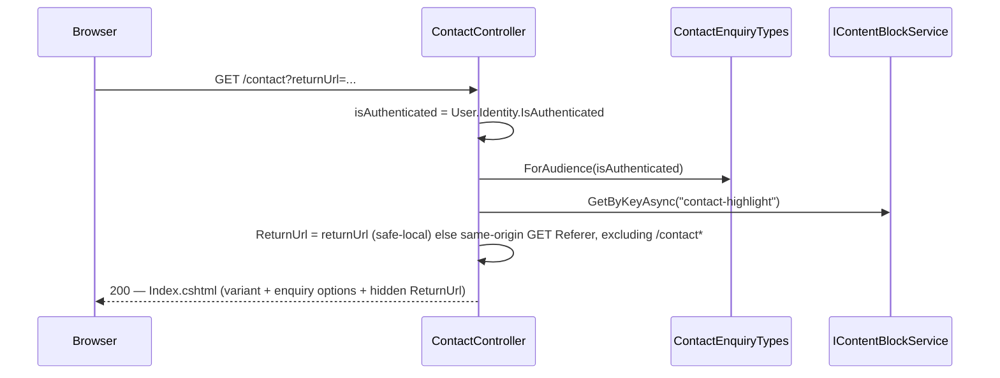
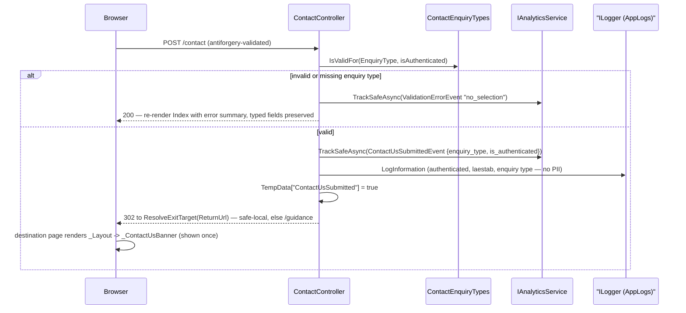

# Contact Us — Technical Documentation

> Feature ticket: **PBI 290542** · PR [#183](https://github.com/DFE-Digital/check-performance-data/pull/183)
> Audience: a developer maintaining or extending this feature.

## 1. Overview

The **Contact Us** page (`/contact`) is a deliberately minimal, placeholder "wayfinder" that gives both signed-in and anonymous users a channel to ask for help outside the guided journeys. Its purpose is **user-research signal collection**, not case handling: it exists so we can measure when users leave the guidance and supported journeys, and what kind of help they were looking for.

Crucially, **the form saves nothing**. There is no persistence of submitted values, no CRM/Zendesk ticket, no file upload, no reference number, no confirmation email, and no dedicated confirmation page. The onward triage journey has not been designed yet, so this ticket ships the entry point only. The one lasting output of a submission is an anonymised analytics event (the enquiry type) plus an activity-log line — never the free-text/contact details.

## 2. Architecture

`ContactController` follows the same shape as `WhatToChangeController` (a simple GDS form controller). It reads establishment context from `ICurrentUserService`, renders editable content via the CMS `EditableContent` view component, and on a valid submit emits a domain analytics event and an activity-log line before redirecting.



## 3. Key components

| Component | Responsibility | Location |
|---|---|---|
| `ContactController` | `GET`/`POST /contact`; validation, analytics, activity log, exit resolution. `[AllowAnonymous]`. | `src/DfE.CheckPerformanceData.Web/Controllers/ContactController.cs` |
| `ContactViewModel` | Form model: the validated `EnquiryType`, the `ReturnUrl`, signed-in establishment context, and the unvalidated (never-persisted) `Name`/`Email`/`School`/`Details`. | `src/DfE.CheckPerformanceData.Web/Controllers/Contact/ContactViewModel.cs` |
| `ContactEnquiryTypes` / `EnquiryAudience` / `ContactEnquiryType` | Hardcoded **placeholder** enquiry-type catalogue + audience filtering (`ForAudience`) + server-side validity check (`IsValidFor`). | `src/DfE.CheckPerformanceData.Web/Controllers/Contact/ContactEnquiryTypes.cs` |
| `ContactUsSubmittedEvent` | The custom analytics event (`enquiry_type`, `is_authenticated`). SDK-agnostic `AnalyticsEvent`. | `src/DfE.CheckPerformanceData.Application/Analytics/ContactUsSubmittedEvent.cs` |
| `LocalUrl` | Shared open-redirect guard (`SafeOrNull`) — a return URL is honoured only if it is a safe local path. Also used by `ContentBlockController`. | `src/DfE.CheckPerformanceData.Web/Common/LocalUrl.cs` |
| `Index.cshtml` | The two-variant GDS form (signed-in vs anonymous), composed from CMS content blocks. | `src/DfE.CheckPerformanceData.Web/Views/Contact/Index.cshtml` |
| `_ContactUsBanner.cshtml` | TempData-driven GOV.UK notification banner shown once on the page the user lands on after submit. | `src/DfE.CheckPerformanceData.Web/Views/Shared/_ContactUsBanner.cshtml` |
| `_Layout.cshtml` (modified) | Renders `_ContactUsBanner` before `@RenderBody()`; the footer "send us a message" link points at `/contact`. | `src/DfE.CheckPerformanceData.Web/Views/Shared/_Layout.cshtml` |

## 4. Data flow

### 4a. Opening the form — `GET /contact`

The controller decides the variant from the auth state, builds the enquiry-type list for that audience, and **captures the "opener"** page so the Back link and the post-submit redirect can return there.



The opener is resolved once, at GET time, in `ResolveOpenerReturnUrl(...)`: a `returnUrl` query param wins if it passes the `LocalUrl` guard and is not itself a `/contact*` path; otherwise the same-origin `Referer` header (the linking page) is used; otherwise `null`. It is carried through the POST as a hidden field. (The POST-time `Referer` is the form page itself, so it is deliberately **not** used as the fallback.)

### 4b. Submitting the form — `POST /contact`



On the invalid branch the view model is rebuilt but the user's typed `Name`/`Email`/`School`/`Details` are copied back so nothing they entered is lost.

## 5. Data model

**No data-model changes.** The feature persists nothing — no new tables, entities, migrations, blobs, or queue messages. The `Name`/`Email`/`School`/`Details` fields are model-bound and then discarded.

## 6. Public interfaces / APIs

### Endpoints (`ContactController`)

| Route | Action | Notes |
|---|---|---|
| `GET /contact` | `Index(string? returnUrl)` | Renders the form. `[AllowAnonymous]`. |
| `POST /contact` | `Submit(ContactViewModel form)` | `[ValidateAntiForgeryToken]`. Validates enquiry type only. |

`ContactController` is `[AllowAnonymous]` because the app's global authorization fallback requires an authenticated user (`Program.cs` sets `FallbackPolicy = RequireAuthenticatedUser()`); anonymous users need this channel.

### Enquiry-type catalogue (`ContactEnquiryTypes`)

The `Value` is a stable machine code (flows to analytics/logs); the `Label` is display-only. Audience filtering unions `Both` with the current audience's restricted set:

```csharp
public enum EnquiryAudience { Both, SignedInOnly, AnonymousOnly }
public sealed record ContactEnquiryType(string Value, string Label, EnquiryAudience Audience);

IReadOnlyList<ContactEnquiryType> ForAudience(bool isAuthenticated);   // signed-in: 4, anonymous: 3
bool IsValidFor(string? value, bool isAuthenticated);                  // non-empty AND in the audience set
```

Current **placeholder** values:

| Value | Label | Audience |
|---|---|---|
| `pupil-data-query` | Help with a pupil data query | SignedInOnly |
| `amendment-evidence` | Help with an amendment or evidence | SignedInOnly |
| `technical-problem` | Technical problem with the service | Both |
| `general-query` | General query | AnonymousOnly |
| `something-else` | Something else | Both |

### Analytics event (`ContactUsSubmittedEvent`)

`EventType = "contact_us_submitted"`, fields `enquiry_type` (the value) and `is_authenticated` (bool). Both are non-PII, so neither is marked `Hidden`. Emitted via `analytics.TrackSafeAsync(...)`.

## 7. Configuration & dependencies

- **No new NuGet packages.** The feature reuses existing services (`IAnalyticsService`, `ICurrentUserService`, `IContentBlockService`, `ILogger`) and GOV.UK Frontend tag helpers.
- **Analytics is inert until configured.** The custom event lands in BigQuery only when `DfeAnalytics:DatasetId` is set; otherwise `IAnalyticsService` resolves to `NullAnalyticsService` (a no-op) and the `TrackSafeAsync` call does nothing. This is existing platform state, not specific to this feature.
- **Content blocks (auto-provisioned):** `contact-title`, `contact-intro`, `contact-highlight`. The `EditableContent` view component seeds each on first render; they are then editable at `/admin/content-blocks`. The highlight is collapsed for end users when its block is empty (editors always see it).
- **Footer link:** the change is in the `footer-support-and-guidance` block's **default HTML** (`_Layout.cshtml`). Environments with an already-seeded footer block must update the "send us a message" link to `/contact` via `/admin/content-blocks`.

## 8. Error handling

- **Validation — enquiry type only.** `IsValidFor` requires a non-empty value that belongs to the current audience. A missing value *or* an out-of-audience value (e.g. an anonymous POST of a signed-in-only code) fails, re-renders the form with the GOV.UK error summary, and emits a `ValidationErrorEvent` (`no_selection`). The contact/school/message fields are never validated because nothing is stored.
- **Error summary is auto-prepended.** GOV.UK Frontend's form tag helper prepends an error summary to any `<form>` with `ModelState` errors — so the view must **not** hand-write one (doing so renders two). See §10.
- **Open-redirect protection.** All return targets pass through `LocalUrl.SafeOrNull`, which accepts only single-slash-rooted local paths (rejecting absolute URLs and protocol-relative `//` / `/\` values). A rejected or `/contact*` target falls back to `/guidance`.
- **Best-effort telemetry.** Analytics and the activity log use `TrackSafeAsync` / a plain `ILogger` call; a telemetry failure never breaks the user's submission.
- **No persistence failures.** Because nothing is saved, there are no database/blob/queue failure modes on this path. Re-submitting (back button, double-tap) is harmless — it simply re-fires the analytics event and log line; there is no reference to duplicate.

## 9. Testing

**Unit (xUnit + NSubstitute):**

| Test class | Covers | Location |
|---|---|---|
| `LocalUrlTests` | The open-redirect guard (safe vs unsafe/empty). | `tests/DfE.CheckPerformanceData.UnitTests/Web/LocalUrlTests.cs` |
| `ContactUsEventsTests` | `ContactUsSubmittedEvent` field projection. | `tests/DfE.CheckPerformanceData.UnitTests/Analytics/ContactUsEventsTests.cs` |
| `ContactEnquiryTypesTests` | Audience filtering + `IsValidFor` (incl. out-of-audience rejection). | `tests/DfE.CheckPerformanceData.UnitTests/Web/ContactEnquiryTypesTests.cs` |
| `ContactControllerTests` | Variant rendering, validation, field echo-back, analytics/log, return-target fallback chain. | `tests/DfE.CheckPerformanceData.UnitTests/Web/ContactControllerTests.cs` |

**E2E (Playwright):** `ContactUsTests` — anonymous reduced list + contact fields; no-selection error summary; valid submit → `/guidance` + banner; signed-in full list (via dev impersonation). Location: `tests/DfE.CheckPerformanceData.E2ETests/Web/ContactUsTests.cs`.

Run:

```sh
# Unit tests
dotnet test tests/DfE.CheckPerformanceData.UnitTests --filter "FullyQualifiedName~Contact"

# E2E — build + start the app stack, then run only the Contact Us tests in the Playwright container
docker compose --profile e2e up -d --build web db azurite
docker compose --profile e2e run --rm e2e-tests \
  sh -c "dotnet test tests/DfE.CheckPerformanceData.E2ETests/ --configuration Release --filter 'FullyQualifiedName~ContactUsTests'"
```

## 10. Extending this feature

- **Changing the enquiry types** is a one-place edit: `ContactEnquiryTypes.All` (value, label, audience). The `Value` is what analytics/logs record — keep it stable, or agree a mapping. The list is an acknowledged placeholder pending the channel redesign.
- **Do not hand-write a GOV.UK error summary** in the view. The form tag helper auto-prepends one to any `<form>` with `ModelState` errors (this is why `Views/WhatToChange/Index.cshtml` has none). A manual summary renders a duplicate.
- **Adding analytics fields:** extend `ContactUsSubmittedEvent.Fields`. Keep identifiers/free text out of plain fields — mark PII `Hidden` (routes to the masked BigQuery channel) or omit it, consistent with the analytics anti-corruption boundary.
- **When the real triage journey is built:** the current handler saves nothing and only emits telemetry. Introducing persistence, CRM/Zendesk, evidence upload, a reference number, or a confirmation page all attach at `ContactController.Submit` — but note the deliberate exclusions in PBI 290542 before adding them. The exit currently redirects to the opener page (or `/guidance`) with the "no details recorded" banner.
- **Establishment context** for the signed-in variant is read-only from `ICurrentUserService` (no MAT switching, by design).

## Related documentation

- [request-journey.md](./request-journey.md) — the guided amendment-request journey this channel sits alongside.
- [content-page-builder.md](./content-page-builder.md) — the CMS / `EditableContent` content-block system the page composes from.
