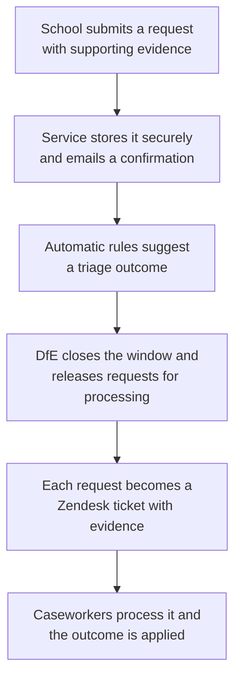

# Check Performance Data — Functional Overview

> Audience: non-technical stakeholders, delivery managers and service owners.
> Plain-language description of what the service does today (16 July 2026). No technical knowledge needed.

---

## What the service is

Check Performance Data lets schools and colleges **check the pupil information the Department for Education holds about them** before it is used to calculate published performance measures. If something is wrong — a pupil is missing, shouldn't be counted, or appears twice — the school can ask for it to be corrected, with supporting evidence, all online. If everything looks right, they can confirm that instead.

Behind the scenes, every request a school submits is **automatically triaged** against a set of rules the Department controls, so straightforward cases can be pre-sorted and caseworkers can focus their attention where human judgement is genuinely needed. Requests are then turned into tickets in the Department's case-management system (Zendesk) for caseworkers to process.

## Why it matters

Checking exercises previously relied on slower, more manual channels. This service gives schools a single, secure, self-service place to review their data and raise corrections during a fixed **checking window**, and gives the Department a consistent, auditable pipeline for handling those requests — with automatic triage reducing manual effort and a live dashboard showing the health of the whole process.

## Who uses it

- **School and college staff** — sign in with their existing **DfE Sign-In** account. They only ever see their own school's data.
- **DfE administrators** — manage checking windows, the triage rules, website content and the processing pipeline through a separate admin area. What each staff member can see is controlled by their role.
- **DfE caseworkers** — receive the resulting tickets in Zendesk (outside this service).

## What school users can do

- **Sign in securely** and see the checking exercises ("windows") currently open for their school.
- **Review their pupil lists** — who is included and who isn't — with search, and download them as spreadsheets.
- **Request an amendment** for a pupil: add a missing pupil, remove a pupil (choosing from reasons such as permanent exclusion, leaving England, or being educated at home), or merge duplicate records. The service asks only the questions relevant to the chosen reason.
- **Upload evidence** (PDF documents) to support a request, with an explanation of how it supports the case.
- **Check their answers before submitting**, then get an on-screen confirmation with a **reference number** and a confirmation email.
- **Save a draft and come back later**, and see all their requests — drafts and submitted — in one place.
- **Withdraw a submitted request** if it's no longer needed (a withdrawal email confirms this).
- **Confirm their data is correct** as a simple declaration — and still raise amendments afterwards if something comes up before the deadline.
- **Read guidance** and search help content without signing in.

The service follows the GOV.UK design standards used across government, works without JavaScript, and is built to meet accessibility requirements.

## What happens to a request

The automatic triage suggests one of three outcomes: **approve**, **reject**, or **needs human scrutiny**. It is deliberately cautious — if any information is missing or uncertain, or anything unexpected happens, the request is always routed to a human rather than decided automatically. Every automated decision records which rule was applied and why, so it can be audited.

## What DfE administrators can do

- **Set up checking windows** — name, opening and closing dates, which exercise (e.g. Key Stage 4 June) — and attach the pupil data file for schools to check.
- **Edit the triage rules themselves** through a built-in editor — no software release needed. Every change is versioned, can be rolled back, and takes effect within minutes.
- **See the whole pipeline live** on a dashboard: how many requests are flowing through, how fast, the mix of triage outcomes, and traffic-light health indicators. A read-only version can be shared as a wallboard link that exposes no pupil data.
- **Release submitted requests to caseworkers** when a window closes (currently a manual button).
- **Manage website content** — guidance pages, help pages and on-page wording — through a built-in page editor with drafts, scheduled publishing and version history, and copy content safely between test and live environments.
- **Manage who can do what** — each admin section can be granted per staff role.
- **Investigate problems** — view system logs, inspect the processing queues, and retry or discard failed items.

## Emails the service sends

Schools receive emails (via GOV.UK Notify) when they: submit a request, confirm their data is correct, or withdraw either. Emails include the reference number and the window deadline.

## Current status

**Working end to end today**
- Sign-in, pupil data review and download, the full amendment journey for the **Key Stage 4 June** exercise (add / remove / merge), evidence upload, drafts, submission, withdrawal, confirmation emails.
- Automatic rules triage of every submitted request, and Zendesk ticket creation when an admin releases a closed window.
- The admin area: windows, rules editing, content management, pipeline dashboard, queues, logs, role-based access.
- Usage analytics feeding the Department's data platform (being switched on environment by environment).

**Not yet built / known limitations**
- Amendment journeys exist **only for Key Stage 4 June** so far. Key Stage 2, Post-16 and KS4 Autumn windows can be created but have no question journeys yet.
- Releasing requests to caseworkers is a **manual admin action** — windows do not close and hand over automatically yet.
- The **Contact us** page is a signpost only: it doesn't record or send anything yet, pending a decision on how enquiries should be routed.
- Some site furniture is placeholder: the privacy notice, accessibility statement and feedback links don't go anywhere yet, and real guidance content still needs to be written into the content system.
- Some admin window-management steps (validating and publishing a window's data file) are not finished, and access to the window-management screens is not yet restricted to admins in the way the rest of the admin area is.

## Risks & assumptions a manager should know about

- **The service is in Beta.** The gaps above are known and visible in places (placeholder links).
- **Human-in-the-loop is preserved**: automation only triages; people still make the final call on every request via Zendesk.
- **Pupil data is handled carefully by design**: personal pupil details are kept in secure file storage rather than spread through the database; shared dashboards contain aggregate numbers only; and every change to a request is recorded in an unchangeable audit trail.
- **Manual window close is a process dependency**: someone must press the release button at the end of each window, or requests won't reach caseworkers.
- **Content and rules changes are self-service**, which is powerful but means editorial and rules governance processes matter — the tooling versions everything and supports rollback.

## Glossary

| Term | Meaning |
|---|---|
| Checking window | A fixed period during which schools can review and correct their data for one exercise (e.g. Key Stage 4 June) |
| Amendment request | A school's request to add, remove or merge a pupil record, with evidence |
| Triage rules / rules engine | The configurable automatic checks that suggest approve / reject / needs-human-review for each request |
| DfE Sign-In | The Department's standard secure sign-in used by schools |
| Zendesk | The ticketing system DfE caseworkers use to process requests |
| GOV.UK Notify | The government service used to send the confirmation emails |
