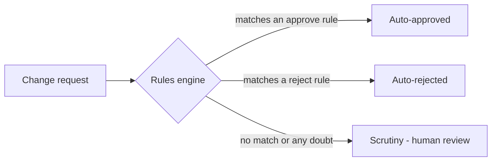
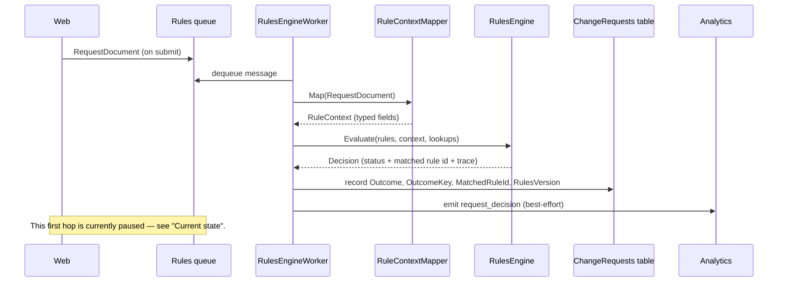
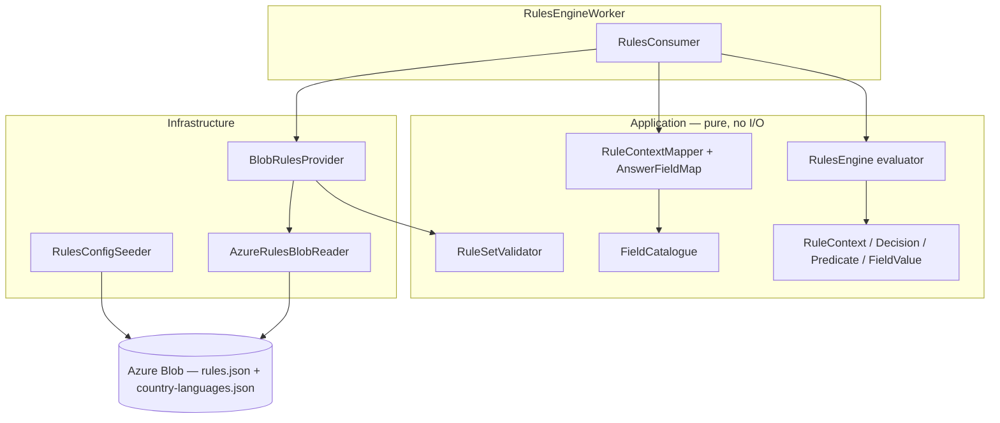
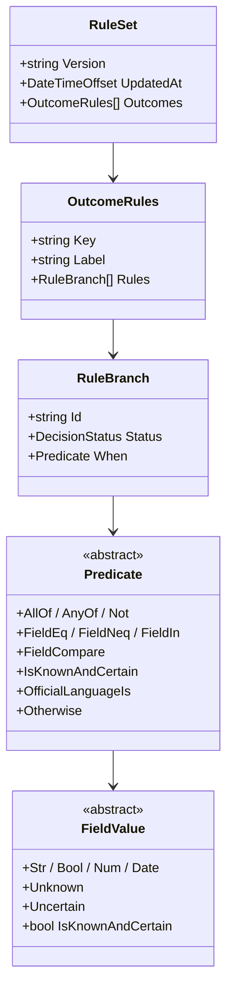
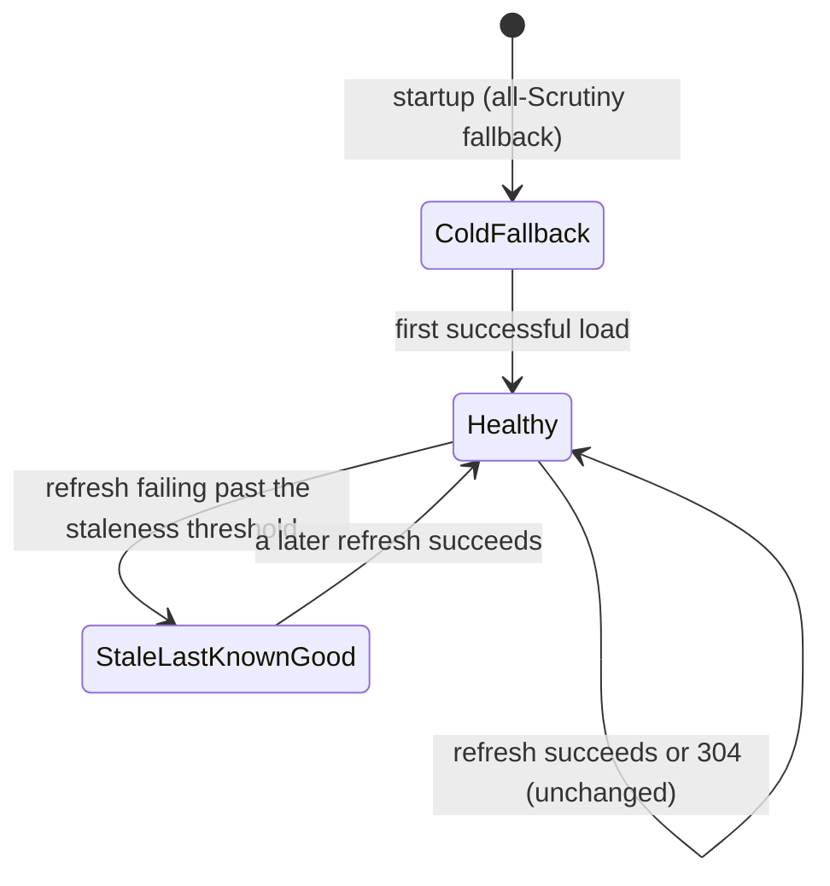

# Rules Engine

How the service automatically triages a pupil-record change request into approve, reject, or send-to-a-human. This is a functional overview: a plain-English summary first, then the technical detail.

---

## What it does

When a school submits a change request (for example "remove this pupil"), the rules engine decides what should happen to it automatically:

- **Auto-approved** — the request clearly meets the criteria to be accepted.
- **Auto-rejected** — the request clearly does not qualify.
- **Scrutiny** — the request goes to a human reviewer.

The goal is to take the routine, clear-cut requests off caseworkers' desks while making sure anything uncertain is still seen by a person.



**The one rule that matters: fail safe to Scrutiny.** Any doubt — a missing answer, an unreadable value, a request reason the rules don't recognise, or an unexpected error — routes to a human. The engine never auto-approves or auto-rejects when it is unsure.

**Three-valued logic in one line.** Every condition evaluates to `True`, `False`, or **`Unknown`**. Only `True` can win a rule; both `False` and `Unknown` fall through to the next rule, and ultimately to the catch-all `otherwise` rule, which is always Scrutiny. That third value — `Unknown` — is what lets the engine tell *"this is false"* apart from *"we don't actually know"*.

---

## How a request flows through

A request is evaluated end-to-end by the background worker (`RulesEngineWorker`):



If the mapper or the engine throws, the worker catches it and still records a **synthetic Scrutiny** decision (rule id `_mapper_error` or `_engine_error`), so a fault can never silently auto-decide. The decision and an audit trace are stored on the request's `ChangeRequest` row; creating the downstream support ticket is a separate step.

---

## Architecture at a glance

The evaluator is a **pure function** — no database, no network, no clock. That keeps the decision logic simple to test and reason about. Everything stateful (blob storage, the queue) lives in Infrastructure and the worker.



A key boundary is `AnswerFieldMap`: it translates the **journey's question vocabulary** (what the web form calls things) into the **rules' canonical field names**. The rules never depend on the web layer, so question wording can change without touching the rules.

---

## The decision data model

Rules are organised by **outcome** (the request's reason), and each outcome holds an ordered list of **branches**. The engine walks the branches top-to-bottom and the **first branch whose condition is `True` wins**.



- **`RuleBranch.Id`** (e.g. `EHE-KS4`) is a stable identifier that appears in the audit trace and the ticket, so a business decision can always be traced back to the exact rule that fired.
- **`FieldValue`** is the tri-state value. `IsKnownAndCertain` is `true` only for a concrete `Str`/`Bool`/`Num`/`Date` — deliberately `false` for `Unknown` and for `Uncertain` (a value supplied with low confidence). This is what stops a low-confidence answer from driving an automatic decision.

---

## Rules as JSON

Rules live in a single `rules.json` blob. Here is one outcome (most are trimmed; see [`seed/rules.json`](../src/DfE.CheckPerformanceData.RulesEngineWorker/seed/rules.json) for the full set):

```json
{
  "key": "Inclusion",
  "label": "Inclusion",
  "rules": [
    { "id": "INC-ACC", "status": "AutoApproved",
      "when": { "field": "inclusionFlag", "in": ["402", "404", "407", "408", "422"] } },
    { "id": "INC-REJ", "status": "AutoRejected",
      "when": { "field": "inclusionFlag", "in": ["413", "430"] } },
    { "id": "INC-DEF", "status": "Scrutiny", "when": "otherwise" }
  ]
}
```

Every outcome **must end with an `"otherwise"` branch** — the validator enforces this — so there is always a defined result, and that result defaults to Scrutiny.

### Predicate reference

| `when` shape | Meaning |
|---|---|
| `{ "field": "x", "eq": "ENG" }` | field equals the literal (type-strict) |
| `{ "field": "x", "neq": "ENG" }` | field does not equal the literal |
| `{ "field": "x", "in": ["a","b"] }` | field equals any value in the list |
| `{ "field": "x", "lt": "2024-09-01" }` | numeric or date comparison (`lt` / `lte` / `gt` / `gte`) |
| `{ "isKnownAndCertain": "pupilAge" }` | true only if the field is a concrete, certain value |
| `{ "officialLanguageIs": "English", "countryField": "countryOfOrigin" }` | looks the country up in `country-languages.json` |
| `{ "all": [ … ] }` | every child must be true (short-circuits on first false) |
| `{ "any": [ … ] }` | at least one child true (short-circuits on first true) |
| `{ "not": { … } }` | negation (`Unknown` stays `Unknown`) |
| `"otherwise"` | terminal catch-all, always true, always last |

### When a condition is `Unknown`

A comparison returns `Unknown` (rather than `False`) whenever the field is **not known and certain** — i.e. the answer was missing, or supplied with low confidence, or `lt`/`gt` is asked of a value that isn't a number or date. `Unknown` then propagates: `all` becomes `Unknown` if no child is false but some are unknown; `any` becomes `Unknown` if no child is true but some are unknown. The net effect is the fail-safe rule — uncertainty drifts down to `otherwise` → Scrutiny.

---

## Where the field values come from

The mapper (`RuleContextMapper`) turns a submitted `RequestDocument` into the typed fields the rules read. Answers are produced in four shapes, defined in `AnswerFieldMap`:

| Shape | What it does | Example |
|---|---|---|
| **Plain copy** | One question → one field, parsed to the type declared in `FieldCatalogue`. | `date-pupil-started` → `schoolAdmissionDate` (Date) |
| **Radio fan-out** | One single-choice radio → several independent booleans (chosen one `true`, the rest `false`, all `Unknown` if unanswered). | a "social care reason" radio → `hadSocialCareInvolvement`, `hadRecentPoliceInvolvement`, `hasBeenDetainedInPrison` |
| **Vocabulary translation** | Journey answer values mapped to canonical values; a "believed" answer becomes `Uncertain`; anything unlisted becomes `Unknown`. | `first-language: believed-english` → `Uncertain("ENG")` |
| **Window-resolved** | One question resolves to different fields depending on the checking window. | the SAT-exams question → `hasSatExamsAsYear11` (KS4) or `hasSatExamsAsYear6` (KS2) |

Some fields are calculated from the pupil record on the message, with a deliberate fail-safe guard: `pupilAge` (only when `Age > 0`), `inclusionFlag` and `isAddBack` (only when the inclusion code `Pincl > 0`). A missing or zero value is left `Unknown` rather than read as `0`.

A few fields referenced by rules have **no producer at all** yet (e.g. `whereaboutsKnown`, `locatedAfterReasonableEfforts`, `illnessHasSevereProfoundEffect`). They are always `Unknown`, so any rule depending on them defers to Scrutiny — which is the intended safe behaviour until the question exists.

**`CheckingWindowType`** is the field that drives most window-specific rules. Its canonical values are `KS2`, `KS4June`, `KS4Autumn`, and `Post16` (it replaced the older `keyStage` field). Legacy phrasings like `"16 to 18"` are normalised to `Post16`; anything unrecognised passes through, matches no rule, and lands in Scrutiny.

---

## Loading rules safely

Rules are configuration, not code — they are loaded from blob storage and refreshed live, with several safety nets.

- **Self-seeding** (`RulesConfigSeeder`, on worker startup): real environments get only an *empty* `rules-config` container from Terraform, so the worker uploads its image-bundled seed when the blob is missing. `rules.json` is version-gated (a newer bundled seed upgrades the stored blob; admin edits stamped later always survive); `country-languages.json` is never overwritten. A stored blob that no longer validates against the current field catalogue is restored from the seed, which self-heals an environment stranded on a superseded schema.
- **Hot reload** (`BlobRulesProvider`): refreshes on a timer (default every 300s) using blob ETags, so an unchanged blob costs nothing. A new rule set is **validated before it is installed**, and swapped in atomically — no request ever sees a half-applied update. If a blob is broken, the previous good rule set keeps serving.



These three states map to the health check as `Healthy` → healthy, `StaleLastKnownGood` → degraded, `ColdFallback` → unhealthy. **Cold fallback is itself safe**: it has no rules, so every request matches nothing and becomes Scrutiny.

---

## Current state

> **The queue path is paused.** In [`Web/appsettings.json`](../src/DfE.CheckPerformanceData.Web/appsettings.json) the flag `RequestSubmission:WriteToBlobInsteadOfQueue` is `true`, so submitted requests are written to blob storage **instead of** being enqueued. Nothing reads that blob, so the engine currently evaluates **no** requests.
>
> The evaluator, provider, seeder, and worker are all fully built and tested — restoring the flow is a one-line config change (flip the flag to `false`), gated on the upstream pupil-data feed being ready.

---

## Going deeper

- **Analytics** — every decision emits a `request_decision` event. See [bigquery-analytics.md](./bigquery-analytics.md).
- **The user journey** that produces a request — see [request-journey.md](./request-journey.md).
- **Editing rules** locally and in real environments — see the [seed README](../src/DfE.CheckPerformanceData.RulesEngineWorker/seed/README.md).
- **Key code**: `Application/RulesEngine/` (`RulesEngine.cs`, `Predicate.cs`, `FieldValue.cs`, `RuleContextMapper.cs`, `AnswerFieldMap.cs`, `FieldCatalogue.cs`), `Infrastructure/RulesEngine/` (`BlobRulesProvider.cs`, `RulesConfigSeeder.cs`), `RulesEngineWorker/Consumers/RulesConsumer.cs`.
- **Tests** (xUnit) live under `tests/DfE.CheckPerformanceData.UnitTests/RulesEngine/` and the end-to-end test under `tests/DfE.CheckPerformanceData.IntegrationTests/RulesEngine/`.
