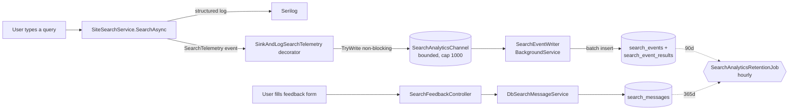
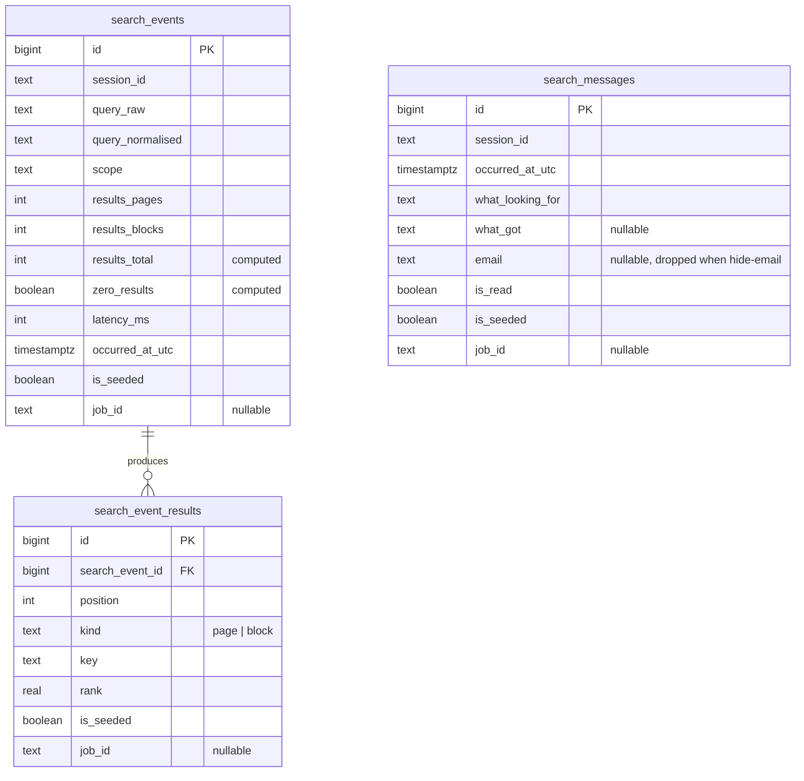

# Search analytics

How the site captures every search request, what the admin dashboard shows, how users report unhelpful searches, and how the whole thing gets purged on a schedule. Lives under `/admin/Search/` (admin) and `/Search/Feedback` (user-facing).

The design goal was to give the DfE team enough insight to answer "what are people searching for and is our content answering them?" **without ever storing PII**. There is no DSI subject id, no IP address, no email tied to a query — the only per-user identifier is an opaque server-side ASP.NET session id, and it's used purely to correlate related actions in the same browsing session.

---

## What gets captured

Two things flow through the same session-id keyed sink:

1. **Search events.** Every call to `SiteSearchService.SearchAsync` emits one row: what was typed, what was returned, how long it took. Zero-result queries land here too — they're the whole point.
2. **Feedback messages.** When a user clicks the "Not the results you were expecting?" link under a `/search` result page, they land on a form. What they write goes into a separate message table, session-linked to the searches they'd just done, so a support person can see both sides.

The sink is intentionally minimal — no user id, no organisation, no IP. Retention limits and the "no PII" property together mean the whole surface can be shown to any admin without additional gating machinery.



---

## Where things live

### Contracts (Application layer)

| File | Purpose |
| --- | --- |
| `Application/Analytics/ISearchAnalyticsSink.cs` | Batch write + expired-purge. Events only. |
| `Application/Analytics/ISearchMessageService.cs` | Create + read + purge for feedback messages. Owns its own retention path. |
| `Application/Analytics/ISearchAnalyticsQueryService.cs` | Every read shape the dashboard needs — summaries, over-time buckets, drill-ins, aggregate-by-weekday-hour, top-N, funnel, anomaly chips. |
| `Application/Analytics/ISearchAnalyticsSessionProvider.cs` | Web-side abstraction over ASP.NET Session so Application doesn't depend on `Microsoft.AspNetCore.Http`. |
| `Application/Analytics/SinkAndLogSearchTelemetry.cs` | The decorator that fans one `SearchTelemetry` event into (a) structured log and (b) channel enqueue. |
| `Application/Analytics/SearchEventDto.cs` | The write-side payload — positional record so the sink can't diverge from the column set. Carries optional `IsSeeded` and `JobId` for the seed page. |
| `Application/Analytics/SearchAnalyticsSummaries.cs` | Read-side aggregate shapes — `SearchAnalyticsSummary`, `VolumeBucket`, `LatencyBucket`, `TopQueryRow`, etc. |

### Web wiring

| File | Purpose |
| --- | --- |
| `Web/Analytics/SearchEventWriter.cs` | `BackgroundService` that drains the channel and calls the sink in batches. Runs for the process lifetime. |
| `Web/Analytics/HttpContextSearchAnalyticsSessionProvider.cs` | Reads `HttpContext.Session.Id` (server-side) — never a cookie, never an HTML comment (defends against form-tampering session injection). |
| `Web/Middleware/SessionAbsoluteLifetimeMiddleware.cs` | Enforces a 24h absolute cap on session lifetime, and commits the session cookie server-side so subsequent middleware sees a stable `Session.Id`. |
| `Web/Middleware/SessionSourceCommentMiddleware.cs` | Injects `<!-- session: <id> -->` at the tail of every `text/html` response. Support-diagnostic aid; toggled by the `SearchAnalytics:ShowSessionComment` setting. |
| `Web/Controllers/SearchAnalyticsController.cs` | The admin dashboard + every drill-in under `/admin/Search/`. |
| `Web/Controllers/SearchFeedbackController.cs` | User-facing feedback form at `/Search/Feedback`. |
| `Web/Controllers/MessagesController.cs` | Admin messages inbox at `/admin/Messages/Inbox`. |
| `Web/Controllers/TestDataController.cs` | Dev-only seed sample search data page at `/admin/test-data/sample-search-data`. |

### Persistence

| File | Purpose |
| --- | --- |
| `Persistence/Analytics/DbSearchAnalyticsSink.cs` | Batch insert into `search_events` + `search_event_results`. Idempotent-per-batch. |
| `Persistence/Analytics/DbSearchMessageService.cs` | CRUD + paged read + purge for `search_messages`. |
| `Persistence/Analytics/SearchAnalyticsQueryService.cs` | Raw SQL for every dashboard read (percentiles via `percentile_cont`, gap-filled buckets via `generate_series`, aggregate-by-weekday-hour via `EXTRACT(ISODOW…) + EXTRACT(HOUR…)`). |
| `Persistence/Analytics/DbSampleSearchDataGateway.cs` | Seed-page write path + rollback-by-job-id path. |

### Retention

| File | Purpose |
| --- | --- |
| `RulesEngineWorker/Maintenance/SearchAnalyticsRetentionJob.cs` | `BackgroundService` that ticks every hour and calls each sink's purge method with the settings-driven day count. |

### Migrations

- `20260727182228_AddSearchAnalytics` — three sink tables (`search_events`, `search_event_results`, `search_messages`).
- `20260727202012_AddSearchAnalyticsPerformanceIndexes` — indexes tuned to the dashboard's read shapes (occurred_at range, session_id lookup, zero-results boolean).
- `20260729080951_AddIsSeededMarker` — `is_seeded BOOLEAN NOT NULL DEFAULT FALSE` on all three tables, so seeded rows and real rows are separable.
- `20260729104910_AddSeedJobIdColumn` — nullable `job_id` text on all three tables so a single seed run's rows can be dropped in one transaction.

---

## The collection pipeline

`SiteSearchService` calls `ISearchTelemetry.RecordSearch(...)` after every search. In production the concrete is `SinkAndLogSearchTelemetry`, which fans that one call into two paths:

1. **Structured log** — delegates to the inner `LoggerSearchTelemetry` verbatim. Nothing lost, nothing changed; the log line is the same one the Phase 1.07 observability work landed.
2. **Analytics enqueue** — maps the event into a `SearchEventDto` and calls `channel.TryWrite(...)`. **Never throws, never blocks.** If the channel is full (cap 1000), it increments the `ISearchAnalyticsDroppedCounter` (a process-lifetime `Interlocked` count) and writes one `Warn` line so operators can see the shed under load. Emitters get their control flow back within microseconds regardless of the sink's health.

The channel is drained by `SearchEventWriter`, a `BackgroundService` that:

- Blocks on the reader.
- On wake, drains up to `BatchSize` items (default 32) or `BatchDeadline` (default 250 ms), whichever comes first.
- Calls `ISearchAnalyticsSink.RecordBatchAsync` once per batch.
- On shutdown, drains the tail so an in-flight request's event isn't lost when the app cycles.

**Why a channel + background writer instead of an inline insert?** Two reasons:

- **Isolation from DB latency.** A slow Postgres write should never delay a user's search response. The channel + writer keeps the emit path O(1).
- **Batching for free.** One `INSERT ... VALUES (...), (...), ...` per 32 events is dramatically cheaper than 32 solo inserts, especially under bursty load.

The session id comes from `ISearchAnalyticsSessionProvider`, which the web-side concrete reads from `HttpContext.Session.Id` — a server-side read, never a cookie or HTML-comment. That closes the door on a hostile client forging session ids into the sink to poison a session-scoped drill-in.

Background / non-request emitters (a scheduled job that happens to call `SearchAsync`) get `null` from the provider, and the decorator skips the channel write in that case — an event with no session to attribute isn't useful in the dashboard — but the structured log still fires.

---

## Data model

Three tables, all keyed on `session_id`:



**Deliberate omissions:**

- No `user_id`, no `dfe_sign_in_subject`, no `organisation`.
- No IP address (raw or hashed).
- No `user_agent`.
- No cross-request join key beyond `session_id`.

**Deliberate inclusions:**

- `query_raw` **and** `query_normalised` — both, because dashboards group on the normalised form but a support person reading the messages inbox wants to see what the user actually typed (case, punctuation, spelling).
- `latency_ms` — for the p95 tile and the request-timings scatter.
- `results_pages` + `results_blocks` — separate columns rather than one total, so the funnel can tell "found pages" from "found only content blocks".
- `zero_results` — Postgres-computed from `results_pages + results_blocks = 0`, so the dashboard's zero-result queries never drift out of sync with a partial migration.
- `is_seeded` + `job_id` — see [Seeding sample data](#seeding-sample-data-dev-only).

---

## The dashboard (`/admin/Search/`)

Landing page shows four tile-swappable charts, a stack of top-N summary cards, a "when people search" heatmap, a request-timings scatter, and a zero-result outcomes funnel. Everything is server-rendered SVG — **no client chart library**. Every chart has a `<details>` fallback that renders the same numbers as an accessible table.

```mermaid
flowchart TB
    subgraph LP["Landing page — /admin/Search/"]
      TF[Time-window filter + bucket size + aggregate toggle]
      TL[4 stat tiles:<br/>Total • Unique sessions • Zero-result % • p95 latency]
      CH[Interactive chart panel<br/>swaps with tile click]
      SC1[Top queries card]
      SC2[Top zero-result queries card]
      SC3[Top pages card]
      HM[Weekday × hour heatmap]
      RT[Request-timings scatter]
      FN[Zero-result outcomes funnel]
    end
    LP --> V[/admin/Search/Volume]
    LP --> UU[/admin/Search/UniqueUsers]
    LP --> ZO[/admin/Search/ZeroResultsOverTime]
    LP --> LO[/admin/Search/LatencyOverTime]
    LP --> RQ[/admin/Search/Queries]
    LP --> ZQ[/admin/Search/ZeroResults]
    LP --> PG[/admin/Search/Pages]
    LP --> RTD[/admin/Search/RequestTimings]
    LP --> SD[/admin/Search/Session/{id}]
```

### Stat tiles

Four numbers, computed by one `GetSummaryAsync` call over the selected window:

| Tile | What it is | Source |
| --- | --- | --- |
| **Total searches** | Row count in `search_events` | `COUNT(*)` |
| **Unique sessions** | Distinct `session_id` values | `COUNT(DISTINCT session_id)` |
| **Zero-result rate** | Percentage of rows where `zero_results = true` | `100.0 * COUNT(*) FILTER (WHERE zero_results) / COUNT(*)` |
| **p95 latency (ms)** | 95th percentile of `latency_ms` | `percentile_cont(0.95) WITHIN GROUP (ORDER BY latency_ms)` |

Each tile is a `<button aria-pressed="true|false">`. Clicking a tile swaps the chart panel below to that tile's own series. All four chart SVGs are pre-rendered server-side; the tile switcher just toggles `hidden`. So the whole surface still works with JS disabled — you see all four charts stacked.

Under each tile: a small week-over-week **anomaly chip** (`+18%` in green, `-27%` in red, grey neutral if `|delta| < 10%`). Chip is only rendered when there's enough prior data in the retention window; otherwise an italic "insufficient prior data" hint.

### The four charts

All four consume a 168-cell weekday × hour spine in aggregate mode and a `generate_series`-driven time bucket in non-aggregate mode. Every chart adapts its X-axis ticks to the selected window (`HH:mm` at 24h → `Wed 24` at 7d → `24 Jul` at 30d → weekly majors at 90d → `Jul 2026` at 1y). Y ticks are nice-numbered.

| Chart | Series | Notes |
| --- | --- | --- |
| **Search volume** | Total events (bar) + unique sessions (line, right Y) | Dual-axis. In aggregate mode the server merges the volume and unique-sessions readers into a single `VolumeBucket[]` so the JS reads both counts off one array. |
| **Unique sessions** | Single-series line | Same reader as the volume chart's right-Y. |
| **Zero-result count** | Single-series line | Absolute count per bucket, not a rate. |
| **Latency percentiles** | Three lines: p5 (grey), p50 (blue), p95 (dark) | Server-side `percentile_cont` per bucket. Auto-flips Y axis to log scale when `max/min > 20` (a single 3s outlier no longer squishes the sub-100ms mass into an unreadable pile). |

### Hover crosshair

Every chart carries a dashed vertical + horizontal SVG crosshair that follows the cursor, plus a floating tooltip with the mapped X/Y values at the snapped bucket. **Tooltip renders in the upper-left of the cursor by default**, with a 24 px offset (so the cursor body doesn't overlap it) and a four-quadrant clip-flip near the chart edges. The same tooltip helper drives the weekday × hour heatmap cells too.

### Aggregate to a typical week

A checkbox above the chart. Ticking it flips a `?aggregate=week` query param and re-renders every over-time chart as a cyclic 168-slot view: Mon 00:00 → Sun 23:00, with each cell aggregating every same-weekday-and-hour event across the whole window. Useful for spotting patterns ("we're busiest 10am Wed") that a straight time series flattens out.

The checkbox lives **inside the time-window filter form** (not its own separate form), so clicking Apply filters preserves the aggregate state across a bucket-size or date-range change.

In aggregate mode:

- Tooltips show `Wed 14:00` — no synthetic anchor date leaks through.
- The reader anchors buckets to a synthetic Monday (`ANCHOR_MONDAY = 2001-01-01`) purely so the sort order is stable across weekdays.

### Weekday × hour heatmap ("When people search")

7 rows × 24 columns, `<rect>` per cell, pale → GOV.UK blue by volume. Cell hover uses the same custom tooltip machinery as the chart crosshairs (was originally a native `<title>` — swapped out because browsers position native tooltips below-right of the cursor with no way to reposition, and the cursor body ends up covering the value).

### Request-timings scatter

Every search event (up to 2000 sampled via `ORDER BY random()`) as a dot on a time × latency-ms plot. Hover a dot → 3-line tooltip: timestamp (to the second, UTC), latency in ms, and the user's search query (or `(empty query)` for blank-query events). Same log-scale auto-switch as the latency chart.

### Zero-result outcomes funnel

Three big-number tiles: how many zero-result sessions **refined** the query afterwards, how many sent **feedback**, how many went **silent**. One CTE-driven SQL query aggregates session-level. Tie-break locked by unit test: refine > feedback > silent.

### Top-N cards

Three summary cards stacked full-width: **Top queries**, **Top zero-result queries**, **Top pages**. Each caps at the `CMS:PageLength` setting; if the total exceeds the cap, a "View all N" link opens the corresponding paged drill-in at `/admin/Search/Queries`, `/ZeroResults`, or `/Pages`.

Every query link opens in a new tab (`target="_blank"` + `rel="noopener"`) pointing at `/search?q=<term>` so an admin can immediately try the query the user did.

### Drill-ins

Same time-window filter as the landing page, but one full page dedicated to one series or top-N. Uses the shared `PagerViewComponent` for `Previous | first 3 | … | current ±1 | … | last 3 | Next` truncation. Every column header carries a `title` attribute with a plain-language description.

### Session drill-in

`/admin/Search/Session/{id}` shows every event for one session id — search timeline + any feedback messages tied to it. Includes a confirm-modal-gated **"Delete this session"** button that drops every event, every result, and every message for that session id in one transaction and writes an `AuditEntry(Action = "SearchSessionDelete")`. Useful for the "please delete my data" support ask, even though we don't require it (no PII → no legal obligation).

---

## User-facing feedback (`/Search/Feedback`)

Under every `/search` result page there's an inset-text link: **"Not the results you were expecting?"**. That takes the user to a GDS form:

- **What were you looking for?** — free-text, required.
- **What did you actually get?** — free-text, optional.
- **Your email address** (optional, pre-filled from the DfE Sign-in claim if signed in) — with a "hide my email" checkbox that **drops the value BEFORE persist** (not after — the value never reaches the database).

The form also renders the user's most recent search results so they can see what the model saw. On submit → `DbSearchMessageService.CreateAsync` writes a `search_messages` row keyed by session id + occurred-at + email (or null). The confirmation view thanks them and shows a link back to `/search`.

Session id is server-rendered readonly on the form so the same session-id that the sink is emitting is the one that lands on the message row — no client-side session id manipulation.

Admin side reads these in `/admin/Messages/Inbox`:

- Sortable + filterable + paginated list.
- Detail view leads with the user's own text (what were you looking for + what got), then shows a snapshot of the session's pre-submission search — the same numbered hit list the user was staring at when they clicked feedback.
- A **Messages badge** in the top nav shows the count of unread search-feedback + waiting DLQ items combined (`MessagesBadgeViewComponent`).

---

## Retention

`SearchAnalyticsRetentionJob` (a `BackgroundService` in `RulesEngineWorker`) ticks every `SearchAnalytics:RetentionIntervalMinutes` minutes (default 60) and calls both purge methods:

- `ISearchAnalyticsSink.PurgeExpiredAsync` — deletes rows in `search_events` (and their `search_event_results`) where `occurred_at_utc < now() - SearchAnalytics:RetentionDays days`. Default 90 days; hard-max 365 enforced in code.
- `ISearchMessageService.PurgeExpiredAsync` — same shape for `search_messages`. Default 365 days (support cases often reference weeks-old sessions); hard-max 730 in code.

Both retention windows are settings-driven (`/admin/settings`) so an operator can shorten either without a code change. The purge SQL is a **CTE-batched DELETE** so a large historical purge doesn't lock the table.

**Why two separate settings?** Events are high-volume, cheap-to-lose, and only useful in aggregate. Messages are low-volume, hand-written, and often referenced by support cases — worth keeping longer.

---

## Settings (`/admin/settings`)

Every knob is under the `SearchAnalytics:*` namespace:

| Key | Default | What it does |
| --- | --- | --- |
| `SearchAnalytics:ShowSessionComment` | `true` | Whether `<!-- session: <id> -->` gets injected at the tail of every `text/html` response (support-diagnostic aid). Turn off in hostile environments where visible session ids are unacceptable. |
| `SearchAnalytics:RetentionDays` | `90` | Days a `search_events` row is retained before purge. Hard-max 365. |
| `SearchAnalytics:RetentionIntervalMinutes` | `60` | How often the retention job runs. |
| `SearchAnalytics:MessageRetentionDays` | `365` | Days a `search_messages` row is retained. Hard-max 730. |
| `SearchAnalytics:SeedSecondsPerEvent` | `0.1` | Per-event throughput estimate used by the seed-page modal to render an initial ETA. Updated after each non-cancelled seed via an EMA blend (`0.7 * old + 0.3 * measured` — see `SeedRateEma.Blend`) so it converges on the actual host's throughput. Deliberately high on first-run so the ETA reads conservative. |

The channel + writer knobs (`SearchAnalyticsChannel` capacity, `SearchEventWriter` batch size + deadline) are code constants, not settings — they're runtime-invariant and changing them means a rebuild.

---

## Seeding sample data (dev only)

`/admin/test-data/sample-search-data` fills the sink with realistic-looking traffic so the dashboard has content to demo. **Dev-only** — `IHostEnvironment.IsDevelopment()` guard on every endpoint returns 404 in Test and Production even for a principal with the admin section grant.

### What it generates

Five presets: last 24h (~500 events), week (~2000), month (~8000), quarter (~25000), year (~80000). Each preset:

- Uses a pool of ~40 realistic queries (`pupil premium`, `KS4 exam entry`, ~15% garbage/typo strings so the zero-result surface is populated).
- Weighted by an intra-day pattern (peak Mon-Fri 09:00-17:00, ~10% on weekends) via `HourWeights` + `WeekendDampen` in `SampleSearchDataSeeder`.
- Plus three multi-scale variance layers so a "last quarter" seed doesn't produce a flat aggregate week-to-week:
  - **Weekly multipliers** — each week in the window gets a random 0.5-1.8 multiplier with light autocorrelation, so trends look organic rather than shot noise.
  - **Daily anomalies** — ~5% spike days (2-3x baseline), ~10% quiet days (0.2-0.4x).
  - **Outage windows** — 1-2 per quarter, 3-6 hours contiguous, with 4-8x latency and ~30% volume (users abandoning). Recorded in the audit payload as `outageWindowsUtc: [[from, to], ...]` so a reviewer can correlate.
- Log-normal-ish latency distribution (median ~40 ms, p95 ~150 ms) plus a rare multi-second outlier per ~1000 events.
- 5-15% of events also produce a `search_messages` row.

### Async execution + progress modal

The POST kicks the seeder onto a background `Task.Run` with its own scope, creates a `SampleSearchDataSeedJob` in an in-memory job store, and 302-redirects to the same page with `?jobId=…`. The client-side JS opens a modal, polls a `/progress` endpoint every 500 ms, and renders live counts + a cyclic log of the last five ticks + a human-readable ETA (`1 hour 12 minutes 15 seconds` — never a raw 4-digit second count). ETA is computed from the persisted `SeedSecondsPerEvent` blended with the cumulative rate once enough samples are in.

### Cancel = interrupt + rollback

The modal's **Cancel** button posts DELETE to `/admin/test-data/sample-search-data/{jobId}`. The controller:

1. Signals the seeder's `CancellationToken` (via the job store's tracked `CancellationTokenSource`).
2. Waits up to 3 s for the seeder loop to observe the token and stop (state `Running` → `Cancelling` → `Completed`).
3. Regardless of whether the seed finished naturally or was cancelled, calls `ISampleSearchDataGateway.DeleteByJobIdAsync(jobId)` which drops every row this job wrote (events + results + messages) in a single transaction.
4. Records both `SeedSampleSearchData` and `SampleSearchDataSeedRolledBack` audit entries.

That's why every sink row carries the `job_id` column — so `WHERE job_id = @id` gives us clean per-job cleanup without a schema-level "seed batch" concept.

### Danger zone

A `Danger zone` section on the same page has two additional destructive actions:

- **Delete seeded data** — one-click confirm modal. Deletes every row with `is_seeded = true` across all three tables in one transaction. Real (`is_seeded = false`) rows are preserved.
- **Delete all data** — typed-DELETE confirmation. TRUNCATE-equivalent across the three tables. Also dev-only.

Both write per-table row counts to the audit trail.

---

## Antiforgery gotcha

The application configures antiforgery to expect its request token in an **`X-XSRF-TOKEN`** header, not the framework default `RequestVerificationToken`. Every fetch/XHR call to a `[ValidateAntiForgeryToken]` endpoint from this codebase must set:

```js
headers: { 'X-XSRF-TOKEN': token }
```

If you use the default header name, the `ValidateAntiForgeryToken` filter silently rejects the request. The app's `UseStatusCodePagesWithReExecute` then re-renders the 400 as a plain 404 page — the failure looks like "the endpoint doesn't exist" rather than "your token is wrong". Cost us a whole debug loop; documenting for the next person.

---

## Gotchas

- **`is_seeded` and `job_id` propagate to child rows.** The sink writes both markers onto `search_event_results` as well as `search_events` (and onto `search_messages` for the same seed run). Any query that assumes real-vs-seeded separation needs to filter on the appropriate column at whichever table it hits.
- **Aggregate readers put the aggregated count in `VolumeBucket.SearchCount`.** For the four aggregate-mode readers (`GetVolumeAggregatedByWeekdayHourAsync`, `GetUniqueSessionsAggregatedByWeekdayHourAsync`, etc.), the primary count lands in `SearchCount` and `UniqueSessionCount` is 0. The controller merges volume + unique-sessions results into a single `VolumeBucket[]` before handing to the view, so the JS reads both from one array. Don't call the readers directly and expect two counts per bucket.
- **Session id is a server read.** `HttpContextSearchAnalyticsSessionProvider` reads `HttpContext.Session.Id`. Don't read the session cookie value directly — the raw cookie is opaque encrypted state, not the session id. And don't trust the HTML-comment session id from `SessionSourceCommentMiddleware` — that's a diagnostic aid, one-way.
- **Emitters never await the sink.** `SinkAndLogSearchTelemetry.TryWrite` returns immediately. If your emitter's tests want to observe a row landing in Postgres, they need to await the `SearchEventWriter`'s next drain — see `SearchAnalyticsIntegrationTests` for the pattern (poll with backoff, or inject a synchronous test-double sink).
- **Zero-result queries at Warn.** `LoggerSearchTelemetry` logs zero-result searches at `Warn` (in addition to the `SearchAnalyticsDroppedCounter`), so an operator watching logs sees them without any dashboard access. This is intentional — the dashboard is the analytical view, the Warn line is the operational alert.
- **The `CMS:SearchDebugOn` toggle is a Phase 1.07 knob.** It promotes per-hit + per-exclusion Debug lines to Info. Not part of the analytics dashboard, but if you turn it on you'll see a lot more log volume — the sink and the dashboard don't care either way.
- **No PII — deliberate, not accidental.** Please don't add a `user_id` or `organisation` column to the sink because "we might want to slice by school later". Phase 1.11 was rescoped mid-flight specifically to avoid the DPO ticket that a PII sink would need. If a per-school slice becomes a requirement, the right pattern is a separate opt-in sink with its own retention + reveal service, not a widening of this one.
