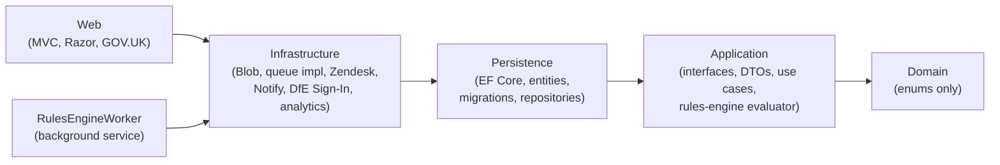
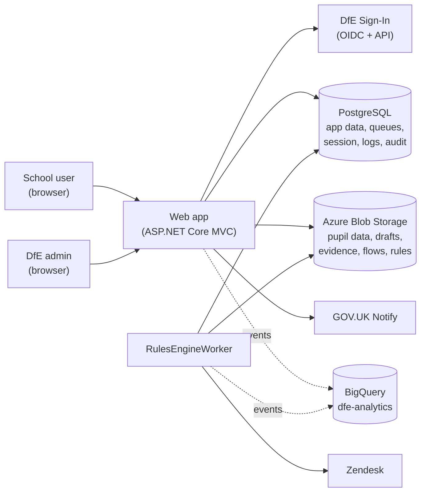
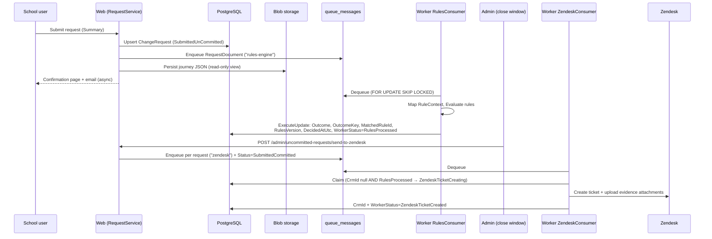
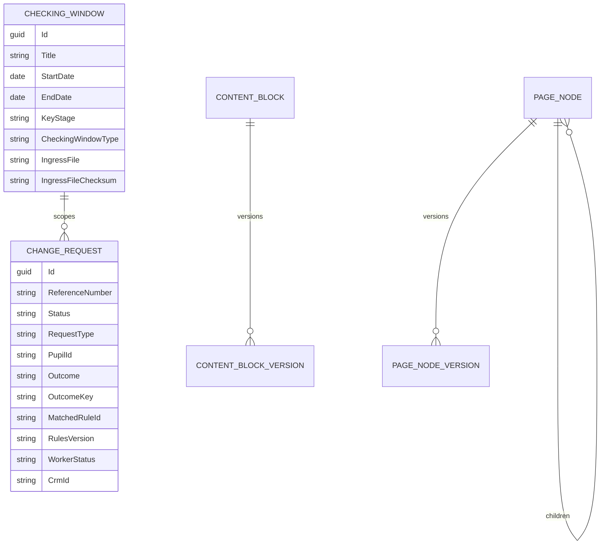

# Check Performance Data (CYPMD) — Technical Documentation

> Audience: developers maintaining or extending the solution.
> Describes the code at commit `2f740861` (branch `analytics-required-events` = `main` + analytics-event work), 16 July 2026.
> Solution root: `check-performance-data/`, solution file `src/DfE.CheckPerformanceData.slnx` (.NET 10 / C# 12).

---

## 1. Overview

Check Performance Data ("Check Your Pupil/Performance/Measures Data", CYPMD) is a DfE service that lets schools review the pupil data DfE holds for a performance-measures **checking window**, request amendments (include / remove / merge a pupil), or confirm the data is correct. Submitted requests are triaged automatically by a JSON-configurable **rules engine** running in a separate background worker, and are ultimately raised as **Zendesk** tickets for human processing. The service is a server-rendered ASP.NET Core MVC app (GOV.UK Design System, progressive enhancement, no SPA), backed by PostgreSQL and Azure Blob Storage, deployed as Docker containers to AKS.

## 2. Solution structure

Six projects under `src/`, strict clean-architecture dependency flow:



| Project | Responsibility | Notes |
|---|---|---|
| `DfE.CheckPerformanceData.Domain` | Pure domain types | **Enums only**: `CheckingWindowType {KS4June, KS2, Post16, KS4Autumn}`, `KeyStages {KS2, KS4, Post16}`, `RequestType`, `RequestStatus`, `WorkerStatus`, `CountryKind`. No entity classes. |
| `DfE.CheckPerformanceData.Application` | Interfaces, DTOs, use cases | Also hosts the **rules-engine evaluator** (`Application/RulesEngine/RulesEngine.cs`), journey engine types, analytics event records, Notify contracts. |
| `DfE.CheckPerformanceData.Persistence` | Data layer | `PortalDbContext` (+ `IPortalDbContext`), all entities, **all 40 EF migrations**, repositories, audit interceptor. Owns Npgsql. (Note: CLAUDE.md's five-layer list omits this project; EF Core lives here, **not** Infrastructure.) |
| `DfE.CheckPerformanceData.Infrastructure` | External adapters | Azure Blob clients, `PostgresQueueService`, Zendesk (Refit), GOV.UK Notify, DfE Sign-In OIDC + API client, DfE Analytics adapter, blob rules provider/seeder. No DbContext. |
| `DfE.CheckPerformanceData.Web` | ASP.NET Core MVC front end | Controllers, Razor views, GOV.UK/DfE frontend, session-backed journeys, admin area. |
| `DfE.CheckPerformanceData.RulesEngineWorker` | Background worker | Queue consumers (`RulesConsumer`, `ZendeskConsumer`), rules-config self-seeder, DLQ retention job, health endpoints. |

Service registration is by extension methods / `DependencyManager.cs` in each owning layer. Central package versions: `src/Directory.Packages.props` (note: does **not** reach `tests/`).

## 3. Runtime architecture



Two deployable containers (Web, RulesEngineWorker) share the same PostgreSQL database and blob storage. They communicate **only** through the Postgres-backed queue and shared tables — there is no direct call between them.

## 4. End-user journeys (Web)

### 4.1 Entry and sign-in

1. `/` — anonymous marketing page (`HomeController.Index`) with a Start button and guidance links.
2. `/LandingPage` (`LandingPageController`) requires auth; the global fallback policy (`Program.cs`) forces `RequireAuthenticatedUser()` on everything not `[AllowAnonymous]`, so this triggers the DfE Sign-In OIDC challenge.
3. On `OnTokenValidated`, `ClaimsEnrichmentService` (`Application/ClaimsEnrichment/`) calls the DfE Sign-In API for roles and organisation, and adds `organisation_id`, `ukprn`, `organisation_name`, `organisation_urn`, `organisation_laestab`, `organisation_type_id` claims. No usable org/role → no cookie, redirect to `/Account/NoAccess`.
4. Landing page lists **open checking windows** for the user's school; picking one stores `SelectedWindowId` in session and reveals the "Pupils" / "Amendment requests" service navigation.

### 4.2 Check your pupil data

`CheckYourPupilDataController` shows included/non-included pupils in tabbed, searchable, paginated tables, with CSV/ZIP download. If the window is open, a radio choice forks the journey: **Request a change** → `WhatToChangeController`, or **Confirm data is correct** → `ConfirmCorrectController`.

### 4.3 Amendment journey (the question-flow engine)

The journey is data-driven from JSON flow configs:

- **Types** (`Application/Journey/`): `QuestionFlowConfig` → `JourneyPage` (`PageType`: `Question`, `Content`, `EvidenceUpload`, `PupilSearch`) → `Question` (`Radio`, `FreeText`, `Date`, `FileUpload`, `TextArea`, `Autocomplete`; supports `Optional`, `CharacterLimit`, named `Validator`, per-option `NextPageId` branching, `VisibleWhen` conditions).
- **Config source**: blob container `question-flows`, blob name `{WhatToChange}_{CheckingWindowType}.json`, loaded via `QuestionFlowBlobClient` and cached in `IMemoryCache` with `NeverRemove` priority (flow edits need an app restart). Source files live at `Web/Data/QuestionFlows/` and are seeded to blob by `SeedQuestionFlows`.
- **Flows that exist today**: `Include_KS4June.json`, `Merge_KS4June.json`, `Remove_KS4June.json` (12-reason branch tree). **Only KS4 June has flows** — for KS2/Post16/KS4Autumn the config lookup returns null and `WhatToChangeController.Confirm` bounces back to the pupil list.
- **State**: `RequestState` per window in session — answers keyed by question id, plus `QuestionHistory` (ordered visited pages). Session is a **Postgres distributed cache** (`AddDistributedPostgreSqlCache`, table `session_cache`) so journeys survive load-balancing across replicas. Auth cookie is 30-min sliding; there is **no auto-save** — drafts persist only on explicit "Save and continue later".
- **Mechanics** (`JourneyController`, ~750 lines): navigation guard prevents URL-hacking ahead of answered history; changing a branch answer trims downstream history; `fromSummary=true` returns to Summary after single-page edits unless the branch changed. Evidence upload: **PDF only** (verified by PdfPig page counting in `Web/FileStorage/PdfPageCounter.cs`), **10 MB max per file**; the page-count cap exists but is **disabled** (`maxEvidencePages = 0` at `Application/DependencyManager.cs`). Validation failures emit `ValidationErrorEvent` analytics with coded reasons.
- **Reference numbers**: `CYPMD_{CheckingWindowType}_{7-char-uppercase-GUID-fragment}` from `JourneyValidationService.GenerateReference`.
- **Duplicate guard**: pupil search checks `IRequestService.HasSubmittedRequestAsync` and blocks a second request for the same pupil.

### 4.4 Summary, submit, drafts, withdraw

- **Summary** (check-answers) offers **Submit request** and **Save and continue later**.
- **Submit** → `RequestService.ConfirmRequestAsync` (see §5).
- **Save draft** persists `RequestState` JSON to blob and upserts the `ChangeRequests` row as `InProgress` or `ReadyToSubmit`.
- **Amendment requests page** (`AmendmentRequestsController.Index`) lists drafts (Edit/Delete) and submitted requests (View/Delete). **Resume** (`ResumeDraftAsync`) is org-scoped — it verifies the caller's organisation owns the row before reading the draft blob (fails closed against IDOR).
- **Delete** (`RequestService.DeleteAsync`): drafts are **hard-deleted** (row + blob); submitted requests are **soft-withdrawn** (`Status → Withdrawn`, kept for audit) and trigger a withdrawal email.

### 4.5 Confirm data is correct

`ConfirmCorrectController`: single-declaration flow (no question engine, no pupil selection). Creates a `ChangeRequest` with `RequestType.ConfirmCorrect`, status `SubmittedUnCommitted`, generates a reference number, fires `CorrectDataConfirmedEvent`, sends a confirmation email. Users can still submit amendments afterwards (the UI says so explicitly), and can view/withdraw the declaration from the amendment-requests page.

### 4.6 Contact, content, and other public surfaces

- **`/contact`** (`ContactController`, `[AllowAnonymous]`) is a **placeholder wayfinder**: validates only the enquiry type, **persists nothing**, emits `ContactUsSubmittedEvent` + one audit line, and redirects with a "we haven't recorded any details" banner. No email, no ticket.
- **CMS catch-all**: `PageController.Show` binds `/{*path}` at `Order = int.MaxValue`, `[AllowAnonymous]`. Resolves the unified `PageNode` tree (page types: folder / content / wiki), renders widget-tree content pages, breadcrumbs and side nav. Unpublished pages preview only for editors; everyone else gets a CMS-authored 404 (`help/not-found`). Seeded roots: `support`, `wiki`, `help`, `guidance` (stable GUIDs for content-staging).
- **`/search`** (`SearchController`, anonymous) unifies page and content-block search.
- **`/cookies`** sets a `cookies_policy` consent cookie (365-day, Lax, Secure).
- **`/healthcheck`** anonymous health endpoint.

## 5. Submission processing pipeline



Key points (`Application/RequestSubmission/RequestService.cs`, `RulesEngineWorker/Consumers/`):

- The `ChangeRequest` row is written **before** enqueueing so its id can ride in the message. The enqueued `RequestDocument` (full answer snapshot) is not itself retained; the journey JSON blob backs the read-only view.
- `RulesConsumer` converts **any** mapping/engine exception into a synthetic **Scrutiny** decision (`_mapper_error` / `_engine_error`) — a fault never silently auto-decides. Decision persistence runs in a transaction; the `request_decision` analytics event is emitted after commit, never inside it.
- **Rules → Zendesk is NOT auto-wired.** The only trigger is the admin "send to Zendesk" POST (explicitly commented as a quick-and-dirty test hook), which rebuilds `RequestDocument`s for every `SubmittedUnCommitted` row in open windows, enqueues them to `zendesk`, flips them to `SubmittedCommitted`, and marks unsubmitted drafts `NotSubmitted`. There is no scheduled window-close job.
- `ZendeskConsumer` is idempotent: conditional `ExecuteUpdateAsync` claim + a **partial unique index on `CrmId`** (migration `20260615083842`). Ticket priority/status derive from the decision (Scrutiny → high/new/question; Auto\* → normal/open/task); custom fields carry decision, URN, CYPMD id, pupil identifiers.

**Status enums** (`Domain/Enums/RequestStatus.cs`):

```
RequestStatus:  InProgress → ReadyToSubmit → SubmittedUnCommitted → SubmittedCommitted
                                           ↘ Withdrawn
                InProgress/ReadyToSubmit → NotSubmitted   (window closed, never submitted)
WorkerStatus:   (null) → RulesProcessed → ZendeskTicketCreating → ZendeskTicketCreated
```

## 6. Postgres-backed queue

`Infrastructure/Queue/PostgresQueueService.cs` over tables `queue_messages` / `dead_letters` (entities `QueueMessageEntity`, `DeadLetterEntity`).

- **Dequeue** uses raw SQL `FOR UPDATE SKIP LOCKED` with a `visible_after_utc` push-forward, giving a **visibility timeout** (default 30 s) so a crashed worker's claim resurfaces. `Attempts` counts every claim; `MaxAttempts = 5`.
- **Dead-lettering** copies to `dead_letters` **before** deleting from `queue_messages` (never loses a message), with a sanitised PII-free reason and a SHA-256 payload hash. `RedriveAsync` re-inserts with the same id (idempotent); `PurgeExpiredAsync` backs `DlqRetentionJob`. A DLQ-depth alert email exists (`INotifyService.SendDlqThresholdEmailAsync`).
- Queue names: `"rules-engine"`, `"zendesk"` (`Application/Queue/QueueOptions.cs`). No pause/resume flag exists.
- Because work rows are deleted on ack, throughput/latency history lives in the append-only `queue_metrics_events` table (`QueueMetricEvent`), which feeds the observability dashboard.
- Admin surfaces: `/admin/queues` (depth/latency), per-queue listing, DLQ inspect/redrive/purge (payloads redacted by default via `PayloadRedactor`; full payload behind the `Dlq:FullPayloadEnabled` setting).

## 7. Rules engine

- **Evaluator** (`Application/RulesEngine/RulesEngine.cs`) is pure (no I/O). `RuleSet { Version, Outcomes[] }` → `OutcomeRules { Key, Rules[] }` → `RuleBranch { Id, Status, When }`. The branch list is walked top-to-bottom; first predicate that evaluates `True` wins; every outcome must end in an `"otherwise"` branch (`RuleSetValidator`). No matching outcome key → `Decision.UnmatchedOutcome` (Scrutiny).
- **Tri-state logic**: leaves (`FieldEq`, `FieldNeq`, `FieldIn`, `FieldCompare`, `IsKnownAndCertain`, `OfficialLanguageIs`) return `Unknown` when a field is missing, low-confidence, or wrong-typed; `AllOf`/`AnyOf`/`Not` propagate `Unknown` conservatively. Each leaf appends to a human-readable audit trace (capped 50 lines).
- **Field production**: `RuleContextMapper` + `AnswerFieldMap` translate journey answers into canonical fields per `FieldCatalogue` (plain copy, radio fan-out, vocabulary translation, window-resolved). `checkingWindowType` and `requestType` come from the message envelope. **`CheckingWindowType` is the rules-facing field**; the older `KeyStage` remains on `CheckingWindow` for grouping but rules don't read it.
- **Config loading** (`Infrastructure/RulesEngine/BlobRulesProvider.cs`): hosted service loads `rules.json` + `country-languages.json` from the `rules-config` container, validates, atomically swaps an immutable `RulesSnapshot` (`Interlocked.Exchange`). Refresh every ~300 s with ETag short-circuiting. Health states: `ColdFallback` (no rules yet → everything Scrutiny) → `Healthy` → `StaleLastKnownGood`. Exposed as health check `rules-provider`.
- **Self-seeding** (`RulesConfigSeeder`): the worker image bundles `seed/rules.json` / `seed/country-languages.json` and uploads them when the (Terraform-provisioned, empty) container lacks them. `rules.json` is version-gated (structural `(DateOnly, long)` comparison of `yyyy.MM.dd-NN` vs admin-save `yyyy.MM.dd-HHmmss` stamps) and self-heals if the stored blob fails validation; `country-languages.json` is never overwritten once present.
- **Version history**: every admin save also appends to the `RulesConfigVersion` table for the editor's history/diff/rollback view — separate from the live blob the evaluator reads.

## 8. Admin area

Access is gated per section by `[RequireAdminSection]` (`Web/Admin/RequireAdminSectionAttribute.cs`) against a DB-backed **role × section grant grid** (`AdminSectionAccess`, cached 1 min). No grant → **404** (not 403; the admin surface is undiscoverable). Defaults (`DefaultAdminAccessSeeder`): `cypmd_admin` → every section (force-rewritten server-side on every save); `cypmd_content_access_user` → content sections only. Grid editable at `/admin/system/roles`.

| Section | URL | Purpose | Grant key |
|---|---|---|---|
| Admin landing | `/admin` | Dashboard, tiles filtered by grants | any grant |
| Page builder | `/admin/pages` | PageNode tree CRUD, widget editor, versions + publish windows, move/copy, soft delete | `content-pages` |
| Deleted pages | `/admin/pages/deleted` | Restore soft-deleted pages | `deleted-pages` |
| Content blocks | `/admin/content-blocks` | Inline-editable content snippets, versions/revert | `content-blocks` |
| Content staging | `/admin/content-staging` | Export/import schema-versioned JSON content bundle (`cpd-content-v2`) between environments; preview→confirm; per-item collision decisions; destructive clear-all | `content-staging` |
| Rules editor | `/admin/rules` | Outcomes/branches predicate builder (AJAX + no-JS fallback), lookups, ETag concurrency, history + rollback-as-new-save, bootstrap upload | `rules-config` |
| Observability | `/admin/observability` | Health strip, throughput/decision-mix/dwell charts, transactions, replay/walkthrough, CSV export, SSE live stream (≤30 s heartbeat for AKS ingress) | `observability` |
| Queues + DLQ | `/admin/queues` | Depth/latency, listings, DLQ redrive/purge | `rules-engine-queue` |
| Uncommitted requests | `/admin/uncommitted-requests` | List `SubmittedUnCommitted` + outcomes; **send-to-Zendesk** (the manual "close window") | `uncommitted-requests` |
| Storage browser | `/admin/storage` | Browse/preview/download/upload/delete blobs in app + ingress accounts | `storage-admin` |
| System settings | `/admin/settings` | Key/value `Setting` editor (page sizes, DLQ options, health thresholds) | `system-settings` |
| Role settings | `/admin/system/roles` | The grant grid itself; can register new role names | `role-settings` |
| Logs viewer | `/admin/system-administration/logs` | Filter/page `AppLogs`, streamed CSV download, clear | `app-logs` |
| Share admin | `/admin/share` | Mint/revoke share + wallboard tokens (plaintext shown once; only hash stored) | `share-admin` |
| Danger zone | `/admin/danger-zone/reset-seed-data` | Wipe + reseed data; grant **and** hard `IsProduction()` 404 guard | `reset-seed-data` |
| **Window admin** | `/admin/windows` | Checking-window wizard — **see gap below** | **none — auth only** |

**Checking-window management**: a linear session-backed wizard (`Controllers/WindowAdmin/`: Title → StartDate → EndDate → WindowType → KeyStage → Create → Summary), plus ingress-file selection that copies a blob from the ingress account into the window's own container (`ingress/<filename>`) with a SHA-256 checksum. Each window gets a **blob container named after its GUID**.

Anonymous-but-tokened surfaces: `/share/{token}` and `/wallboard/{token}` serve **aggregate-only** observability view-models (no pupil data), constant-time token-hash compare, 404 on invalid/revoked, `no-store` + `Referrer-Policy: no-referrer`.

Dev-only tooling (`Dev*Controller`s incl. impersonation used by E2E): `[AllowAnonymous]` but double-gated on `Dev:ToolsEnabled` **and** `!IsProduction()`.

## 9. Authentication & authorization summary

- OIDC to DfE Sign-In (`Infrastructure/DependencyManager.cs`, `AddDfeSignInAuthentication`): cookie sign-in scheme (30-min sliding), `CallbackPath /auth/callback`, scopes `openid profile email organisationid`, claims from userinfo, `SaveTokens`. `OnRemoteFailure` → `/Account/NoAccess` (never a raw 500). Local dev uses a Mockoon fake IdP (`docs/LocalDevelopement/mockoon.md`); docker localhost:8080 is typically pointed at the **real test** DfE Sign-In via `.env`.
- The app is single-organisation-per-session; org selection happens inside DfE Sign-In. LA-Estab is composed as `{localAuthority.code}/{establishmentNumber}`, with a hardcoded `DSI/TEST` override for the DSI sandbox org (URN 990082).
- **DataProtection** key ring persisted to blob (`data-protection-keys/keys.xml`) so OIDC state cookies survive multi-replica load balancing.
- Antiforgery header name `X-XSRF-TOKEN` — all `fetch()` POSTs send it (`wwwroot/js/site.js` `getToken()` pattern).
- Security headers: CSP (script/style/img/connect/frame allow-list for self + GTM/GA/Clarity, `object-src 'none'`, `form-action 'self'`), HSTS outside dev, HTTPS redirect, forwarded headers for the AKS ingress.

## 10. Data model

40 migrations (`20260331 InitialCreate` → `20260706 AddAppLogs`). Core request/window relationships:



| Entity | Purpose |
|---|---|
| `ChangeRequest` | Core request row: submitter, pupil identity, status, decision fields, Zendesk state |
| `CheckingWindow` | Window definition: dates, key stage, window type, ingress/schema file refs + checksums, validation record |
| `PageNode` / `PageNodeVersion` | Unified CMS page tree + versioned, publish-windowed content |
| `ContentBlock` / `ContentBlockVersion` | Editable content snippets + history |
| `WikiPage` / `WikiPageVersion` | Internal wiki (Postgres full-text search via `NpgsqlTsVector`) |
| `RulesConfigVersion` | Append-only rules/lookups config history for the editor |
| `Setting` | Key/value overrides (absent row = code default) |
| `AdminSectionAccess` | Role → section grant rows |
| `AuditEntry` | Insert-only audit trail (see below) |
| `AppLog` | Row-per-log-event for the admin logs viewer |
| `QueueMessageEntity` / `DeadLetterEntity` / `QueueMetricEvent` | Queue working tables + append-only metrics |
| `ShareToken` | SHA-256-hashed scoped tokens for share/wallboard |
| `Country` | Country reference data (~203 rows) for autocomplete |
| `DevZendeskTicket` | Dev-only captured "tickets" from the fake Zendesk service |

**Auditing**: `PortalDbContext.SaveChangesAsync` hand-rolls a two-phase interceptor — one `AuditEntry` per Added/Modified/Deleted entity (old/new/changed values as JSON), with deferred capture of generated PKs via a second save. A Postgres `BEFORE UPDATE OR DELETE` trigger makes `AuditEntries` immutable at the DB level. **Caveat:** bulk `ExecuteUpdate`/`ExecuteDelete` (used by the worker consumers and close-window) **bypass** this interceptor.

**Session**: `session_cache` table via `AddDistributedPostgreSqlCache` — shared across replicas.

Migrations run on **every boot** (environment guard commented out) plus a raw `DO $$` history-normalisation block.

## 11. Blob storage layout

| Container | Contents | Client |
|---|---|---|
| `{windowId}` (one per checking window) | `data/{laestab}_pupils.json` (pupil ingress), `request_{ref}.json` (submitted journey), `draft_requests/{ref}.json` (drafts), `evidence-uploads/{guid}` (PDF bytes), `ingress/<file>` (admin-copied ingress file) | `PupilDataBlobClient`, `RequestBlobClient`, `RequestStateBlobClient`, `EvidenceBlobStorageService` |
| `question-flows` | Journey flow JSON per `{WhatToChange}_{CheckingWindowType}` | `QuestionFlowBlobClient` |
| `rules-config` | `rules.json`, `country-languages.json` | `BlobRulesConfigStore` / `AzureRulesBlobReader` |
| `data-protection-keys` | `keys.xml` DataProtection ring | ASP.NET DataProtection |

Two storage accounts: **app** (`ConnectionStrings:AzureStorage`) and **private ingress/LDS** (`ConnectionStrings:IngressStorage`, infrastructure-encrypted). Pupil PII stays in blob; the DB carries only the stable `PupilId`/UPN/name fields needed for listing and dedup. Pupil ingress parsing is strict C# DTO binding (`PupilRecord`, UPPER_SNAKE `[JsonPropertyName]`s, numeric-bool converter) — malformed JSON throws rather than reading empty.

## 12. Notifications (GOV.UK Notify)

Producer/consumer split so requests never wait on Notify: `RequestNotificationService` builds an `EmailNotification` → in-process channel (`ChannelNotificationDispatcher`) → `NotificationBackgroundService` drains off-thread → `NotificationSender` resolves recipients (originator, plus all DfE Sign-In org users when `IncludeOrganisationUsers`) → `NotifyService` maps `NotificationType` → template id (`NotifySettings`) via the Notify .NET SDK with Polly resilience. Failures are logged and swallowed; undelivered messages are lost on ungraceful shutdown (accepted until a durable-queue migration). `DevConsoleNotifyService` is the config-gated dev fake.

| NotificationType | Trigger | Recipients |
|---|---|---|
| `SubmissionConfirmed` | Amendment submitted | Originator + org users |
| `DataCheckConfirmed` | Confirm-correct declared | Originator + org users |
| `AmendmentWithdrawn` | Submitted amendment withdrawn | Originator only |
| `DataCheckWithdrawn` | Declaration withdrawn | Originator + org users |
| (ops) DLQ threshold alert | Dead-letter depth breach | Ops address |

## 13. Analytics (dfe-analytics / BigQuery)

- Port/adapter: `IAnalyticsService` (Application) → `DfeAnalyticsService` (Infrastructure, only place touching the `Dfe.Analytics` SDK, v0.5.2) or `NullAnalyticsService` when `DfeAnalytics:DatasetId` is unset (local/review/tests) — everything no-ops safely.
- 15+ custom events in `Application/Analytics/*Event.cs`: journey funnel (`ChangeTypeSelectedEvent`, `DraftSavedEvent`, `DraftResumedEvent`), submission (`RequestSubmittedEvent`, `RequestSubmissionFailedEvent`, `CorrectDataConfirmedEvent`), evidence (`EvidenceUploadAttemptedEvent`, `EvidenceContinueEvent`, `EvidenceFileRemovedEvent`), deletion (`AmendmentRequestDeletedEvent`, `ConfirmationDeletedEvent`), `ValidationErrorEvent` (coded reasons), `PupilDataSearchResultsEvent`, `ContactUsSubmittedEvent`, and the worker-side `RequestDecisionEvent`. The SDK's `web_request` event is enriched with org context by `Web/Analytics/OrganisationEventEnricher.cs`.
- Controllers use best-effort `TrackSafeAsync` (analytics can never break a user action); the worker uses `TrackAsync` post-commit. `reference_number` is the only identifier sent, always as a `Hidden` (policy-tag-masked) field.
- GCP auth is Workload Identity Federation configured via Terraform (`terraform/application/dfe_analytics.tf`); settings now come from Terraform per environment (recently enabled in dev). Known upstream bug: service-account `CredentialsJson` auth is broken in the SDK — WIF is the working path.
- Client-side, GTM + Microsoft Clarity run in parallel behind cookie consent (`GtmSettings`, `ClaritySettings`).
- Event catalogue doc: `docs/bigquery-analytics.md` (slightly behind code — e.g. `ContactUsSubmittedEvent`).

## 14. Configuration

- Options pattern throughout. Key sections: `ConnectionStrings` (`Postgres`, `AzureStorage`, `IngressStorage`), `DfeSignIn`, `Notify`, `Zendesk` + `ZendeskTicketFieldSettings`, `DfeAnalytics`, `QueueOptions`, `RulesEngineOptions` (worker poll/retry/blob/refresh), `BlobRulesProviderOptions`, `AppLogSink` (batch 50 / flush 1 s / channel 10k), `PollySettings` / `NotifyPollySettings`, `GoogleTagManager`, `Clarity`, `Dev:ToolsEnabled`, `Serilog`.
- `Zendesk:UseFake` **defaults to true** (fresh envs never hit real Zendesk); config-gated rather than environment-gated because the DfE test site also runs `ASPNETCORE_ENVIRONMENT=Development`.
- `RequestSubmission:WriteToBlobInsteadOfQueue` is **dead config** — read by nothing.
- Deployed secrets come from Azure Key Vaults (`*-app-kv`, `*-inf-kv`) surfaced as env vars by Terraform; local dev uses `.env` + docker-compose (double-underscore env-var naming, e.g. `DfEAnalytics__CredentialsJson`).

## 15. Logging, monitoring, health

- **Serilog**: bootstrap logger, then `UseSerilog` (`ReadFrom.Configuration`, console: expression template in dev / compact JSON otherwise), `writeToProviders: true` so the DI `DatabaseLoggerProvider` receives events too. An additional `Serilog.Sinks.PostgreSQL.Alternative` sink writes to a `Logs` table from config.
- **AppLogs pipeline** (separate from the Serilog sink): bounded channel → `DatabaseLogWriter` hosted service batches to the `AppLogs` table → admin viewer with CSV export. `SkipCategories` prevents self-logging loops.
- **No Application Insights.** Monitoring = Postgres logs + observability dashboard + StatusCake (Terraform) + AKS Log Analytics.
- Health: web `/healthcheck` (+ `rules-provider` check); worker `/healthz/live` + `/healthz/ready` probed by exec `curl` in the AKS pod spec.

## 16. Hosting & deployment

- **Docker**: multi-stage Dockerfiles for Web and Worker (sdk:10.0 → aspnet:10.0, port 8080); pinned Playwright image for E2E; nginx maintenance page (`maintenance_page/`).
- **docker-compose**: profiled services — `web`, `rules_engine`, `db` (Postgres 18.1-alpine), `azurite` (+ one-shot `azurite_init` rules seeder), `pgadmin`; `docker-compose.e2e.yml` adds the one-shot `e2e-tests` runner (kept separate so the VS `docker-compose.dcproj` orchestration ignores it). Never add a `docker-compose.override.yml` (breaks `make test-e2e`).
- **CI/CD** (`.github/workflows/build-and-deploy.yml`): build + push both images to GHCR + Snyk scan → PR review apps (`deploy` label) → E2E (non-visual) against the review app → sequential deploy matrix **development → qa → preproduction → production** on push to `main`, via shared `DFE-Digital/github-actions` actions. Also: DB backup/PTR/restore workflows, maintenance toggle, Terraform validation, review-app teardown.
- **Terraform** (`terraform/application/`): AKS web app + worker (separate replica counts, exec health probes), Azure Postgres **Flexible Server v17** (note: local compose runs 18.1), Redis module, two storage accounts (app: `files`, `question-flows`, `rules-config`; private LDS ingress account), two Key Vaults, StatusCake, GCP WIF for analytics; `terraform/domains/` for DNS + Front Door. Environments: development, qa, review (per-PR), preproduction, production (`config/*.tfvars.json`).

## 17. Testing

| Project | Framework | Scope | Run |
|---|---|---|---|
| `tests/...UnitTests` | xUnit + NSubstitute | ~2,600 facts/theories across all layers | `dotnet test tests/DfE.CheckPerformanceData.UnitTests/` |
| `tests/...IntegrationTests` | xUnit + Testcontainers (Postgres + Azurite) + TestHost | ~174 tests: architecture/layering rules, audit, queue, rules config/engine, observability (incl. SSE auth), content staging, persistence | `dotnet test tests/DfE.CheckPerformanceData.IntegrationTests/` (needs Docker) |
| `tests/...E2ETests` | xUnit + Playwright + ImageSharp visual regression | ~77 tests: real Chromium against a running instance; auth via dev impersonation | `make test-e2e` (Docker, incl. visual baselines in `Snapshots/`) or `make test-e2e-fast` (native, skips visual) |

Notes: **xUnit, not NUnit** (dead NUnit entries linger in `Directory.Packages.props`); Moq is referenced but unused — use NSubstitute. CI runs E2E (non-visual) against review apps only; visual regression is local-only. Test SDK versions drift because central package management doesn't cover `tests/`.

## 18. Frontend conventions

- GovUk.Frontend.AspNetCore v4.2.1 + DfE Frontend + MoJ Frontend components; server-rendered Razor, progressive enhancement only (no SPA).
- Custom CSS/JS go in the GOV.UK template's `BodyStart`/`BodyEnd` sections — never `Head`.
- JS enhancement inventory (`wwwroot/js/`): async form submit + XSRF helper (`site.js` — when intercepting submits read the `formaction` **attribute**, not the property), page-tree + content-editor drag-drop, rules predicate builder (`admin-rules.js`), observability SSE board/replay/export, `<govuk-confirm-modal>` tag helper (`docs/govuk-confirm-modal.md`), DLQ bulk select, accessible autocomplete, TinyMCE 5 (vendored) for rich text.
- WCAG 2.2 AA is mandatory; health/status UI uses shape + colour, not colour alone.

## 19. Known gaps & gotchas (verified at this commit unless dated)

**Security / correctness**
- **Window-admin controllers have no `[RequireAdminSection]` or role check** — any signed-in DfE Sign-In user can reach `/admin/windows/*`. Every other admin controller is gated. Flag/fix candidate.
- `Controllers/WindowAdmin/EndDateController.cs` by-id edit was observed (2026-07-07 review) reading/writing `StartDate` where `EndDate` is meant — editing an end date corrupts the start date. `WindowRepository.UpdateAsync` re-news the entity without copying `Published`/validation fields → silent data loss on update. Re-verify before relying on window editing.
- Bulk `ExecuteUpdate`/`ExecuteDelete` bypass the audit interceptor (worker decision writes, close-window status flips are unaudited).
- CSP still permits inline scripts in practice (many inline `<script>`/`<style>` blocks in views); GTM/GA/Clarity domains allow-listed.
- `.env` contains real test secrets (DfE Sign-In, Zendesk, pgAdmin) — git-ignored, but rotate if ever exposed.

**Functional gaps**
- Only **KS4 June** journey flows exist; KS2/Post16/KS4Autumn windows can be created but have no amendment journey.
- Window **schema-file upload route is not implemented** (Summary links to `/admin/windows/{id}/schema-file`; no controller handles it); window **validate/publish actions don't exist** — the manage-windows list hard-codes `IsOpen = true, IsPublished = true`.
- Rules→Zendesk hand-off is manual (admin POST); no scheduled window-close.
- `/contact` is a persist-nothing placeholder pending a triage decision.
- Evidence page-count limit disabled (`maxEvidencePages = 0`).
- Footer **Privacy / Accessibility statement / Guidance / feedback links are `href="#"`** placeholders; the home "email notifications" sign-up link too.
- `Views/Shared/Error.cshtml` is the unstyled default MVC scaffold (not GDS-styled).

**Code smells / drift**
- `services.Configure<ZendeskSettings>(s => s = settings)` is a no-op (Refit client works; `IOptions<ZendeskSettings>` unbound).
- Namespace drift `DfE.CheckPerformance.Persistence.*` (missing "Data") on several entities and early migrations.
- `Country.Kind` stored as INT (all other enums stored as text) — positional-fragile.
- Two colliding `CheckingWindowDto` types (LandingPage vs WindowManagement).
- `KeyStage` and `CheckingWindowType` coexist on `CheckingWindow` (additive, not a replacement).
- `QuestionFlowService` caches flows `NeverRemove` — flow-config edits require an app restart.
- README claims anonymous-only access (stale); `docs/rules-engine.md` and `docs/bigquery-analytics.md` are slightly behind code.

## 20. Extending the solution

| Task | Where |
|---|---|
| New amendment journey / window type | Author `Web/Data/QuestionFlows/{WhatToChange}_{CheckingWindowType}.json`; seed to the `question-flows` container (`SeedQuestionFlows` locally); add any new answer fields to `FieldCatalogue` + `AnswerFieldMap` so the rules engine can read them |
| New rule / outcome | Prefer the `/admin/rules` editor (versioned, validated); the worker seed (`RulesEngineWorker/seed/rules.json`) only bootstraps empty environments — bump its version stamp if you change it |
| New question validator | Implement in `Application/Journey/Validators/`, register by name; flow JSON references it via `validator` — unregistered names fail open |
| New entity | `Persistence/Entities/` + configuration + migration in Persistence (never Domain); interface in Application; repository in Persistence |
| New external service | Interface in Application, adapter in Infrastructure, register via the layer's `DependencyManager`/`*Extensions` |
| New admin section | Controller with `[RequireAdminSection("your-key")]`, nav entry in `Web/Admin/Nav/`, key added to `DefaultAdminAccessSeeder.AllSections` |
| New analytics event | Record in `Application/Analytics/`, emit via `TrackSafeAsync` (web) / `TrackAsync` post-commit (worker); update `docs/bigquery-analytics.md` |
| New email | Add `NotificationType`, template id in `NotifySettings`, build in `RequestNotificationService` |

**Further reading in-repo**: `docs/request-journey.md`, `docs/rules-engine.md`, `docs/content-page-builder.md`, `docs/bigquery-analytics.md`, `docs/architecture/c4-*.md`, `docs/E2E-Playwright.md`, `docs/govuk-confirm-modal.md`, `docs/Access-to-portal.md`, `docs/LocalDevelopement/mockoon.md`.
