# Check Performance Data: admin user guide

*Version 1.0, 29 September 2026. Describes the service as it worked on that date.*

## About this guide

This guide is for Department for Education (DfE) staff who use the admin area of the Check Performance Data service. That includes service owners, window administrators, content editors and the people who run data egress.

It covers every group on the Administration page, in the order the page shows them: Dashboard, CMS administration, System administration, Messages, Window administration, Data egress, Audit log and Danger zone. For each screen, it says what the screen is for, what you can see and what you can do.

This guide does not cover:

- what schools and colleges see and do in the service
- caseworking in Zendesk

The source of this guide is a Markdown file kept with the service's code, alongside the screenshots. If something in the guide is wrong or out of date, ask the development team to correct it.

## Contents

- 1. Getting access to the admin area
- 2. Finding your way around
- 3. Dashboard
- 4. CMS administration
- 5. System administration
- 6. Messages
- 7. Window administration
- 8. Data egress
- 9. Audit log
- 10. Danger zone
- Appendix A: Actions that cannot be undone
- Appendix B: Admin sections a role can be granted
- Appendix C: System settings reference
- Appendix D: Getting help

## 1. Getting access to the admin area

### Signing in

You sign in with your DfE Sign-In account. Choose your organisation when DfE Sign-In asks you to.

Once you are signed in, an **Admin** link appears in the header of the service. It appears only if you have an admin role. If you cannot see the link, you do not have one.

### Roles

Your access depends on the role DfE Sign-In gives you. There are 2 admin roles:

| Role | Who it is for | What it can see by default |
|---|---|---|
| `cypmd_admin` | Administrators | Every section. This role always has full access and you cannot reduce it. |
| `cypmd_content_access_user` | Content editors | Pages, Content blocks, Deleted pages, Seed sample CMS pages and Content staging import/export. |

You assign roles in DfE Sign-In, not in this service. An administrator can change which sections a role can see. Chapter 5 explains how, under Role settings.

Access is given to roles, not to named people. The service has no list of admin users.

### If you cannot see a page

If you type the address of an admin page that your role has not been given, the service shows the *Page not found* screen. It does not tell you that you are not allowed in. This is deliberate: it keeps the admin area hidden from people who should not use it.

If you think you should have access to a page, ask an administrator to give your role that section. Chapter 5 explains how.

### Environments

The service runs in 4 environments. Each one uses a matching DfE Sign-In environment.

| Environment | Address | DfE Sign-In environment |
|---|---|---|
| Development | `https://check-performance-data-development.test.teacherservices.cloud/` | Test |
| QA | `https://check-performance-data-qa.test.teacherservices.cloud/` | Test |
| Preproduction | `https://preproduction.check-performance-data.education.gov.uk/` | Preproduction |
| Production | `https://check-performance-data.education.gov.uk/` | Production |

Some screens exist only outside production. This guide says so wherever it applies.

## 2. Finding your way around

### The Administration page

Select **Admin** in the header to open the *Administration* page. It shows one section for each group you have access to.

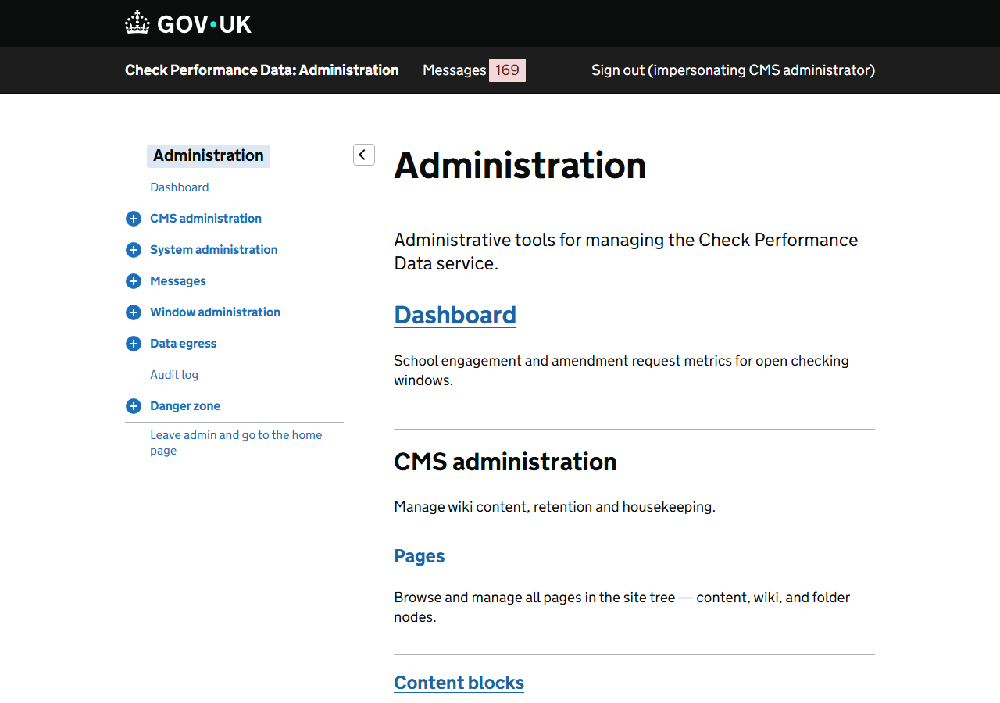
*The top of the Administration page. The side menu lists all eight groups. In the main area, each group has a heading, a description and links to its screens.*

The groups are:

- **Dashboard**: figures on school engagement and amendment requests.
- **CMS administration**: pages, content blocks, deleted pages, content staging and search analytics.
- **System administration**: the rules engine, system settings, logs, role settings and test data.
- **Messages**: search feedback and the dead-letter queue.
- **Window administration**: creating and managing checking windows.
- **Data egress**: pulling approved decisions and sending them to the Learning Data Service (LDS).
- **Audit log**: a record of administrative activity.
- **Danger zone**: actions that permanently delete data, and the blob storage browser.

### The side menu and the Messages badge

Every admin page has the same menu on the left. It shows the same groups as the Administration page. The page you are on is highlighted. Select the plus or minus button next to a group to open or close it. Select the arrow button above the menu to hide or show the whole menu.

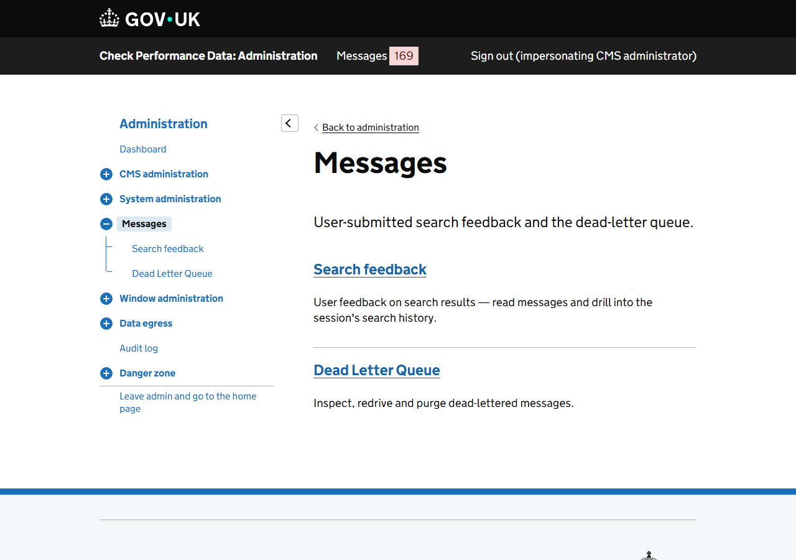
*The side menu, with the Messages group open. The count beside Messages in the header is the Messages badge.*

The Pages entry opens out into the live page tree of the site. Under the menu, **Leave admin and go to the home page** takes you back to the public service.

The **Messages** badge in the header counts 2 things added together: search feedback messages you have not read, and messages in the dead-letter queue. The count is red while the dead-letter queue has any messages in it.

### Conventions used in this guide

- You **select** links and buttons. The guide writes their names in bold, exactly as they appear on screen. Screen names and page titles are in italics.
- A **Warning** box marks an action that cannot be undone.
- Times are in UTC unless the screen says otherwise. UTC is the same as Greenwich Mean Time, and is one hour behind British Summer Time.

## 3. Dashboard

### School engagement and amendment request figures

Use the *Dashboard* to see how many schools have engaged with a checking window and how many amendment requests they have made.

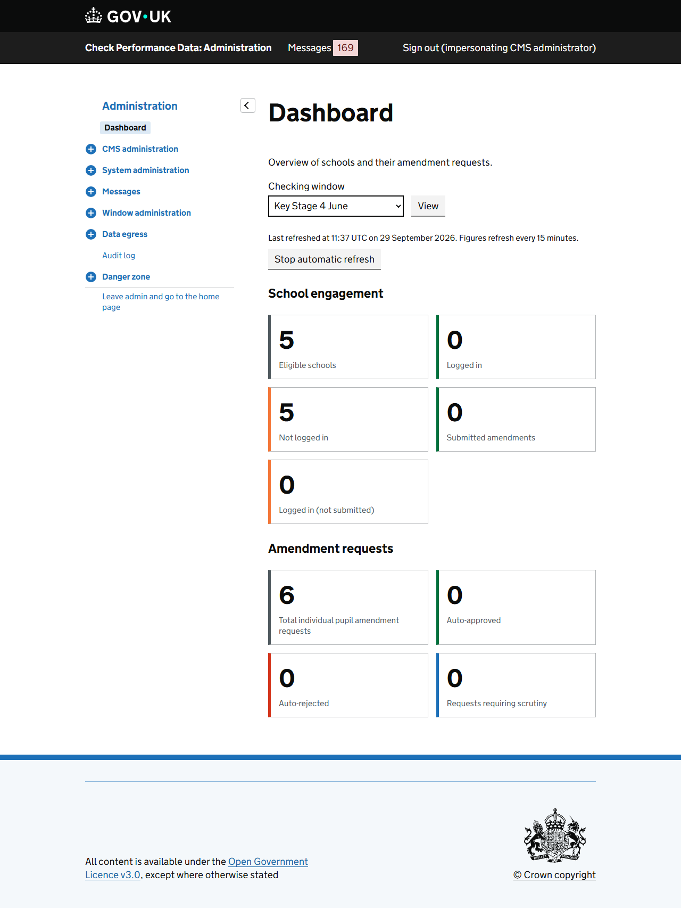
*The Dashboard for the Key Stage 4 June window.*

The dashboard lists open checking windows only. To see another window:

1. Choose a window from **Checking window**.
2. Select **View**.

The page shows when the figures were last refreshed. They refresh by themselves every 15 minutes. To stop this, select **Stop automatic refresh**. The page then says *Automatic refresh is off. Reload the page to see newer figures.* Automatic refresh needs JavaScript. Without it, reload the page to see new figures.

The dashboard has 9 tiles:

| Group | Tile | What it counts |
|---|---|---|
| School engagement | Eligible schools | Schools that have a pupil data file in the window. |
| School engagement | Logged in | Eligible schools that signed in during the window's dates. |
| School engagement | Not logged in | Eligible schools that have not signed in. |
| School engagement | Submitted amendments | Eligible schools that have submitted at least one amendment request. |
| School engagement | Logged in (not submitted) | Schools that signed in but have not submitted a request. |
| Amendment requests | Total individual pupil amendment requests | Requests that schools have submitted. Drafts and withdrawn requests are not counted. |
| Amendment requests | Auto-approved | Submitted requests that the rules engine approved. |
| Amendment requests | Auto-rejected | Submitted requests that the rules engine rejected. |
| Amendment requests | Requests requiring scrutiny | Submitted requests that the rules engine sent to a caseworker. |

Some things to know when you read the figures:

- All 5 school engagement tiles count the same group of schools: the eligible schools.
- The Logged in figure counts sign-ins the service has recorded since it started recording them. Sign-ins from before then are not included.
- A submitted request that the rules engine has not yet decided counts in the total only. It does not count as approved, rejected or scrutiny.

## 4. CMS administration

The content management system (CMS) is where every public page of the service is written and published. This group holds the tools for managing it.

This guide covers what each screen does. For step-by-step help with writing and editing pages, use the in-app guide *How to use the CMS*, which is under Help in the public service.

### Pages

Use *Pages* to find, create, edit, move, copy and delete pages.

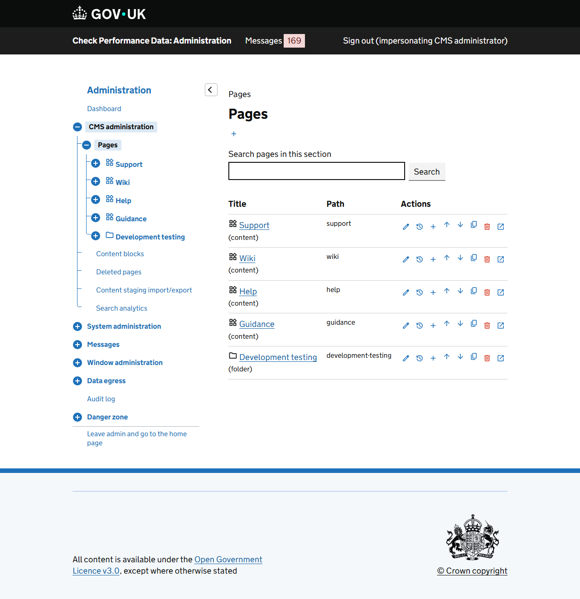
*The Pages screen, showing the top level of the site.*

The screen lists the pages at one level of the site tree. Each row shows the page title, its path and the type of page: content, wiki or folder. Select a page title to open the pages below it.

Each row has icon buttons. Their names are:

| Button | What it does |
|---|---|
| Edit | Opens the page editor in a new tab. |
| Versions | Opens the page editor on its version history. |
| Add child page | Creates a page below this one. |
| Move up and Move down | Changes the order of the page among the pages at the same level. |
| Copy | Makes a copy of the page. |
| Delete | Opens the delete confirmation for the page. |
| View | Opens the live page in a new tab. |

To search below the level you are looking at, enter words in **Search pages in this section** and select **Search**.

In the side menu, you can also press the right mouse button on a page to see the same actions: New child page, Edit, Versions, Move up, Move down, Copy page, Delete and View. You can move a page by dragging it in the side menu. Both need JavaScript.

#### Creating a page

1. To create a page at the top level, select the plus icon under the **Pages** heading. Its name is **Create a top-level page**. To create a page below another, select **Add child page** on its row.
2. Choose the **Page type**: Content, Wiki or Folder.
3. Enter the **URL segment**. Use lowercase letters, digits and hyphens only. For example, `my-page`.
4. Enter the **Title**.
5. Select **Create page**.

The service creates the page as a draft and opens it in the page editor. A new page is not live until you publish it.

#### Editing a page

Select **Edit** on a page to open the page editor. It has 3 tabs: Content, Properties and Versions. Above the tabs, a tag shows whether the page is published or a draft, and which version.

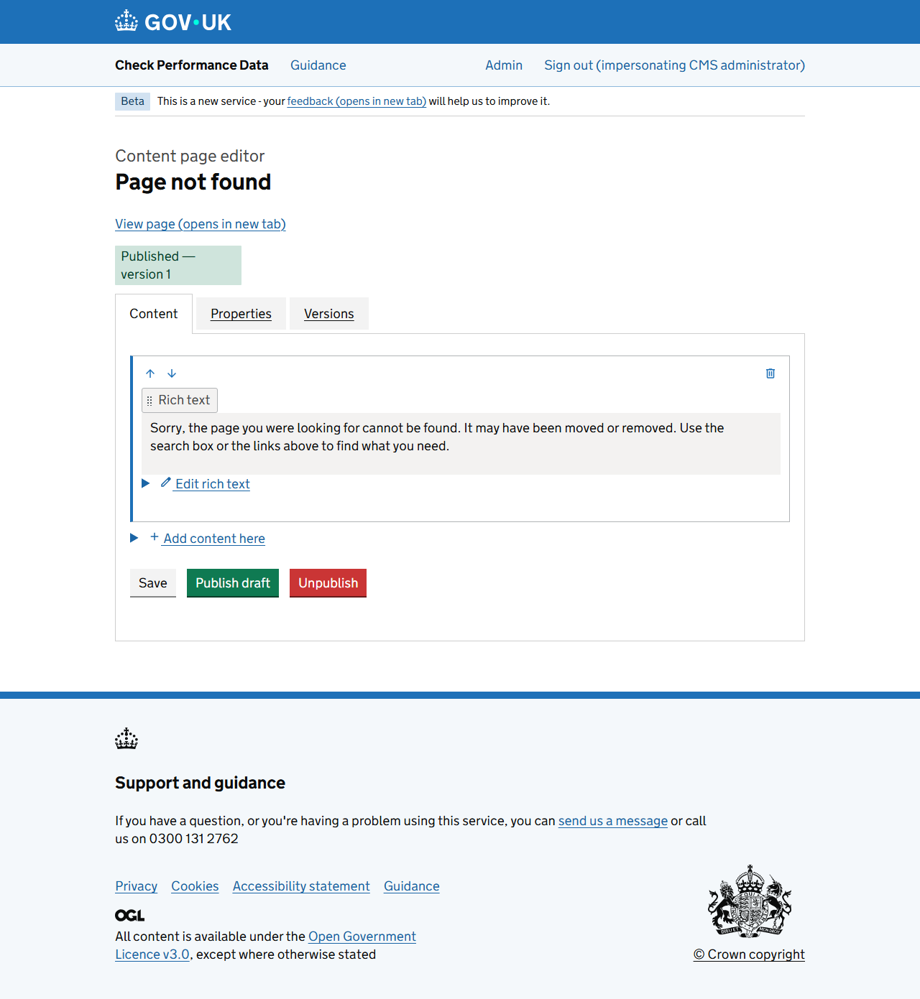
*The page editor. This page has one Rich text widget on the Content tab.*

On the **Content** tab you build the page from regions and widgets:

- A region sets the layout. The layouts are Single, Halves, Thirds, Quarters, OneThirdTwoThirds and TwoThirdsOneThird.
- A widget holds the content. The widgets are Card, Divider, Heading, Page navigation, Published callout, Rich text, Search, Search results and Summary list.

To add content, select **Add content here**. Choose a region layout and select **Add region**, or choose a widget and select **Add widget**. Widgets go inside a region. Each item has buttons to move it up or down and to delete it.

The buttons under the content are:

| Button | What it does |
|---|---|
| **Save** | Saves your changes as a draft. The live page does not change. |
| **Publish draft** | Makes the draft live. The tag above the tabs changes from *Draft* to *Published*. |
| **Unpublish** | Takes the live page offline. This button shows only while the page is published. |

On the **Properties** tab you can change the Title, Subtitle, Page name, URL segment, Show in menu, Appear in search and Search keywords. Select **Save details** to save them. The service confirms with a *Page details* message that says *Saved.* Changing the URL segment changes the address of the page and of every page below it. The service asks you to confirm with *Change page URL?*, and warns that existing links and bookmarks will stop working.

The **Versions** tab lists every saved version with its status, when it was changed and who changed it.

#### Publishing, scheduling and restoring versions

On the **Versions** tab, each version has **Publish from** and **Publish to** date and time fields, and these buttons:

- **Save** saves the dates. A version with a Publish from date in the future goes live at that time. A version with a Publish to date stops being live at that time.
- **Publish** makes that version live now.
- **Unpublish** takes the live version offline.
- **View** previews the version.

To go back to an earlier version of a page, select **Publish** on that version.

#### Deleting a page

1. Select **Delete** on the page's row.
2. Check the page name, then select **Delete page**.

You cannot delete a page that has pages below it. The screen tells you to remove or move the child pages first.

> **Warning** The delete screen says *This action cannot be undone*. In practice, the page moves to *Deleted pages*, where you can restore it. Do not rely on this: treat a delete as final.

### Content blocks

Use *Content blocks* to edit pieces of text that appear on several pages, such as the footer, without opening each page.

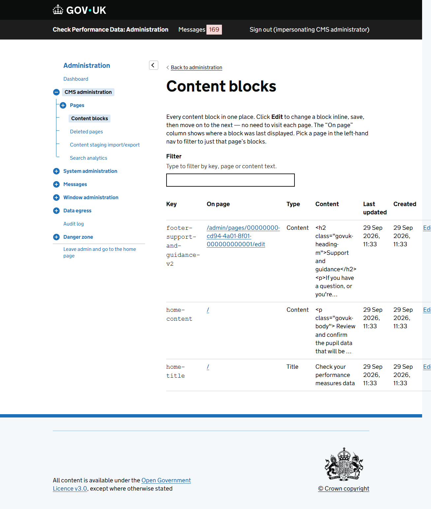
*The Content blocks screen. On a narrow window the table is wider than the screen, so scroll sideways to reach the Edit links.*

Each row shows the block key, the page it appears on, its type, its content, and when it was last updated and created. To find a block, enter words from its key, page or content in **Filter**. To see only the blocks on one page, choose that page in the side menu.

To edit a block:

1. Select **Edit** on the block's row. The edit form opens for that block.
2. Change the **Value**. You can also change **Appear in search**, which controls whether the block shows in help search results, and **Search keywords**.
3. Select **Save**, or select **Cancel** to leave the block as it was.

Each block keeps a version history. Select **Version history** in the block's edit form to see it. The *Content block versions* screen lists each version with its date, and previews the content when you select one. You can revert to an earlier version. The service asks you to confirm: *Are you sure you want to revert to version…?* It warns that this replaces the current published content, and adds the current version to the history.

### Deleted pages

Use *Deleted pages* to bring back a page that someone deleted.

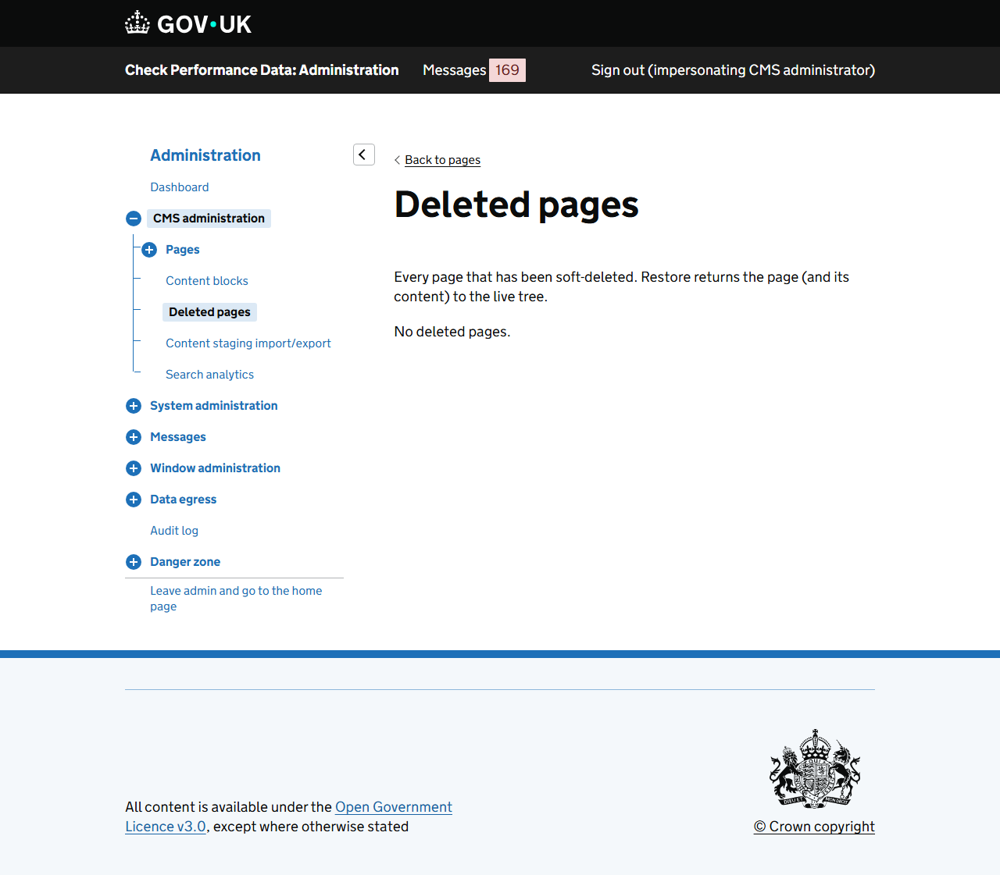
*The Deleted pages screen when no page has been deleted.*

Each deleted page is listed with its path, type, when it was deleted and who deleted it. Select **Restore** to put the page and its content back in the live tree. The service shows *Page restored.*

### Content staging import/export

Use *Content staging import/export* to move pages and content blocks from one environment to another. For example, to copy content you have tested in QA to production.

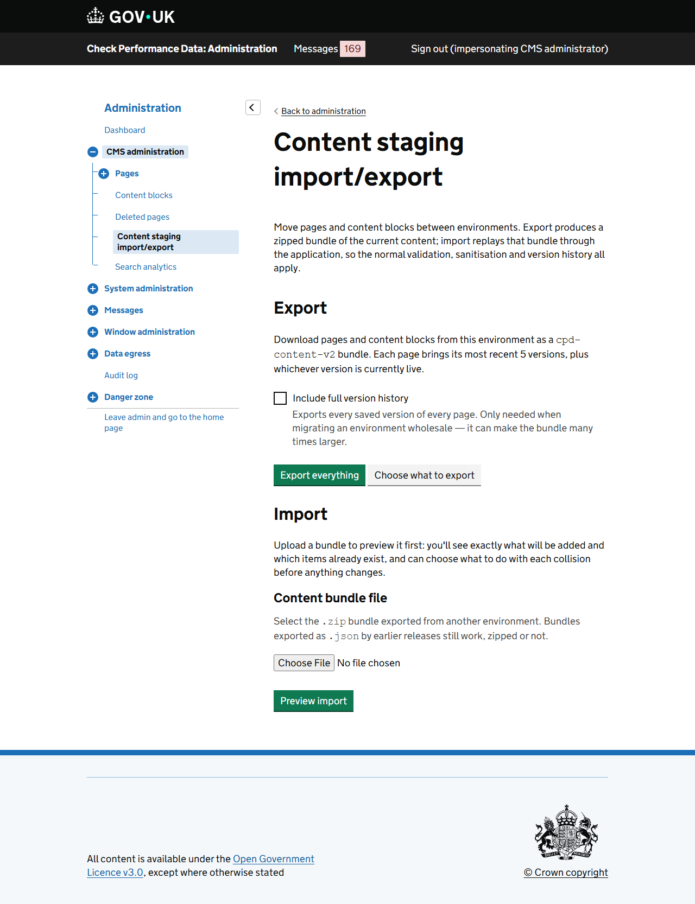
*The Content staging import/export screen.*

#### Exporting content

- Select **Export everything** to download every page and content block as a zip file.
- Select **Choose what to export** to pick items. Tick the pages and content blocks you want, then select **Export selected**. When you pick a page, its parent pages are always included, so the site structure stays intact.

Each page is exported with its 5 most recent versions and its live version. Tick **Include full version history** to export every saved version. Only do this when you are moving a whole environment, because it makes the file much larger.

#### Importing content

Importing has 2 steps. The first step changes nothing.

1. Under **Content bundle file**, choose the zip file you exported from another environment.
2. Select **Preview import**.
3. Read the *Review import* screen. It says how many items are new, how many are already in this environment and how many cannot be imported. Nothing changes until you confirm.
4. Choose what to do with the items:
    - **Default for new items**: **Include** adds them. **Skip** leaves them out.
    - **Default for items already in this environment**: **Skip** keeps what is there. **Overwrite** replaces it. **Fail** stops the import.
    - Each item also has its own choice, with **Use default** as the starting point. Use it to override the default for one item.
5. Select **Confirm import**. To leave without importing, select **Cancel**. When the import finishes, the service shows a summary such as *Import complete. Pages: 1 added, 11 updated, 0 skipped. Content blocks: 0 added, 0 updated, 0 skipped.*

Some items cannot be imported. The service lists them under *These items cannot be imported*. This happens when an item's parent page is not in this environment or in the file. The service skips these items, and does not create a blank parent for them.

An import applies the normal checks and keeps version history, as if someone had typed the content in. Every import is recorded in the audit log.

> **Warning** In development environments only, and only if the *CMS:ShowDeleteAllButton* system setting is turned on, this screen also shows a **Clear all CMS content** button. The service asks you to confirm with *Clear all CMS content?* It deletes every page and content block in the environment and cannot be undone. Only use it to reset a test environment. It is never available in production, QA or preproduction, whatever the setting says.

### Search analytics

Use *Search analytics* to see what people search for, whether they find results and where the content has gaps. The figures cover a time window you choose.

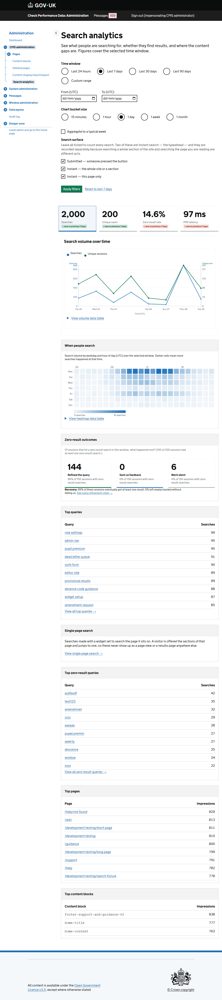
*The Search analytics screen.*

The filters at the top are:

- **Time window**: Last 24 hours, Last 7 days, Last 30 days, Last 90 days or Custom range. For a custom range, enter **From (UTC)** and **To (UTC)**.
- **Chart bucket size**: 15 minutes, 1 hour, 1 day, 1 week or 1 month.
- **Aggregate to a typical week**: tick this to combine all the weeks in the window into one typical week.
- **Search surface**: choose which kinds of search to count. *Submitted* is someone pressing the search button. *Instant, the whole site or a section* is the search-as-you-type suggestions. *Instant, this page only* is the search box that searches the page it sits on. The last 2 are recorded separately because they are different kinds of search.

Select **Apply filters** to update the screen. Select **Reset to last 7 days** to go back to the default.

Below the filters you will find:

- **4 summary figures**: Searches, Unique users, Zero-result rate and P95 latency. P95 latency is the time within which 95 out of 100 searches finished. Each figure shows how it compares with the previous period.
- **Search volume over time**: a chart of searches and unique sessions. Select **View volume data table** for the same figures as a table.
- **When people search**: a chart of searches by weekday and hour. Darker cells mean more searches. Select a cell to see the sessions behind it.
- **Zero-result outcomes**: what happened after a search that found nothing. People either refined their search, sent feedback, or gave up without telling you.
- **Top queries**, **Top zero-result queries**, **Top pages** and **Top content blocks**.
- **Single-page search**: searches made with the search box on a single page.

Zero-result queries are the list of what to write next. If people keep searching for something and find nothing, that is a content gap.

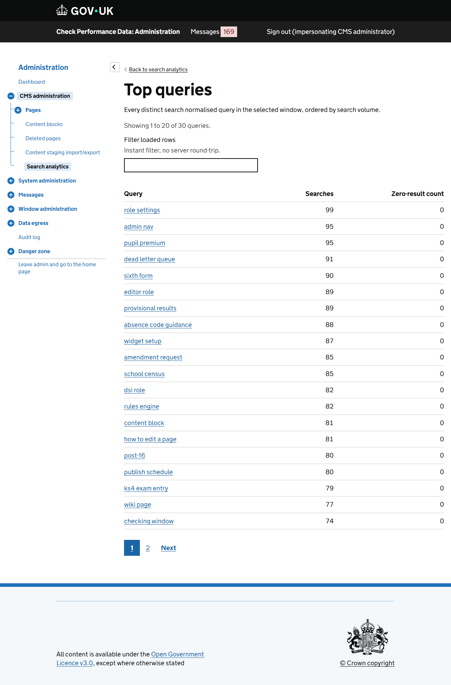
*The Top queries screen. Select **View all top queries** on the main screen to open it.*

Each list has a link to a full screen, such as **View all top queries** and **View all zero-result queries**. On the full screens you can filter the rows and move between pages. Select a query to run that search on the live site.

A session screen shows every search one visitor made, with the time, query, scope, number of results and how long each search took. The session screen also lets you delete that visitor's data.

> **Warning** Select **Delete this session's data** to permanently delete every search event and support message from that session. The service asks you to confirm with *Delete this session's data?* This cannot be undone. The deletion is recorded in the audit log.

## 5. System administration

This group holds the tools that keep the service running: the rules engine, system settings, logs and role settings.

### Rules Engine: what it does

When a school submits a change request, the rules engine decides what should happen to it. It gives each request one of 3 outcomes:

- **Auto-approved**: the request clearly meets the conditions to be accepted.
- **Auto-rejected**: the request clearly does not qualify.
- **Scrutiny**: the request goes to a caseworker for a decision.

The engine takes routine, clear-cut requests off caseworkers' desks. If it has any doubt, it chooses Scrutiny. A missing answer, an unreadable value, a reason it does not recognise or an unexpected error all lead to Scrutiny. The engine never approves or rejects a request when it is unsure.

After the engine decides, the service creates a Zendesk ticket for the request. The Department controls the rules the engine follows. You can view and change them in *Rules Engine configuration*, later in this chapter.

### Pipeline dashboard

Use the *Pipeline dashboard* to see whether requests are moving through the service, and how quickly.

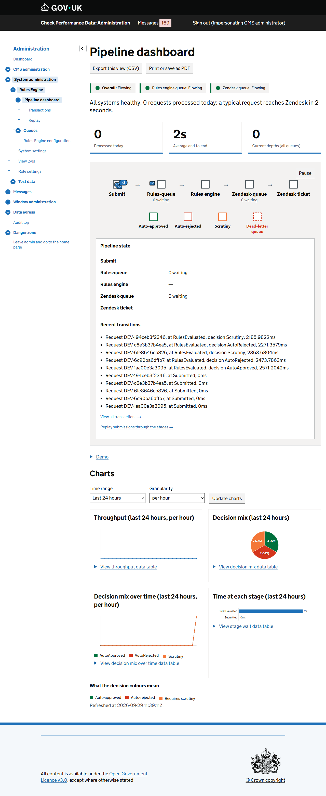
*The Pipeline dashboard, after 5 test requests had gone through the rules engine.*

The screen shows:

- **A health strip** with 3 indicators: *Overall*, *Rules engine queue* and *Zendesk queue*. Each says whether messages are flowing, or whether a queue is backing up or stalled. The thresholds for amber and red are system settings (see Appendix C).
- **A status sentence**, such as *All systems healthy*, with how many requests have been processed today and how long a typical request takes to reach Zendesk.
- **3 figures**: Processed today, Average end-to-end and Current depths (all queues).
- **The live board**, a picture of the pipeline. Requests move from Submit to Rules-queue, to Rules engine, to Zendesk-queue and to Zendesk ticket. Below them are the 3 outcomes and the dead-letter queue. Select **Pause** to freeze the moving requests while you read the board. Select **Resume** to start them again.
- **Pipeline state** and **Recent transitions**: how many messages are waiting at each stage, and the latest steps taken by recent requests.
- **Charts**: Throughput, Decision mix, Decision mix over time and Time at each stage. Choose a **Time range** (Last hour, Last 6 hours, Last 24 hours or Last 7 days) and a **Granularity**, then select **Update charts**. Each chart has a link to view its data as a table.

Select **Export this view (CSV)** to download the figures. Select **Print or save as PDF** to print the page.

Outside production, a **Demo** panel is also available. It lets testers send test requests through the pipeline. It does not appear in production.

#### Transactions

*Transactions* lists every message recorded passing through the queues, newest first.

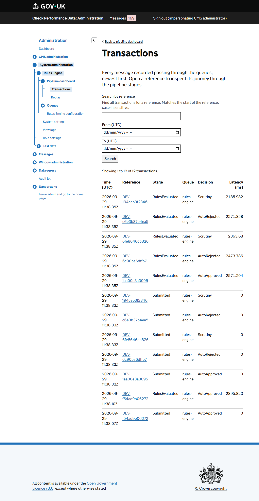
*The Transactions screen.*

To find a request:

1. Enter the start of its reference in **Search by reference**. The search matches the start of the reference and ignores capital letters.
2. If you want, enter **From (UTC)** and **To (UTC)** dates and times.
3. Select **Search**.

Each row shows the time, reference, stage, queue, decision and latency in milliseconds. Select a reference to see the journey that request took through the pipeline. The journey page shows the time of each stage and how long the request waited at it.

#### Replay

*Replay* lets you watch recent submissions move through the pipeline stages one step at a time. Use it to see how a request travelled, or to explain the process to someone.

1. Optionally, enter **From (UTC)** and **To (UTC)** and select **Filter**. Select **Reset to recent** to go back to the latest submissions.
2. Tick one or more submissions. Select **Select all on this page** to tick them all.
3. Select **Play selected**.

Replay only shows what the service has already recorded. It does not send anything again.

#### Share links and the wallboard

Share links let you show the pipeline to someone without them signing in. *Share links* has no entry in the menu. Open it by adding `/admin/share` to the address of the service. You need the *share-admin* section for your role (see Appendix B).

1. Enter a **Label** so you can recognise the link later.
2. Choose the **Surface**: *Share link* for a read-only overview of the pipeline, or *Wallboard* for a display for a wall screen.
3. Select **Generate link**.
4. Copy the link straight away. The service says *Copy this link now — it is shown once and cannot be retrieved again.*

The link shows totals only. It contains no pupil information. Anyone who has the link can open it without signing in. The *Issued links* list shows each link's label, surface, when it was created and whether it is live.

> **Warning** Select **Revoke** to switch a link off. The service does not ask you to confirm. Anyone who then uses the link sees a *Page not found* screen. You cannot switch a revoked link back on. Generate a new one instead.

### Queues

Use *Queues* to see how many messages are waiting to be processed.

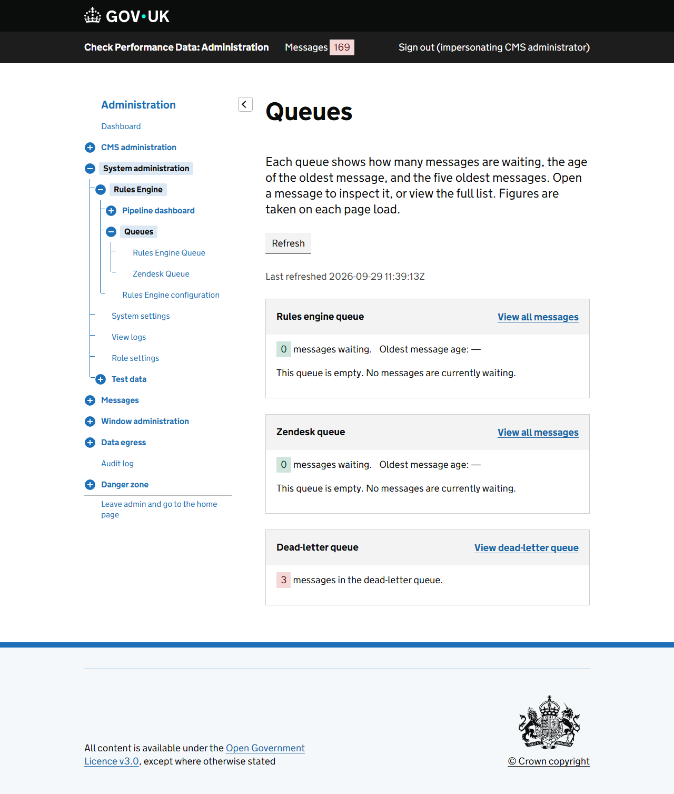
*The Queues screen.*

The screen has a section for each queue: *Rules engine queue*, *Zendesk queue* and *Dead-letter queue*. For the first two it shows the number of messages waiting, the age of the oldest message and the 5 oldest messages. The figures are taken when the page loads. Select **Refresh** to update them.

Select **View all messages** to open the full list for a queue. The list shows the messages waiting, oldest first.

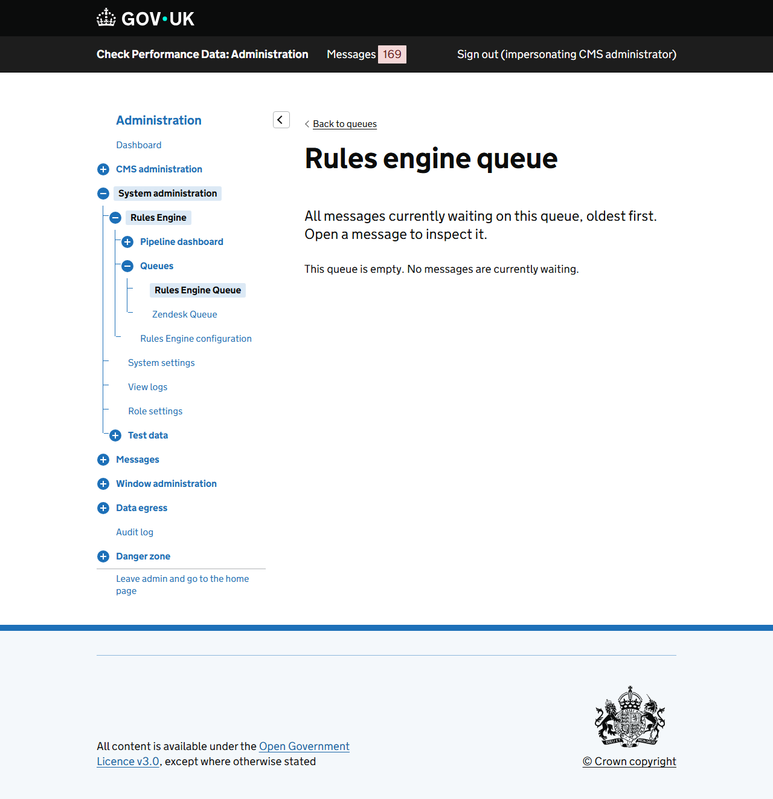
*The Rules engine queue screen when no messages are waiting.*

Select a message to inspect it. The screen hides pupil identifiers. For the dead-letter queue, select **View dead-letter queue**. Chapter 6 explains it.

### Rules Engine configuration

Use *Rules Engine configuration* to view and change the decision rules the engine follows, and the country language list it uses.

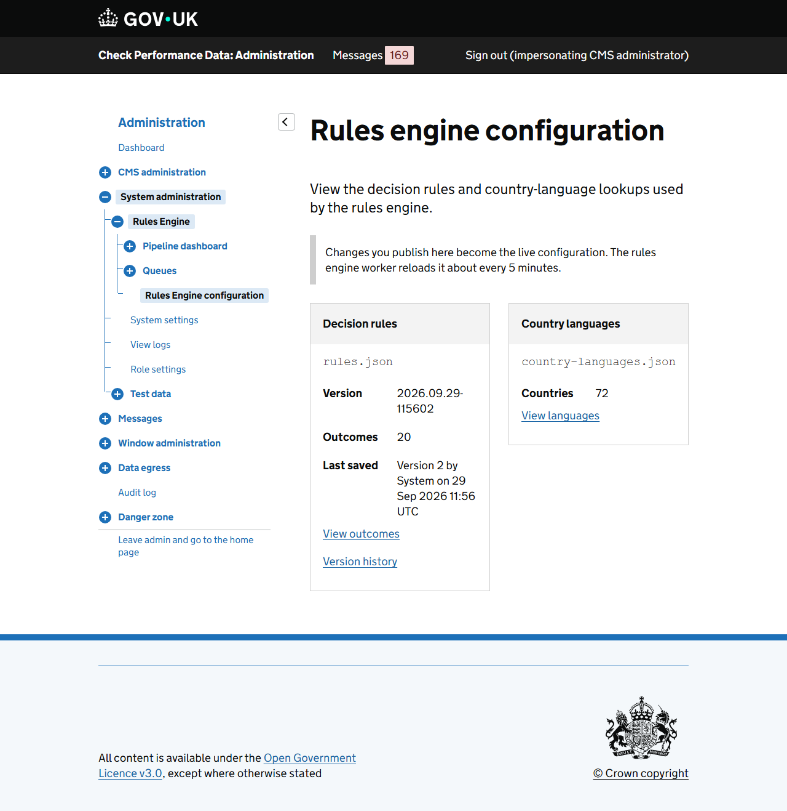
*The Rules engine configuration screen.*

The screen has 2 cards:

- **Decision rules** shows the rules version, the number of outcomes, and when and by whom they were last saved. Select **View outcomes** to change the rules. Select **Version history** to see earlier versions.
- **Country languages** shows the number of countries in the list. Select **View languages** to change the list.

Changes you publish here become the live rules. The rules engine picks them up about every 5 minutes.

An **Upload** link appears on a card only while that configuration is empty. It lets you publish a first version from a file. Once a configuration holds data, you change it on the screens described below.

#### Decision outcomes and branches

An outcome is a reason a school gives for a change, such as *Deceased* or *Not on roll*. Each outcome has one or more branches. A branch is a rule with a decision.

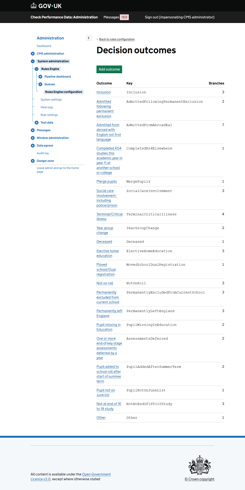
*The Decision outcomes screen.*

Select an outcome to see its branches.

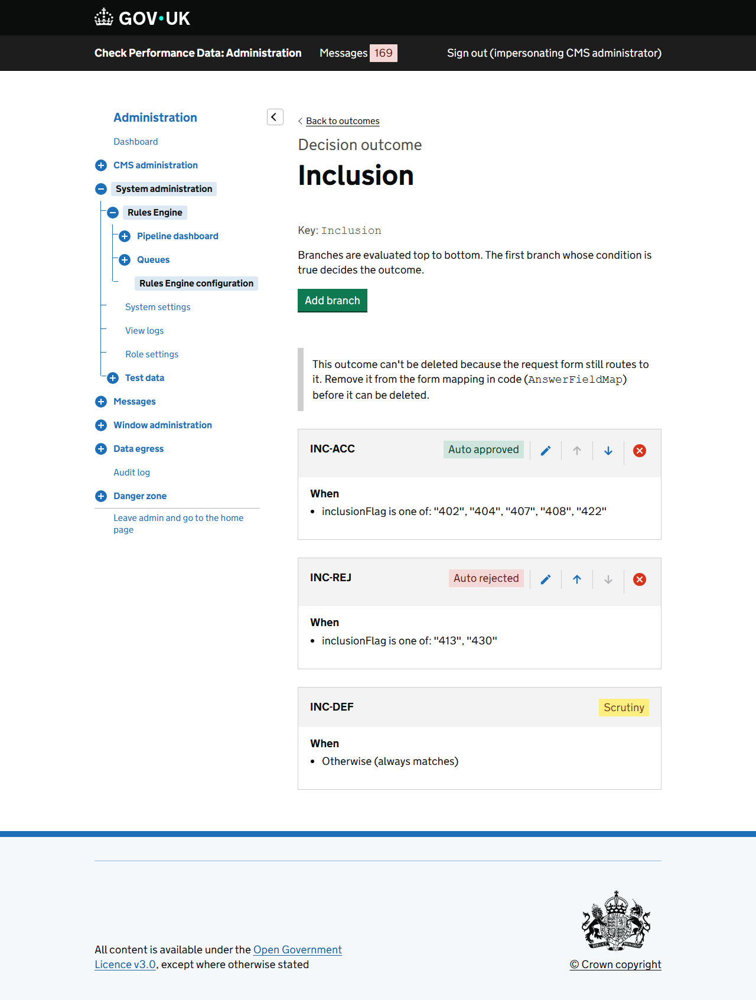
*An outcome with 3 branches. The engine checks branches from top to bottom.*

The engine checks the branches from top to bottom. The first branch whose condition is true decides the outcome. The last branch, *Otherwise*, always matches and always sends the request to Scrutiny.

To add an outcome:

1. Select **Add outcome**.
2. Enter an **Outcome key**. Use letters and numbers only, and start with a letter. The key is used in the rules and on tickets.
3. Optionally, enter a **Label**. This is the name shown in admin. It defaults to the key.
4. Select **Create outcome**.

The service adds a catch-all Scrutiny branch for you. The request form does not use a new outcome until the development team connects its key to the form. Until then, the outcome exists in the rules, but no request can use it.

To add a branch to an outcome:

1. Open the outcome, then select **Add branch**.
2. Choose the **Decision**: AutoApproved, AutoRejected or Scrutiny.
3. Build the **Condition**. Under **Match**, choose how conditions combine: *All of these*, *Any of these* or *Not (one condition)*. Select **Add condition** to add a test. For each test, choose a **Field**, which is one of the answers the school gives, then an **Operator** and a **Value**. The operators are *equals*, *does not equal*, *is one of*, *is known and certain* and *official language is*. If you change the field, select **Update field** so the operators match it. Select **Remove condition** to take a test out. Select **Add group** to nest a group of conditions.
4. Select **Save branch**.

To change a branch, select its edit icon. To reorder branches, use the up and down icons. To remove a branch, select its remove icon. The service then asks *Remove branch?* Select **Remove branch** to confirm. It records a new version, and you can roll it back.

#### Deleting an outcome

1. Open the outcome, then select **Delete this outcome**.
2. Type the outcome key in the box to confirm.
3. Select **Delete outcome**.

> **Warning** Deleting an outcome removes it and all its branches from the rules. The service records a new version, so you can roll the change back from the version history. You cannot delete an outcome while the request form still routes to it. The outcome screen tells you when that is the case.

#### Country languages

*Country languages* maps each country to its official languages. One of the rule conditions uses it to check a pupil's first language.

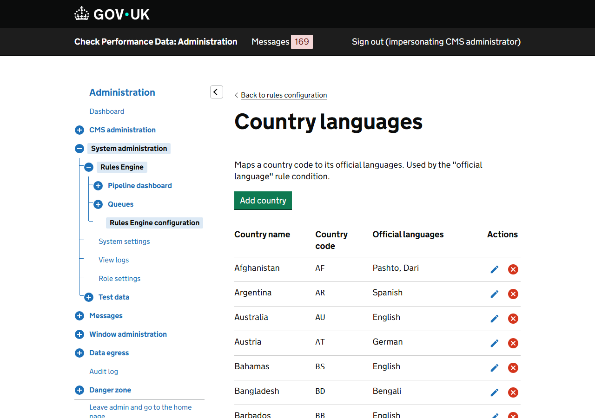
*The top of the Country languages screen. The list continues below.*

- To add a country, select **Add country**. Enter the **Country code** and one or more **Official languages**, using **Add language** for each extra one. Select **Save**.
- To change a country, select its edit icon. Change the languages, then select **Save**.
- To remove a country, select its remove icon.

> **Warning** The remove icon removes the country straight away. The service does not ask you to confirm. To bring it back, roll back to an earlier version.

#### Version history and rollback

Every change to the decision rules is saved as a new version. Select **Version history** on the *Rules Engine configuration* screen to see them.

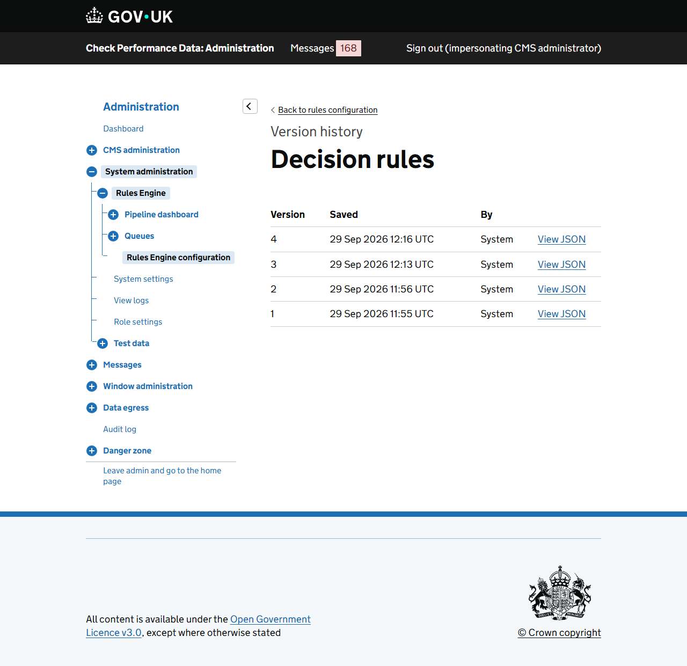
*The version history for the decision rules.*

Each version shows when it was saved and by whom. Select **View JSON** to see exactly what was saved. To go back to a version:

1. Open the version.
2. Select **Roll back to this version**.
3. On the confirmation screen, read what will happen, then select **Roll back**.

A rollback does not erase anything. It saves a new version with the older content, so you can roll forward again.

#### If someone else changed the rules first

If someone else saved a change while you were editing, the service saves nothing. It shows a message such as *The rules were changed by someone else. Nothing was saved — reload and try again.* Reload the page, check what has changed, and make your change again.

### System settings

Use *System settings* to change how the service behaves without a new release.

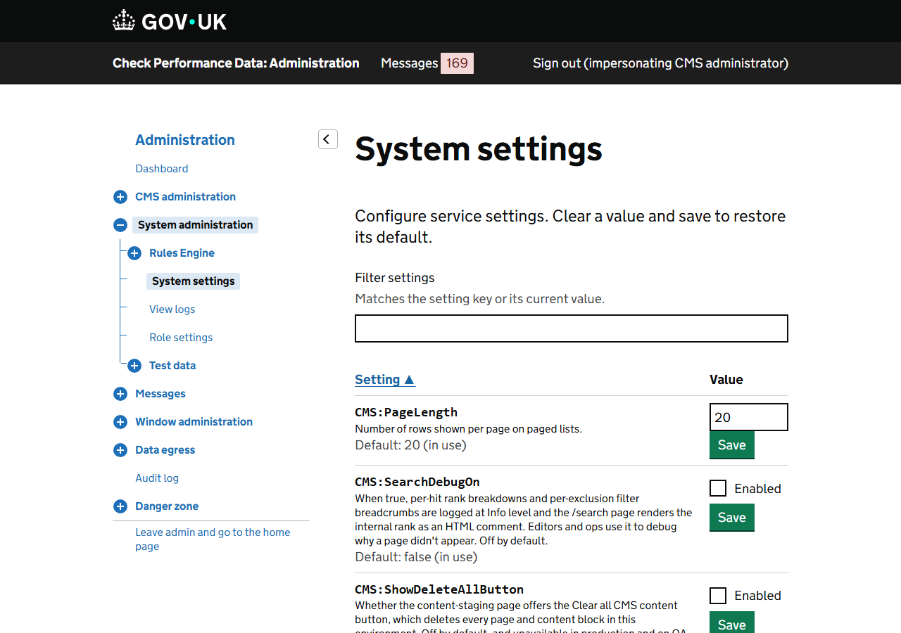
*The top of the System settings screen. The list continues below.*

The screen lists every setting with a description, its default and its current value. Enter words in **Filter settings** to find one by its name or value.

To change a setting:

1. Change its value. A tick box switches a setting on or off.
2. Select **Save** beside that setting.

Each setting saves on its own. To go back to the default, clear the value and select **Save**.

Appendix C explains every setting in plain English.

### View logs

Use *View logs* to see what the service has recorded about its own activity, and to download it. This is mainly for the development team when something has gone wrong.

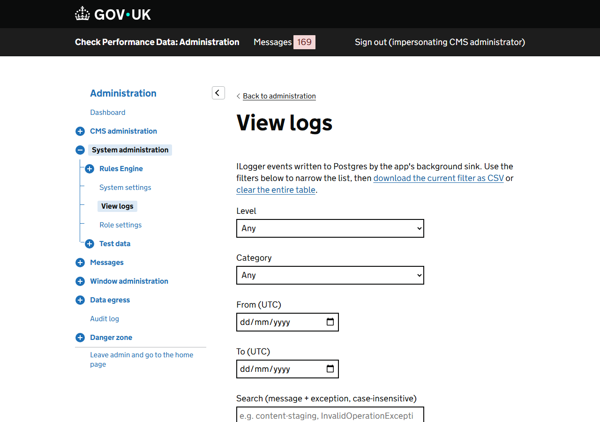
*The top of the View logs screen. The list of log entries continues below.*

The list shows the newest entries first, 20 to a page. Each entry has a timestamp, a level, a category, a message and the request that caused it.

To narrow the list, use the filters: **Level**, **Category**, **From (UTC)**, **To (UTC)** and **Search**. Search looks in the message and any error text, and ignores capital letters. Select **Apply filters**, or select **Reset** to clear them.

Select **Download CSV** to download the entries that match your filters.

> **Warning** Select **Clear all logs** to delete every log entry. The service asks you to confirm with *Clear all application logs?* This cannot be undone. New entries are recorded as normal afterwards.

### Role settings

Use *Role settings* to choose which admin sections each role can see. Chapter 1 explains roles.

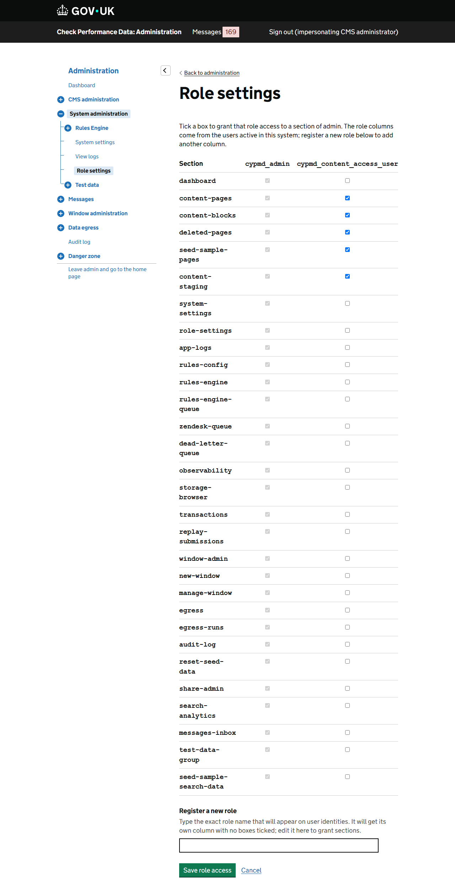
*The Role settings screen.*

The grid has one row for each admin section and one column for each role. The section names are short codes, such as `content-pages`. Appendix B explains what each one unlocks.

To change what a role can see:

1. Tick the box for each section the role should have. Clear the box for each section it should not have.
2. Select **Save role access**. The service confirms with *Role access saved.*

The `cypmd_admin` column is fixed. Administrators always have every section.

To add a role, type its name in **Register a new role**, exactly as it appears in DfE Sign-In. The role gets its own column with no boxes ticked. Tick the sections it needs, then select **Save role access**.

A change takes effect straight away on the server you saved it on. On other servers it takes effect within about a minute.

### Test data

The *Test data* group has 2 tools for filling an environment with sample content. Use them to test or demonstrate the service.

- **Seed sample CMS pages** adds a set of published sample pages under Wiki, Help, Support and Guidance. It also restores the pages used for testing. It is available in every environment except production.
- **Seed sample search data** adds made-up search events and feedback messages, so that Search analytics has something to show. You choose how far back the data goes: the last 24 hours, week, month, quarter or year. It is available in development, review and QA environments only.

> **Warning** Sample data looks like real data. Search events and feedback messages you seed appear in Search analytics and in the Search feedback inbox, and cannot be told apart from real ones. Do not seed sample data in an environment where you need to see real figures.

## 6. Messages

This group holds what the service sends to you: feedback from people who used the search, and requests that could not be processed.

### Search feedback

*Search feedback* lists messages people sent from the search results page, using the link that asks whether the results were what they expected.

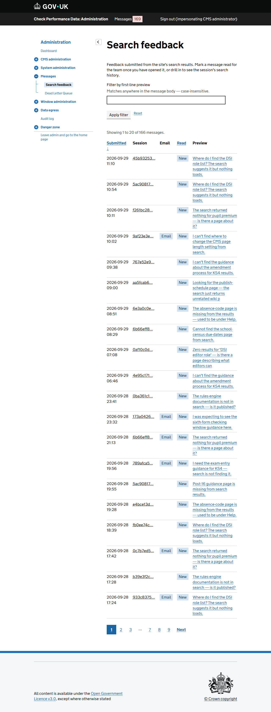
*The Search feedback screen.*

The list shows 20 messages a page. Each row shows when the message was sent, the session it came from, an *Email* tag if the person gave an email address, whether it is *New* or *Read*, and the start of the message.

- To find messages, enter words in **Filter by first-line preview** and select **Apply filter**. The filter matches anywhere in the message and ignores capital letters. Select **Reset** to clear it.
- To sort, select **Submitted** or **Read** in the column headings.

Select a message to open it. The message screen shows what the person was looking for and what they got. It also shows their last search on the site, how many results came back and what they were. Under *Message details* it shows when it was sent, the session, their email address (or that they did not want to be contacted) and the status.

- Select **Mark as read** when you have dealt with the message. The status changes to *Read*, and the screen shows who marked it. Opening a message does not mark it as read.
- Select **View this session's searches** to see everything else that person searched for.

The Messages badge in the header counts messages that are still *New*.

### Dead Letter Queue

A dead-lettered message is a request that the pipeline could not process, even after several attempts. The service moves it to the dead-letter queue so that it is not lost. Someone then decides whether to try it again or to delete it.

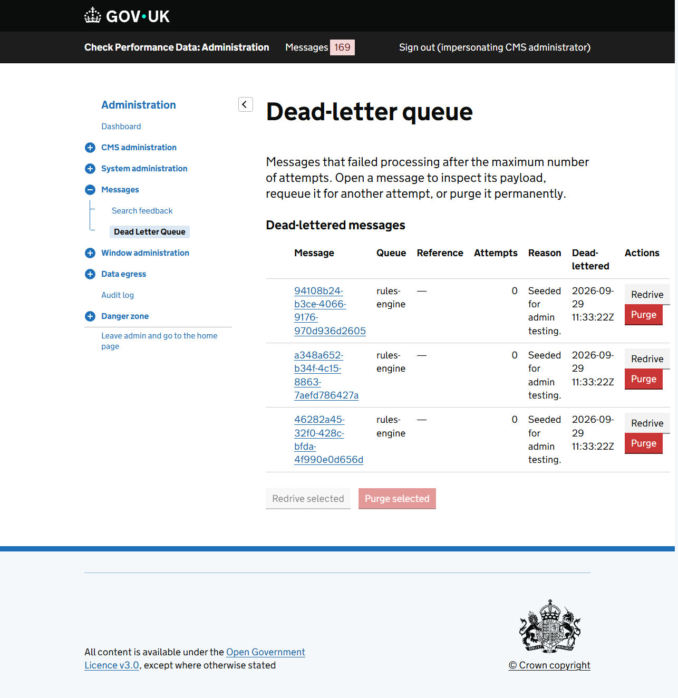
*The Dead-letter queue screen.*

Each row shows the message ID, the queue it came from, its reference, how many attempts were made, the reason it failed and when it was dead-lettered.

To try a message again:

1. Select **Redrive** on its row. To try several, tick them and select **Redrive selected**.
2. Read the confirmation. The service asks *Requeue this message?* and warns that trying again may create a downstream effect, such as a support ticket.
3. Select **Yes, requeue**.

The message goes back to the queue it came from for another attempt.

To open a message, select its ID. The detail screen shows the reason, the number of attempts and the payload, with a **Redrive** button. The payload hides pupil identifiers. An administrator can allow the full payload to be shown by turning on the *Dlq:FullPayloadEnabled* setting in System settings. Every time someone views a full payload, the service records it in the audit log.

> **Warning** Select **Purge** to delete a message from the dead-letter queue for good. To delete several, tick them and select **Purge selected**. The service asks you to confirm with *Purge this message?* This cannot be undone. The service keeps a record in the audit log that you purged it. Do not purge a message until you know that the request it carries has been dealt with another way.

The dead-letter queue also sends an email alert when it holds too many messages, and deletes old messages after a set number of days. Both are system settings (see Appendix C).

## 7. Window administration

A checking window is a period when schools can check their data and ask for changes. Window administration is where you set windows up, load the data schools check, and close them when the period ends.

### Windows, checking exercises and datasets

A **window** has:

- a **name**, such as *Key Stage 4 June*
- a **window type**: Key Stage 4 June, Key Stage 2, Post 16 or Key Stage 4 Autumn
- a **key stage**: Key stage 2, Key stage 4 or Post 16
- a **turnaround commitment**: a short sentence that tells schools when to expect changes, such as *updated in the Autumn*
- a **next opportunity**: an optional month and year. Once the window's pupil data checking has closed, schools see when they can next review their data. They see the month and year only, for example *October 2027*.

A window runs one or 2 **checking exercises**:

- **Pupil data checking**: schools check their pupil data and ask for changes.
- **Results enquiry**: schools ask about results.

Each exercise has its own opening and closing date and time. The window's overall dates are worked out from its exercises, so you do not enter them.

Each exercise also has one or more **datasets**: the data the school checks. Each dataset needs 2 files:

- an **ingress file**: the data itself. You choose it from the ingress storage area. You do not upload it from your own computer. The service copies it into the window's own storage and records a checksum, which lets it tell later if the file has changed.
- a **schema file**: a JSON file that describes what the data should look like. You do upload this from your computer.

Some datasets are marked *(optional)*. The supplier may send those later, or not at all. You can validate without them.

When both files are in place, you **validate** the exercise. Validation reads every record and checks it against the schema. When the exercise ends, you **close** it. Closing sends the requests schools have submitted for processing.

### Manage windows

Use *Manage windows* to see every window and open one.

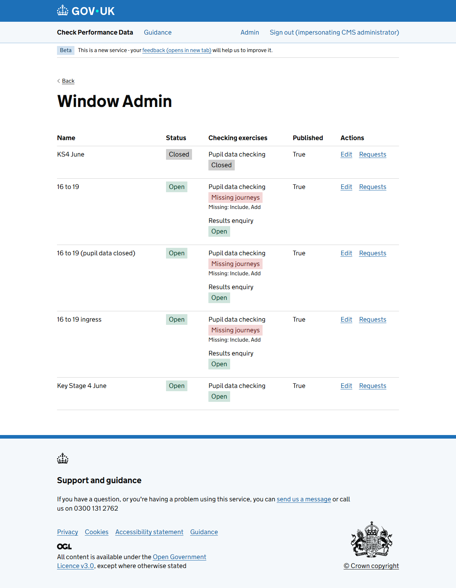
*The Manage windows screen. The screen title is Window Admin.*

The screen opens in the public layout of the service, without the admin side menu. Select **Back** to return.

The table has these columns:

| Column | What it shows |
|---|---|
| Name | The window name. |
| Status | *Open* or *Closed*. |
| Checking exercises | Each exercise with its own status tag: *Upcoming* (not open yet), *Open* or *Closed*, worked out from the exercise's dates. A red *Missing journeys* tag replaces these when the service has no request form set up for this type of window. The line beneath it lists which types of request are affected, for example *Missing: Include, Add*. Tell the development team if you see it. |
| Published | *True*. At present this column says *True* for every window, so it does not tell you anything. |
| Actions | **Edit** opens the window summary. **Requests** opens the list of requests for the window. |

### Creating a new window

Use *Create new window* to start a new window. The service takes you through 6 pages, one question at a time. It only creates the window on the last page.

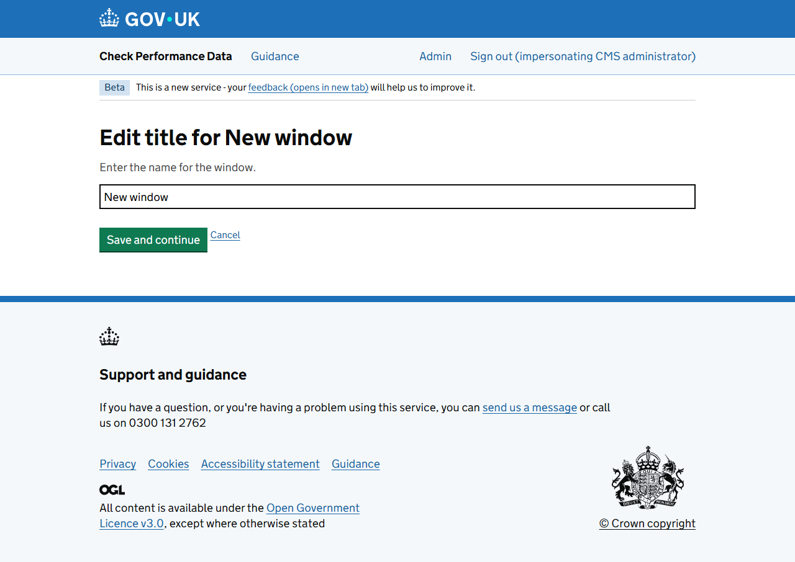
*The first page of Create new window.*

1. **Edit title for New window.** Enter the name for the window. It starts as *New window*. Select **Save and continue**.
2. **Select the window type.** Choose Key Stage 4 June, Key Stage 2, Post 16 or Key Stage 4 Autumn. Select **Save and continue**.
3. **Select the key stage.** Choose Key stage 2, Key stage 4 or Post 16. Select **Save and continue**.
4. **Which checking exercises does this window run?** Tick *Pupil data checking*, *Results enquiry* or both. Select **Save and continue**.
5. **Dates.** For each exercise you ticked, the service asks for that exercise's dates. Enter **When does it open?** as a day, month and year. Enter **What time does it open?** as an hour and minute on the 24-hour clock, such as 09 30 or 17 00. Then do the same for **When does it close?** Select **Save and continue**.
6. **Check your answers.** The page lists every answer. Select **Change** beside an answer to correct it. When everything is right, select **Save and continue**.

Selecting **Save and continue** on the last page creates the window and its storage. The service then opens the window summary page.

The service does not ask for a turnaround commitment or a next opportunity in these pages. Add them afterwards from the window summary.

#### Leaving the wizard part-way

The service keeps your answers for the rest of your session. If you leave and come back, the first page shows the name you entered. The window is not created until you complete the last page, so leaving does not affect any existing window.

> **Warning** The Cancel links in this wizard do not work as you would expect at present. On the first page, **Cancel** takes you to the Administration page if you have not saved any answers yet. If you have, it opens the *Do you want to delete this window?* page described below. On the later pages, **Cancel** shows a *Page not found* screen. On the *Check your answers* page, **Cancel** does nothing. That page is at `/admin/windows/cancel-creation`. It shows your answers, with **Continue** and **Delete** buttons. Both show *Page not found*, and **Delete** does not discard your answers. To leave, use the side menu or the header. To start again, change each answer.

### The window summary page

Select **Edit** on a window in *Manage windows* to open its summary. This is where you manage the window from day to day.

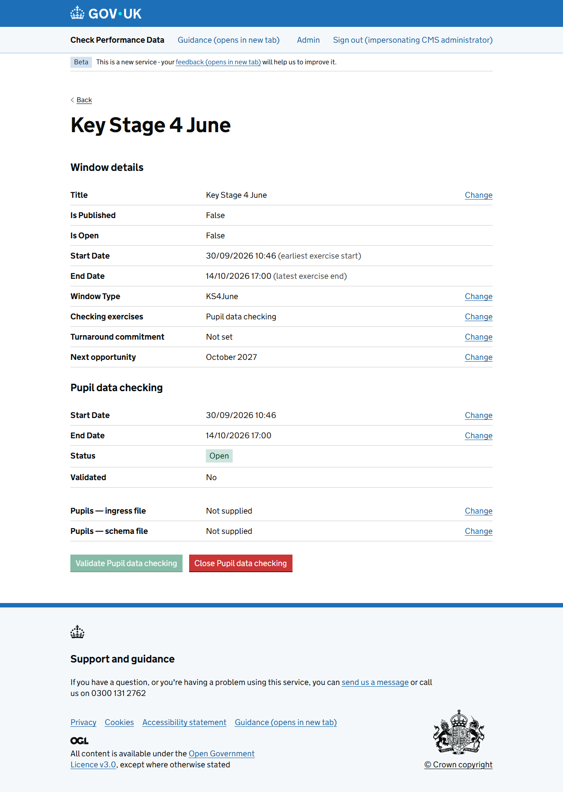
*The summary page for a window with one exercise, Pupil data checking.*

The first section, *Window details*, lists the title, whether the window is published and open, its start and end dates, its window type, its checking exercises, its turnaround commitment and its next opportunity. Select **Change** beside a row to edit it. The start and end dates have no **Change** link, because they come from the exercises. *Is Published* and *Is Open* have none either.

When you change an exercise's dates, the service checks them. It rejects an opening date in the past, with the message *Start date can not occur in the past.* It also rejects a closing date before the opening date, with *End date can not occur before the start date.* The first check applies even if you only want to change the closing date of an exercise that has already opened. The service cannot save changes to the dates of an exercise that has already opened. If you need to move the closing date of an open exercise, ask the development team.

*Is Published* and *Is Open* can differ from the *Published* and *Status* columns on *Manage windows*. For example, a window that *Manage windows* shows as open can show *False* here. If they disagree, ask the development team which is right.

Below that, each exercise has its own section. It shows:

- **Start Date** and **End Date**, with **Change** links.
- **Validated**: *Yes* with the date and time, *No*, or *Not since the files changed*. The last one means the exercise was validated once, but someone has since replaced a file. Validate again.
- One line for each dataset's **ingress file** and **schema file**, each with a **Change** link. A missing file shows *Not supplied*.
- **Status**: *Open*, *Closed* or *Upcoming*. An exercise is open between its start and end dates.
- Buttons named after the exercise. **Validate Pupil data checking** is always shown for an exercise that has files to load. **Close Pupil data checking** is shown only while the exercise is open. **Send Pupil data checking requests for processing** is shown only once the exercise has closed.

#### Choosing an ingress file

1. Select **Change** beside a dataset's ingress file.
2. On *Browse ingress files*, choose a storage container from the list.
3. Open folders until you find the file. Select **Back to Containers** to start again.
4. Under **Select a file**, choose the file.
5. Select **Use selected file**.

The service copies the file into the window's own storage and records its checksum. Then it returns you to the summary page. Nothing is uploaded from your computer.

The screen says *No ingress containers were found* if the ingress storage area is empty. The file has to be placed there by whoever supplies the data first.

#### Uploading a schema file

1. Select **Change** beside a dataset's schema file.
2. On *Upload a JSON schema file*, choose the file from your computer.
3. Select **Save and continue**.

#### Validating an exercise

Validation checks every record against the schema. The validate button is greyed out until the exercise has all the files it needs.

1. Select the validate button for the exercise, such as **Validate Pupil data checking**.
2. On the validation page, select **Run validation**.
3. Watch the progress. The page counts *Records read*, *Records processed*, *Files written* and *Errors* as it goes.
4. When it finishes, read the result. *Validation complete* means no errors. *Validation failed* means at least one error, and the page describes what was wrong.
5. The page lists *Records processed per LAESTAB*: one row for each school, with the number of records checked.

If validation fails, fix the data at source, put the corrected file in the ingress storage area, choose it again as the ingress file, and validate again.

Without JavaScript the page works differently. There is no live progress. The result appears once validation has finished.

#### Closing an exercise early

Use this to stop schools using an exercise before its scheduled end. You can only close an exercise that is open.

1. Select the close button for the exercise, such as **Close Pupil data checking**.
2. Read the confirmation page. It shows the window, the exercise and its scheduled end.
3. Under **To confirm, type the window name**, type the window's name exactly as the page shows it. Capital letters matter.
4. Select the close button again to confirm, or select **Cancel** to go back.

If the name you type does not match, the exercise stays open. The page shows *The window name you entered does not match*. Correct the name and try again.

> **Warning** You cannot undo closing an exercise. From that moment schools cannot make new requests for it, and any school part-way through a request is stopped on its next page. The service also sends every request schools have submitted for processing, and cancels drafts that a school has not submitted. Submitted requests cannot be changed afterwards. Cancelled drafts cannot be resumed.

After it closes, the summary page shows a *Success* banner, for example *Pupil data checking was closed early on 03/09/2026, 10:39 by Sam Taylor. 1 request sent for processing and 10 drafts cancelled.* The exercise's **End Date** becomes the time you closed it, its **Status** becomes *Closed*, and the close button is no longer shown. The close is recorded in the audit log.

The banner and the end date use the service's own clock. During British Summer Time that clock is one hour behind UK time, so a close at 13:33 shows as 12:33.

If the service closes the exercise but cannot send its requests for processing, the summary page shows an *Important* banner instead. It says the exercise was closed and that its requests could not be sent. The exercise is closed. Select **Send Pupil data checking requests for processing** to try again.

#### Sending requests for processing after an exercise has closed

When an exercise reaches its scheduled end, the service does not send its requests for processing by itself. Someone must do it.

1. Select **Send Pupil data checking requests for processing** in the exercise's section. The button appears once the exercise has closed.
2. Read the confirmation page. It says how many *Requests to send for processing* and how many *Drafts to cancel*.
3. Select **Send requests for processing** to confirm, or select **Cancel** to go back.

> **Warning** You cannot undo this. Submitted requests are sent for processing and cannot be changed afterwards. Drafts that a school has not submitted are cancelled, and cannot be resumed.

You do not need to do this after closing an exercise early, because closing it early also sends its requests. If there is nothing left to send, the confirmation page says so.

### Requests for a window

Select **Requests** on a window in *Manage windows* to see every request made in that window. The page is read-only. Use it to check what schools have asked for, and what happened to each request.

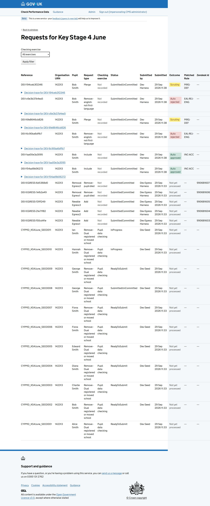
*The top of the Requests screen. The table continues below and is wider than the screen.*

To show one exercise only, choose it under **Checking exercise** and select **Apply filter**. Results enquiries appear here under the Results enquiry exercise.

Each row shows:

- **Reference**, **Organisation URN**, **Pupil** and **Request type**
- **Checking exercise** (or *Not recorded* if the request has none)
- **Status**, such as InProgress, ReadyToSubmit, SubmittedUnCommitted or SubmittedCommitted
- **Submitted by** and **Submitted**
- **Outcome**: *Auto approved*, *Auto rejected* or *Scrutiny*, or *Not yet processed*
- **Matched Rule**: the rule that decided the outcome
- **Zendesk Id**: the ticket, once one exists

For a request the rules engine has decided, select **Decision trace** under the row to see how the engine reached its decision. The trace lists each condition the engine checked and whether it was true, ending with the rule that decided.

### Who can do what

Two sections control window administration, and you give them to a role separately:

- **new-window** lets a role start the Create new window pages.
- **manage-window** lets a role use Manage windows, the window summary, the requests list, and the pages for changing a window.

The Create new window wizard uses pages from both sections. A role that has only one of them gets a *Page not found* screen part-way through. Give both sections together. Chapter 5 explains how to change what a role can see, under Role settings.

## 8. Data egress

### What an egress run is

An egress run takes the decisions that caseworkers have made in Zendesk for one checking window, prepares them to the Learning Data Service (LDS) specification, checks the files, and sends them to LDS.

A run works with one or 2 **output types**:

- **New learners**: requests to add a pupil.
- **Remove learners**: requests to remove a pupil.

Only one run can be active for a checking window and an output type at any time. If a colleague already has one, the service tells you who and since when. Once an output type has been sent to LDS for a window, it cannot be sent again. A run that failed, or that someone abandoned, does not block a new one.

### Starting a run

Use *Start a new egress* to begin.

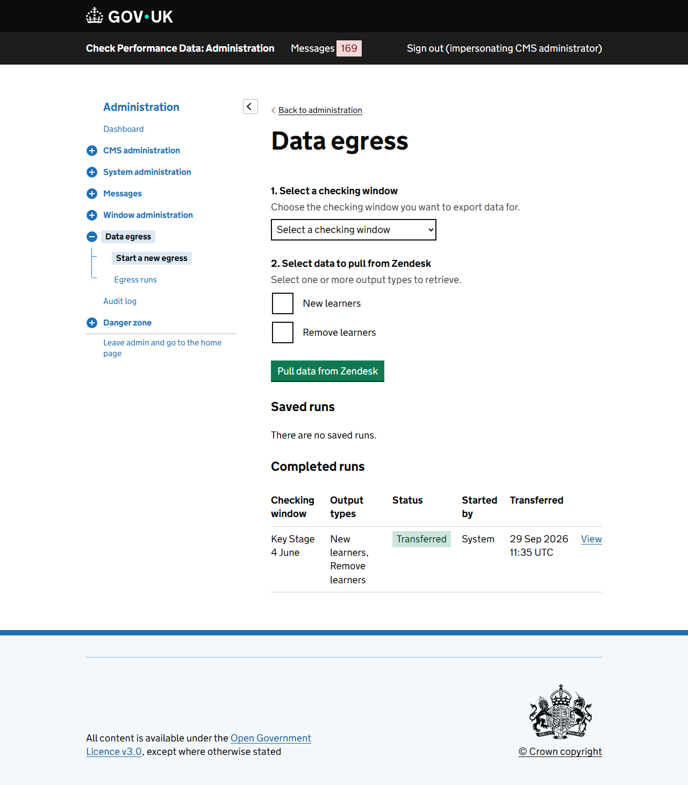
*The Data egress screen.*

1. Under **1. Select a checking window**, choose the window.
2. Under **2. Select data to pull from Zendesk**, tick **New learners**, **Remove learners** or both.
3. Select **Pull data from Zendesk**.

The service saves the run as soon as the pull finishes. The same screen lists *Saved runs* that are still in progress, each with a **Resume** button, and *Completed runs*, with a **View** link.

If the service refuses to start the run, it says why. There are 2 common reasons:

- *{Output type} for this checking window is already being processed by {name}, started {date} at {time} UTC. Wait for that run to finish or be abandoned.*
- *{Output type} for this checking window has already been transferred to LDS by {name} on {date} at {time} UTC. It cannot be sent again.*

### Reviewing the pulled data, preprocessing and transferring

A run has 5 screens. You move through them in order.

**1. Data pulled from Zendesk.** The screen lists every request for the output types you chose, whatever its decision, with one tab for each output type. Each row shows the ticket ID, reference, decision, reason and the pupil details. Only approved and auto-approved requests go forward.

The buttons are **Proceed to preprocessing**, **Save and exit** and **Abandon run**.

**2. Preprocessing data.** Select **Run preprocessing**. The service prepares the records in 8 steps and shows progress as it goes: Filter records, Derive correction codes, Split DfE establishment number, Standardise dates, Build LDS records, Trim values, Validate against LDS spec and Save to database. Do not leave the page while it runs. If you do, the run goes back to the pulled data and nothing is saved. When it finishes, the service takes you to the next screen.

**3. Preprocessing failed.** You only see this screen if a record has a problem. The service says how many problems it found. One failing record fails the whole batch, so nothing is saved and nothing is sent. The *Records that failed* list shows the **Ticket ID**, **Reference**, **Step**, **Field** and **Problem** for each one. Correct the source data in Zendesk, then select **Start a new egress**. Select **View the pulled data** to look at the records again. You cannot retry a failed run. You always start a new one.

**4. Confirm transfer to LDS.** The screen shows the checking window, when the data was preprocessed and the target container. Under *Files to be transferred* it lists each file with its record count. Select **preview** beside a file name to look at it, and **Download** to save a copy. When you are sure, select **Confirm and transfer**.

**5. Transfer complete.** The screen shows what was sent: the files, the number of records in each, and a checksum for each. It also shows who transferred them, when, and the status *Success*. Select **Start a new egress** to begin another run.

If the transfer fails, the service removes any file it had already written. The run shows as failed. You can try the transfer again from the *Confirm transfer to LDS* screen.

The *Data pulled from Zendesk*, *Preprocessing data* and *Confirm transfer to LDS* screens all have **Save and exit** and **Abandon run**. **Save and exit** only leaves the page. You do not need to save, because the service saved the run when the pull finished. Select **Resume** on the *Data egress* screen to go back to where you were.

> **Warning** **Abandon run** does not ask you to confirm. It ends the run straight away. If the run was in the middle of a transfer, the service also removes any files it had already written to LDS storage. The run can never be resumed. You need to start a new one.

### Egress runs

Use *Egress runs* to see the history of every run.

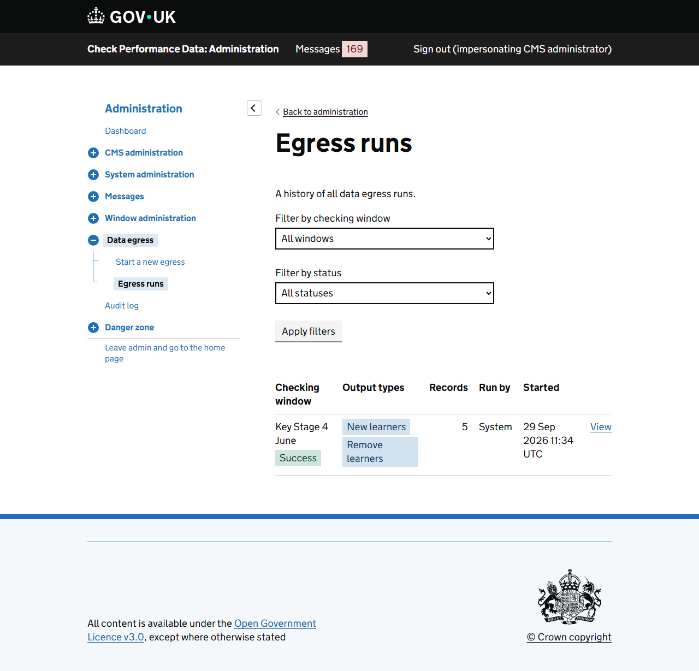
*The Egress runs screen.*

You can filter by **checking window** and by **status**, then select **Apply filters**. The statuses are:

- **Success**: the files were sent to LDS.
- **Failed**: preprocessing or the transfer failed.
- **Draft**: the run is still in progress.
- **Abandoned**: someone abandoned it.

Each row shows the checking window, the output types, the number of records, who ran it and when it started. The **Records** figure is what LDS received. It is 0 for any run that was not sent. Select **View** to open a finished run. For a run in progress, the link is **Resume**.

## 9. Audit log

Use the *Audit log* to see a record of administrative activity in the service, including every data egress run.

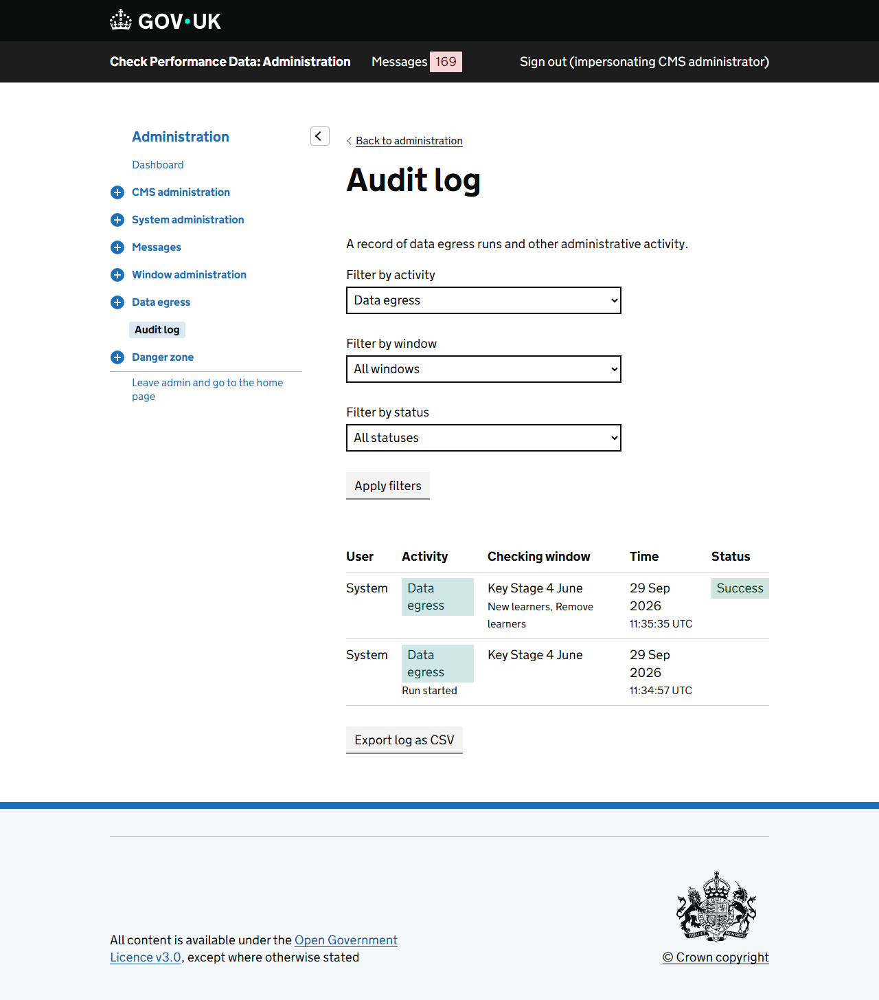
*The Audit log, filtered to Data egress.*

The list shows the newest entries first, 20 to a page. The columns are **User**, **Activity**, **Checking window**, **Time** and **Status**.

- For data egress, the Activity is a *Data egress* tag. A pull shows *Run started*. A transfer shows a *Success* or *Failed* status.
- When someone closes an exercise early, the Activity is a *Window admin* tag. The Checking window column names the window, with the exercise and *closed early, before scheduled end* beneath. The User column shows who closed it, and the Status is *Success*.
- For everything else, the Activity is the type of item that changed, with the action beneath it: Insert, Update or Delete.
- Actions the service takes for itself show *System* as the user.

By default the log shows all activity. Most of it is routine application log entries, marked *App log*, which can hide the entries you want. To find something, use the filters:

- **Filter by activity**: choose the type of item, such as *Data egress*, *Dead letter* or *Role access*.
- **Filter by window**: choose a checking window.
- **Filter by status**: *Success* or *Failed*. Data egress transfers have either. An exercise closed early is always *Success*.

Select **Apply filters**. The filters work together.

Select **Export log as CSV** to download every entry that matches your filters.

You cannot edit or delete audit log entries from the service.

## 10. Danger zone

This group holds actions that permanently delete or change data. Use them with care.

### Reset seed data

Use *Reset seed data* to put a test environment back to its starting state.

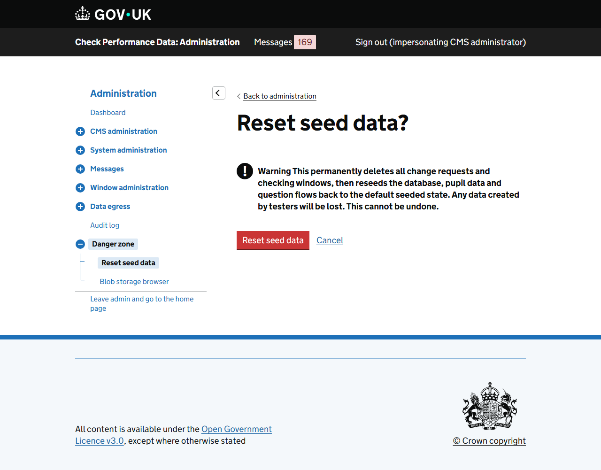
*The Reset seed data screen.*

The screen is available in every environment except production. Testers use it on development, QA and preproduction.

> **Warning** This permanently deletes all change requests and checking windows. It then puts the database, pupil data and question flows back to the default seeded state. Any data testers created is lost. This cannot be undone. The screen is the only confirmation. When you select **Reset seed data**, it happens straight away. Select **Cancel** to leave.

### Blob storage browser

Use the *Blob storage browser* to look at files in the service's storage, and to upload, download and delete them.

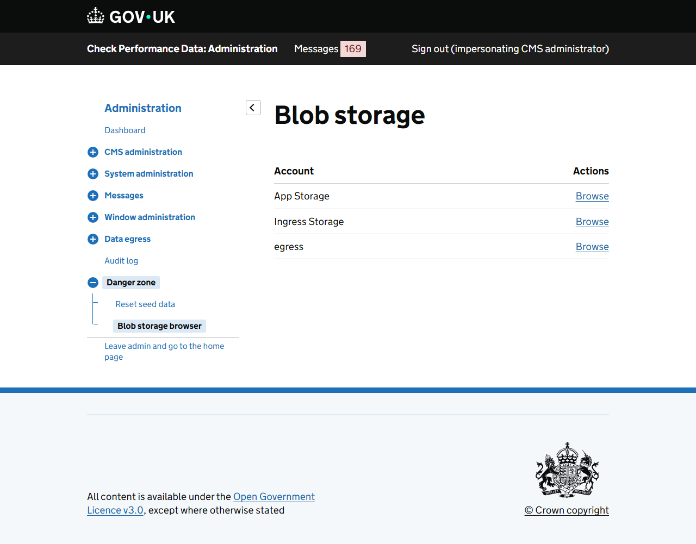
*The Blob storage screen.*

There are 3 storage accounts:

- **App Storage**: the service's own files. It holds one container for each checking window, with the pupil data for that window.
- **Ingress Storage**: the files that suppliers send in, which you choose from when you set up a window.
- **egress**: the files prepared for LDS.

To find a file:

1. Select **Browse** beside an account.
2. Select **Browse** beside a container. The screen says how many containers the account holds.
3. Select **Open** on a folder to go into it. Select **Up to container root** to come back out. Files show **Preview**, **Download** and **Delete** buttons. The preview screen also has a **Download this blob** link.

To upload files, use the *Upload files* section at the top of a container. Choose one or more files. To put them in a new sub-folder, type its name in **Folder (optional)**. Leave it blank to upload into the folder you are looking at. Then select **Upload**.

Storage can hold pupil data. Only open, download or preview files that you need to. Look after any file you download.

> **Warning** Select **Delete** on a file to delete it from storage. The only check is a message from your browser that asks *Delete {file name}?* Once you confirm, the file is gone and cannot be recovered. Do not delete the files a window or an egress run depends on.

## Appendix A: Actions that cannot be undone

This table lists the actions in the admin area that change or delete data. It says whether the service asks you to confirm first.

| Screen | Action | What it does | Does it ask you to confirm? |
|---|---|---|---|
| Window summary | Close an exercise early | Ends the exercise for schools straight away, sends submitted requests for processing and cancels drafts. Cannot be undone. | Yes. You must type the window's name. |
| Window summary | Send requests for processing | For an exercise that has closed: sends submitted requests for processing and cancels drafts. Cannot be undone. | Yes. A confirmation page shows the counts. |
| Data egress | Confirm and transfer | Sends the files to LDS. The same output type cannot be sent again for that window. | No. The screen warns you that this cannot be undone. |
| Data egress | Abandon run | Ends the run for good. Removes any files a transfer had already written. | No. |
| Dead-letter queue | Purge | Deletes a message for good. The audit log keeps a record of the purge. | Yes. A dialog asks *Purge this message?* |
| Dead-letter queue | Redrive | Sends a message back to its queue. May create a ticket. | Yes. A dialog asks *Requeue this message?* |
| View logs | Clear all logs | Deletes every log entry. | Yes. A dialog asks *Clear all application logs?* |
| Search analytics | Delete this session's data | Deletes every search event and message from one session. | Yes. A dialog asks *Delete this session's data?* |
| Share links | Revoke | Switches a share link off for good. | No. |
| Rules Engine configuration | Delete an outcome | Removes an outcome and its branches. Can be rolled back. | Yes. You type the outcome key. |
| Rules Engine configuration | Remove a branch | Removes one branch. Can be rolled back. | Yes. A confirmation page. |
| Rules Engine configuration | Remove a country | Removes a country from the language list. Can be rolled back. | No. |
| Rules Engine configuration | Roll back | Saves an earlier version as a new version. | Yes. A confirmation page. |
| Pages | Delete a page | Moves the page to Deleted pages, where it can be restored. The screen says it cannot be undone. | Yes. A confirmation page. |
| Content blocks | Revert to an earlier version | Replaces the published content with an earlier version. | Yes. A dialog. |
| Content staging import/export | Import with Overwrite | Replaces content that already exists. | Yes. The *Review import* screen. |
| Content staging import/export | Clear all CMS content | Deletes every page and content block. Development environments only. | Yes. A dialog asks *Clear all CMS content?* |
| Blob storage browser | Delete a file | Deletes the file from storage. | Only a browser message. |
| Danger zone | Reset seed data | Deletes all change requests and windows, then reseeds. Not in production. | The Reset seed data screen is the only confirmation. |

## Appendix B: Admin sections a role can be granted

*Role settings* lists 30 sections. This table shows what each one unlocks, grouped in the order of the Administration page.

| Group | Section | What it unlocks |
|---|---|---|
| Dashboard | `dashboard` | Dashboard |
| CMS administration | `content-pages` | Pages |
| CMS administration | `content-blocks` | Content blocks |
| CMS administration | `deleted-pages` | Deleted pages |
| CMS administration | `content-staging` | Content staging import/export |
| CMS administration | `search-analytics` | Search analytics and its drill-down screens |
| System administration | `observability` | Pipeline dashboard |
| System administration | `transactions` | Transactions |
| System administration | `replay-submissions` | Replay |
| System administration | `share-admin` | Share links, which has no menu entry |
| System administration | `rules-engine` | Queues |
| System administration | `rules-engine-queue` | Rules Engine Queue |
| System administration | `zendesk-queue` | Zendesk Queue |
| System administration | `rules-config` | Rules Engine configuration |
| System administration | `system-settings` | System settings |
| System administration | `app-logs` | View logs |
| System administration | `role-settings` | Role settings |
| System administration | `test-data-group` | The Test data heading |
| System administration | `seed-sample-pages` | Seed sample CMS pages |
| System administration | `seed-sample-search-data` | Seed sample search data |
| Messages | `messages-inbox` | Search feedback |
| Messages | `dead-letter-queue` | Dead Letter Queue |
| Window administration | `window-admin` | The Window administration heading |
| Window administration | `new-window` | Create new window |
| Window administration | `manage-window` | Manage windows, the window summary and the requests list |
| Data egress | `egress` | Start a new egress and every screen of a run |
| Data egress | `egress-runs` | Egress runs |
| Audit log | `audit-log` | Audit log |
| Danger zone | `reset-seed-data` | Reset seed data |
| Danger zone | `storage-browser` | Blob storage browser |

## Appendix C: System settings reference

This appendix explains every setting on the *System settings* screen. The setting names are the ones the screen shows. Chapter 5 explains how to change them.

### CMS

| Setting | What it does | Default |
|---|---|---|
| `CMS:PageLength` | The number of rows shown on each page of a list. | 20 |
| `CMS:SearchDebugOn` | When on, the service records why each page did or did not appear in a search, for people fixing search problems. | Off |
| `CMS:ShowDeleteAllButton` | When on, the Content staging screen offers the Clear all CMS content button. It never appears in production, QA or preproduction, whatever this says. | Off |

### Dead-letter queue

| Setting | What it does | Default |
|---|---|---|
| `Dlq:AlertRecipients` | The email addresses to tell when the dead-letter queue is too long. Separate addresses with commas. | Empty |
| `Dlq:AlertThreshold` | The number of messages in the dead-letter queue at which the service sends an email alert. | 10 |
| `Dlq:FullPayloadEnabled` | When on, administrators can see the full contents of a dead-lettered message, including pupil details. Every view is recorded in the audit log. | Off |
| `Dlq:RetentionDays` | How many days a dead-lettered message is kept before it is deleted. The audit log entries are kept separately. | 90 |

### Pipeline health thresholds

These settings decide when the health strip on the Pipeline dashboard changes colour.

| Setting | What it does | Default |
|---|---|---|
| `Health:DepthAmber` | The number of messages waiting in a queue at which the strip turns amber. | 25 |
| `Health:DepthRed` | The number of messages waiting in a queue at which the strip turns red. | 100 |
| `Health:DlqRateRed` | The number of messages in the dead-letter queue at which the strip turns red. | 5 |
| `Health:OldestAgeAmberSeconds` | How old, in seconds, the oldest waiting message must be for the strip to turn amber. | 120 |
| `Health:OldestAgeRedSeconds` | How old, in seconds, the oldest waiting message must be for the strip to turn red. | 600 |

### Queue metrics

| Setting | What it does | Default |
|---|---|---|
| `Metrics:RetentionDays` | How many days the service keeps the queue figures behind the Pipeline dashboard charts. | 30 |
| `Metrics:RetentionIntervalMinutes` | How often, in minutes, the service deletes old queue figures. | 60 |

### Notifications

| Setting | What it does | Default |
|---|---|---|
| `Notify:UseFake` | When on, the service does not send real emails. It writes them to a log instead. Turn this off in an environment where emails need to go out, such as the dead-letter queue alerts. | On |

### Search analytics

| Setting | What it does | Default |
|---|---|---|
| `SearchAnalytics:MessageRetentionDays` | How many days a feedback message is kept. The most it can be set to is 730. | 365 |
| `SearchAnalytics:RetentionDays` | How many days search events are kept. The most it can be set to is 365. | 90 |
| `SearchAnalytics:RetentionIntervalMinutes` | How often, in minutes, the service deletes old search data. | 60 |
| `SearchAnalytics:SeedSecondsPerEvent` | An estimate, in seconds, of how long each event takes when seeding sample search data. The service adjusts it as it learns. You should not need to change it. | 0.1 |
| `SearchAnalytics:SessionAbsoluteHours` | The longest a search session can last, however active the person is. The most it can be set to is 168, which is one week. | 24 |
| `SearchAnalytics:ShowSessionComment` | When on, every page includes a hidden comment with the session ID, so that support staff can trace a problem. Only turn this off where visible session IDs are not acceptable. | On |

## Appendix D: Getting help

If something in the admin area does not work as this guide describes, or you need an access change that you cannot make yourself, contact the development team through the service's usual support route.

The source of this guide is the file `docs/user-guides/admin-user-guide.md` in the `DFE-Digital/check-performance-data` repository. It is kept up to date with the service. Anyone who can change the repository can suggest a correction.
