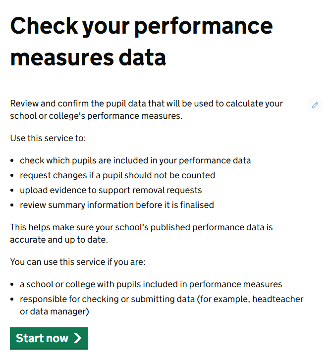
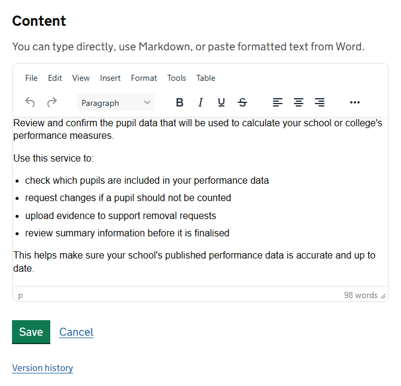
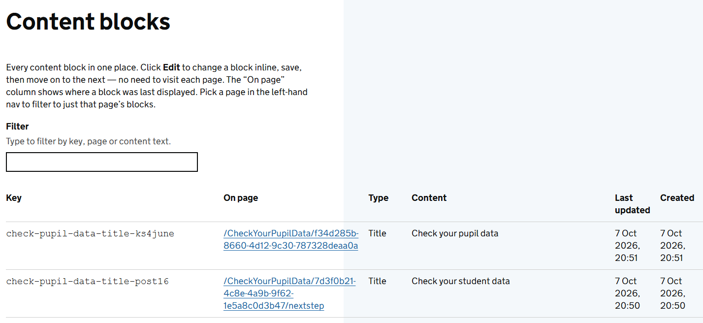
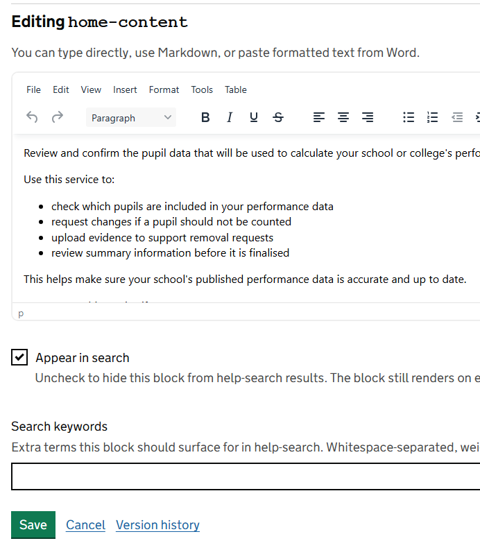
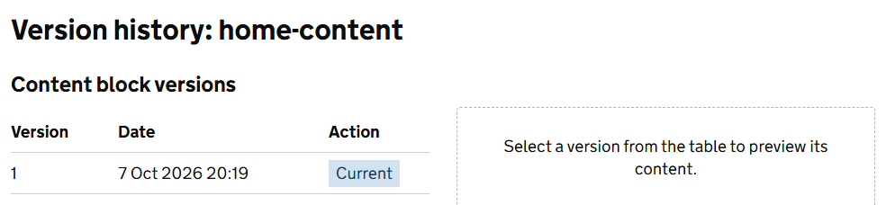

Some pages of the service are not CMS pages. The home page, the contact page, the footer and the pages of the request journey are built into the service, and their layout is fixed. The words on them are held in **content blocks**, which you can edit.

A content block is one piece of text with a name, called its **key**. For example, `home-content` is the main text of the home page.

## Blocks you are likely to edit

| Key | Where it appears |
|---|---|
| `home-title`, `home-content` | The home page |
| `contact-title`, `contact-intro`, `contact-highlight` | The Contact us page. The highlight is hidden from visitors while it is empty. |
| `privacy` | The Privacy page |
| `accessibility` | The Accessibility statement |
| `footer-support-and-guidance-v2` | The *Support and guidance* text in the footer of every public page |

The pages of the request journey have blocks of their own. The **Content blocks** screen lists them all.

> **Warning** A content block has no draft. When you select **Save**, the change is live at once, on every page that shows the block. Read it through before you save.

## Edit a block on the page where it appears

This is the quickest way, because you see the text in place.

1. Sign in as an editor and go to the page.
2. Move your pointer over the text. A small pencil appears beside each block.
3. Select the pencil. The block opens for editing where it sits.
4. Make your change and select **Save**.

The pencils are shown to people with the content editor role. If you cannot see them, use the Content blocks screen instead.

> **Warning** Saving a block with the pencil clears its **Search keywords** and ticks **Appear in search** again. If the block has either set, edit it from the Content blocks screen instead, or set them again there afterwards.

## Edit a block from the Content blocks screen

Go to **Admin**, then **Content blocks**. Use this when you want to find a block by its words, or change several blocks in one sitting.

- Type in **Filter** to search by key, page or the words in the block.
- Select a column heading to sort by it.
- The **On page** column shows where the block was last displayed. *Not seen yet* means nobody has visited its page since the block was added.
- To see only the blocks on one page, choose that page in the menu on the left.

Select **Edit** on a block's row. The form opens in the list.

As well as the text, you can set:

- **Appear in search**: untick to keep the block out of search results. It still shows on its page.
- **Search keywords**: extra words the block should be found for, separated by spaces.

Select **Save**, or **Cancel** to leave the block as it was.

## Go back to an earlier version of a block

Every save is kept. Select **Version history** in a block's edit form.

Select a row to read that version. Select **Revert** on the one you want and confirm with **Yes, revert**. That version becomes the live text straight away. A revert is saved as a new version, so you can undo it in the same way.

## Where blocks come from

You cannot create or delete a content block. Each one is made by the service the first time someone visits the page it belongs to, starting with the default text. After a release that adds a new block, it appears in the list once its page has been visited.

## Content block or page?

| Use a content block when | Use a page when |
|---|---|
| The text is on a page built into the service, such as the home page | You are adding guidance, help or reference content |
| A pencil appears beside it | You want to control the layout |
| The same text shows on every page, like the footer | You want to work on a draft, or publish on a date |
