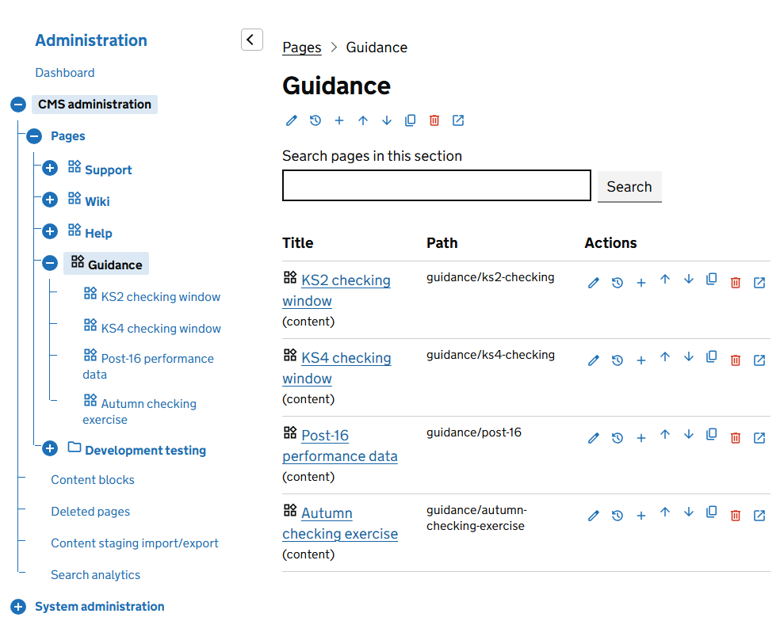
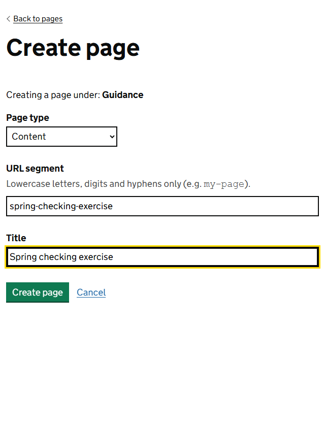

A new page starts as a draft that only editors can see. Creating one takes about a minute.

## 1. Find where the page belongs

Go to **Admin**, then **Pages**. The screen lists the pages at one level of the site. Select a page's title to see the pages beneath it.

The site starts with 4 sections: **Support**, **Wiki**, **Help** and **Guidance**. Most pages belong under one of them. Where you put a page decides its address. A page called `autumn-checking-exercise` under Guidance is at `/guidance/autumn-checking-exercise`.

## 2. Add the page

Select the plus icon on the row of the page yours should sit beneath. Its name is **Add child page**. To add a page at the top level, select the plus icon beside the **Pages** heading instead.

Fill in the 3 fields.

**Page type.** You cannot change this later, so choose with care.

| Type | Use it for |
|---|---|
| Content | Almost everything. You build the page from widgets, so it can have columns, cards, a search box and a contents list. |
| Wiki | A simple page of text with nothing else. Quicker to write, but it cannot use widgets, and its title and address cannot be changed afterwards. |
| Folder | A container that groups pages. It has no content of its own. Its address shows a list of the pages inside it. Its title and address cannot be changed afterwards. |

**URL segment.** The last part of the page's address. Use lowercase letters, numbers and hyphens only, for example `spring-checking-exercise`. Keep it short and use the words people would search for.

**Title.** The main heading of the page. On a content page you can change it later.

Select **Create page**. A content or wiki page opens in the editor, ready for you to write. A folder takes you back to the list.

## If the page cannot be created

| Message | What to do |
|---|---|
| A page already exists at that path. | Another page under the same parent uses that URL segment. Choose a different one. |
| 'x' is a reserved path segment and cannot be used for content pages. | A top-level page cannot be called `admin`, `dev` or `healthcheck`. Choose a different segment. |
| 'x' conflicts with an existing application route and cannot be used for content pages. | A top-level page cannot use an address that belongs to a built-in page of the service. Choose a different segment. |
| Path may only contain lowercase letters, digits, hyphens, and forward slashes (e.g. 'my-page' or 'section/sub-page'). | Remove spaces, capital letters and punctuation from the URL segment. |

## Start from a page that already exists

If a new page will look like an existing one, copy it. On the **Pages** screen, select the **Copy** icon on the page's row.

The copy is added after the last page at the same level, with `-copy` added to its address and *- Copy* to its title. A copy of a content page opens on its **Properties** tab with the message *Copied. Change the segment and title to something meaningful before publishing.*

> **Warning** The copy keeps every version of the original, including its publishing dates. A copy of a published page is published too, at the `-copy` address, straight away. If you do not want that, open its **Versions** tab and select **Unpublish**.

The pages beneath the original are not copied, and the copy starts with no search keywords.

## Edit a wiki page

A wiki page opens in a simpler editor: one box for the text, with **Save page** to keep a draft, **Publish** to save and publish in one step, and **Unpublish**. Its versions are listed under the box, with the same publishing dates and actions as a content page. See [Drafts, publishing and versions](managing-versions.md).

## What to do next

Your page exists but it is empty and unpublished. Next, [build it from regions and widgets](editing-with-widgets.md).
