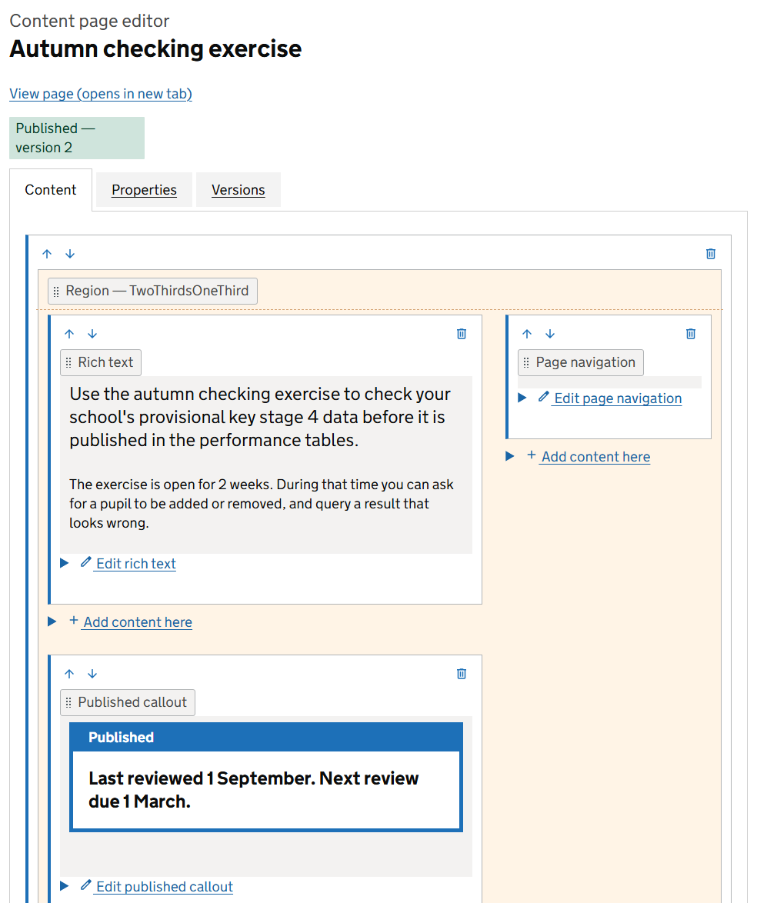
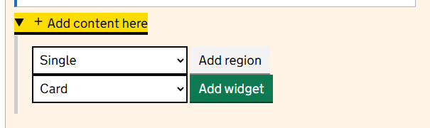
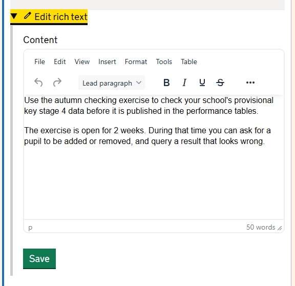
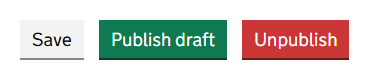
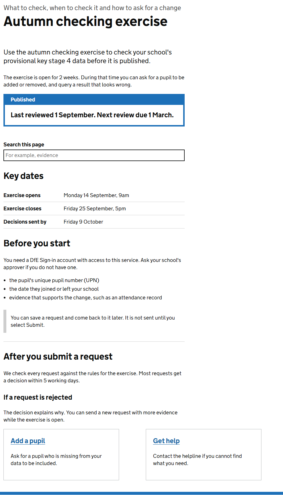

A content page is a stack of **regions**. A region is a row that sets the layout: one column, two, three or four. Inside each column you place **widgets**, which hold the content.

## The editor

Open a page in the editor from the **Edit** button on the page itself, or from the pencil icon on the **Pages** screen.

At the top:

- **View page** opens the page as visitors see it, in a new tab. If the page is published, that is the live version, not your draft.
- The tags tell you what exists. A green *Published* tag means visitors can see a version. A grey *Draft* tag means there are changes that are not live yet. A page can have both.
- The tabs are **Content**, where you build the page, [**Properties**](page-properties.md) and [**Versions**](managing-versions.md).

Each widget shows how it will look, with a label saying what kind of widget it is.

## Add a region or a widget

Select **Add content here** at the place you want the new content. The link appears in every empty column and after every item.

To add a region, choose a layout and select **Add region**.

| Layout | Columns |
|---|---|
| Single | One column, the full width of the page |
| Halves | 2 equal columns |
| Thirds | 3 equal columns |
| Quarters | 4 equal columns |
| OneThirdTwoThirds | A narrow column on the left and a wide one on the right |
| TwoThirdsOneThird | A wide column on the left and a narrow one on the right |

To add a widget, choose its type and select **Add widget**. See [Widgets: what each one does](widget-reference.md) for the full list.

> A new page has no regions. Add a region first, then add widgets inside it. For a page of text, **TwoThirdsOneThird** with the text in the wide column gives a comfortable line length and leaves room for a contents list.

On a phone, the columns of a region stack one above the other, left column first.

## Edit a widget

Under each widget's preview is an **Edit** link, such as **Edit rich text**. Select it to open the widget's settings, make your change and select **Save**.

> **Warning** Each widget saves on its own. If you change two widgets and select **Save** on one, the change to the other is lost. Save each widget before you open the next.

## Write in the text editor

The Rich text widget has a toolbar like a word processor. The **Styles** list on the left is the most useful part: it applies GOV.UK styles so your page matches the rest of the service.

| Style | Use it for |
|---|---|
| Lead paragraph | One opening paragraph in larger text, at the top of a page |
| Heading 2 (section), Heading 3 (sub-section), Heading 4 (minor) | Headings inside a block of text |
| Inset text (grey) | A note that needs to stand apart from the text around it |
| Information callout (blue) | Something important that everyone should read |
| Published / review callout (blue) | When the page was last reviewed |

The **Warning** button in the toolbar adds a GOV.UK warning: an exclamation mark with bold text beside it. Use it only for consequences that are serious or cannot be undone.

You can paste from Word. The formatting is kept, so check the result and remove anything that does not look like the rest of the page.

To add a picture, use the image button. The picture is stored inside the page, so it travels with the page when you export it. Always fill in the description. Keep pictures small: a large picture makes the page slow for everyone.

## Move content

There are 2 ways.

**Arrows.** Each region and widget has **Move up** and **Move down** arrows in its top left corner. They move the item one place within its column.

**Dragging.** Take hold of an item by its grey label, such as *Rich text* or *Region — Single*, and drag it. A blue line shows where it will land. You can drag a widget into a different column or a different region.

## Remove content

Select the bin icon in the top right corner of a region or widget, then confirm.

> **Warning** Deleting a region deletes every widget inside it, and there is no undo. If you delete something by mistake, do not publish: visitors still see the last published version. Open it with **View** on the **Versions** tab and copy back what you need.

## Save and publish

Adding, moving, deleting and saving a widget all update your draft straight away. Visitors do not see any of it.

| Button | What it does |
|---|---|
| **Save** | You do not need this. Your draft is already saved each time you add, move, delete or save a widget. |
| **Publish draft** | Makes your draft the live page, now. |
| **Unpublish** | Takes the live version off the site. Shown only when the page is published. |

To publish at a future date instead, see [Drafts, publishing and versions](managing-versions.md).

## How the finished page looks

This is the example page from the screenshots above, as a visitor sees it. The wide column holds the text, a search box, a summary list and headings. Two cards sit side by side in a *Halves* region at the bottom.

