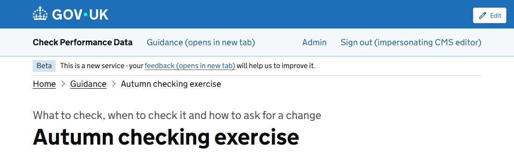
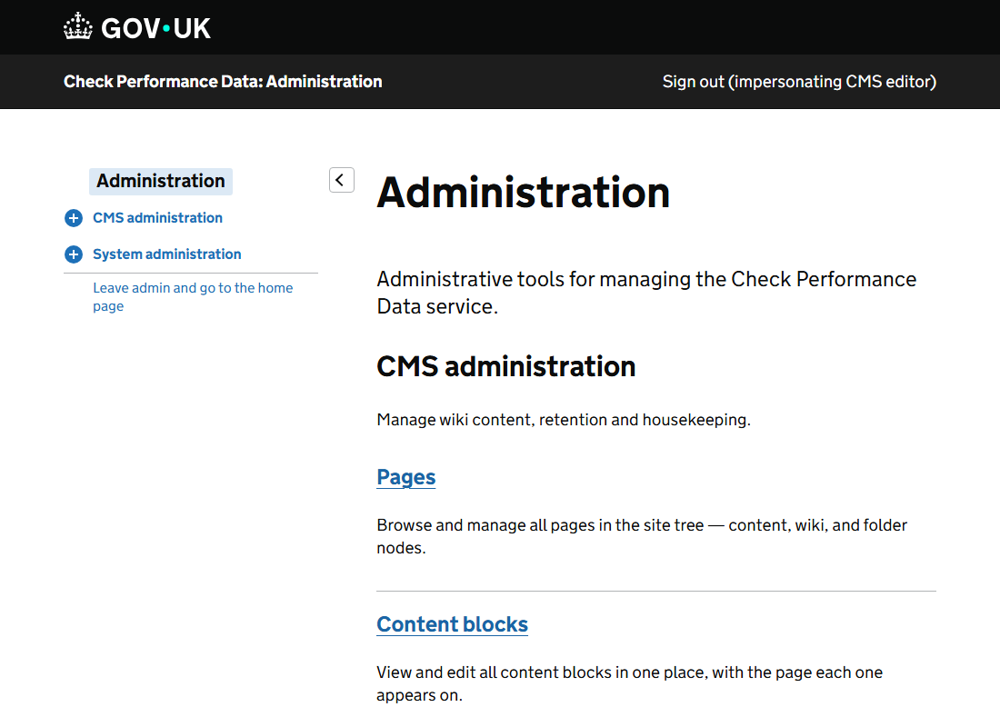

Everything you need to write and publish content. If you are new to the CMS, read the first 3 pages in order: they take you from an empty page to a published one.

## Two ways into the editor

**From the page you are reading.** When you are signed in as an editor, every content page shows an **Edit** button in the top right corner. Select it to open that page in the editor, in a new tab.

**From the admin area.** Select **Admin** in the header, then **Pages**. This is where you create pages and find ones that are not published yet.

## The 5 things to know first

1. **Nothing you do to a page is public until you publish it.** Your work is kept as a draft. Visitors keep seeing the published version until you select **Publish draft**.
2. **A page is made of widgets.** A heading, a block of text and a search box are each a widget. You add them one at a time and arrange them in regions.
3. **Every version is kept.** You can look at any earlier version of a page and make it live again.
4. **Deleting is not final.** A deleted page goes to *Deleted pages*, where it can be restored with all its versions.
5. **Changing a page's address breaks links to it.** The CMS warns you first. Avoid it once a page is published.

## In this section

| Page | What it covers |
|---|---|
| [Create a page](creating-a-page.md) | Adding a page and choosing its type and address |
| [Build a page from regions and widgets](editing-with-widgets.md) | Adding, editing, moving and removing content |
| [Widgets: what each one does](widget-reference.md) | Every widget, its settings and when to use it |
| [Page properties](page-properties.md) | Title, address, menu and search settings |
| [Drafts, publishing and versions](managing-versions.md) | Publishing, scheduling, unpublishing and going back |
| [Content blocks](content-blocks.md) | The text of the home page, contact page and footer |
| [Search](search.md) | Search boxes, results pages and making content easy to find |

## Before you publish: a checklist

- The page has one clear title, and the subtitle adds something the title does not.
- Headings go in order: Heading 2 for sections, Heading 3 inside them. Do not skip a level.
- Link text says where the link goes. Not "click here".
- Every image has a description for people who cannot see it.
- You have read the draft with **View** on the **Versions** tab, not only in the editor.
- You have searched for the words people will use, and the page comes up. If not, add **Search keywords**.
