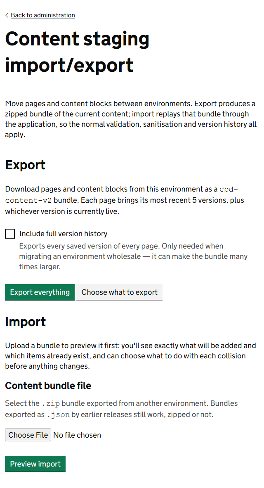
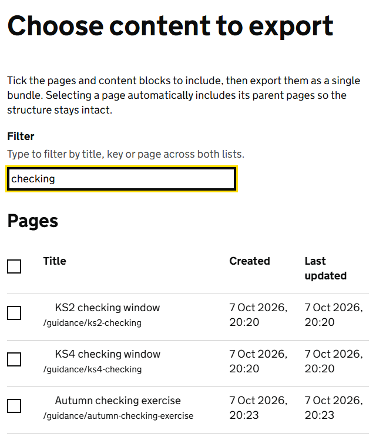
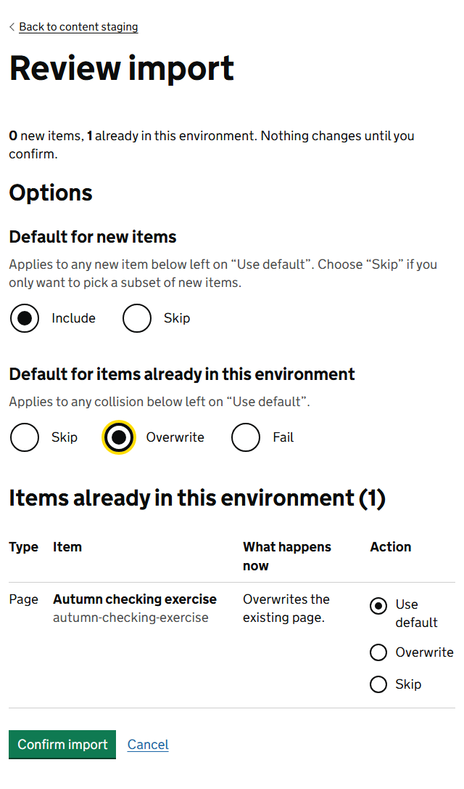
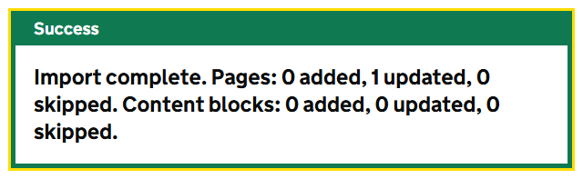

Content staging copies pages, content blocks and home page banners from one environment to another. The usual use is to write and check content in a test environment, then bring it into production.

You export a file from the first environment and import it into the second. Go to **Admin**, then **Content staging import/export**.

## Export

**Export everything** downloads every page, content block and home page banner as one zip file.

**Choose what to export** lets you pick. Tick the pages, content blocks and home page banners you want, then select **Export selected**.

- Type in **Filter** to narrow both lists by title, key or page.
- When you tick a page, the pages above it are included automatically, so it has somewhere to go in the other environment.

Each page is exported with its live version and its 5 most recent versions. Tick **Include full version history** to export every version. Only do this when you are moving a whole environment: the file can be many times larger.

## Import

An import has 2 steps, and the first changes nothing.

1. Under **Content bundle file**, choose the zip file you exported.
2. Select **Preview import**.

The **Review import** screen tells you how many items are new, how many are already in this environment, and how many cannot be imported. Now decide what happens to each.

**Default for new items**

| Choice | What happens |
|---|---|
| Include | New pages and blocks are added. |
| Skip | They are left out, unless you choose Include for an item yourself. |

**Default for items already in this environment**

| Choice | What happens |
|---|---|
| Skip | What is here is kept. The version in the file is ignored. |
| Overwrite | What is here is replaced by the version in the file. |
| Fail | The import stops if anything in the file is already here. |

Each item in the tables below also has its own choice, which starts as **Use default**. Change it to treat that one item differently.

3. Select **Confirm import**, or **Cancel** to leave without importing.

> **Warning** **Overwrite** replaces a page's content and its whole version history with what is in the file. Anything written in this environment since the export is lost. If in doubt, export this environment first, so you have a copy to go back to.

## How items are matched

Every page and block carries a hidden identity that stays the same in every environment. An import matches on that, not on the title or address. So if a page was renamed in the first environment, importing it updates the same page here instead of adding a second one.

If nothing matches by identity, the import looks for a page at the same address, or a block with the same key, and treats that as the match.

## Items that cannot be imported

The Review import screen lists these under *These items cannot be imported*. It happens when a page's parent is not in this environment and not in the file. The import skips those pages. It never invents an empty parent for them.

To fix it, go back to the first environment and export again with the parent ticked.

## Safety

- Imported content goes through the same checks as content typed into the editor. Anything unsafe, such as scripts, is removed, and the summary tells you if that happened.
- Every import is recorded in the audit log.
- If you wait too long on the Review import screen, you will see *The import session expired. Upload the file again.* Nothing has been changed. Start again.

## A safe way to release content

1. Write and publish the content in the test environment and check it there.
2. Export only what you changed, with **Choose what to export**.
3. In production, export what is there first and keep the file.
4. Import with **Overwrite** only for the pages you mean to replace. Leave the default as **Skip**.
5. Check the pages in production.

## Pages the service imports by itself

Some pages are supplied with the service and imported automatically when it starts, with no one using this screen. This guide is one example. A newer release overwrites them, so changes made to them in an environment do not last.

You can tell them apart in the editor: a warning under the page title says *This page is supplied with the service*. To change one for good, ask the development team, so that every environment gets the change.

## Clear all CMS content

Development environments can show a **Clear all CMS content** button on this screen. It deletes every page, content block and home page banner and cannot be undone. It is for resetting a test environment.

It appears only when an administrator has turned on the `CMS:ShowDeleteAllButton` setting, and never in QA, preproduction or production, whatever the setting says.
