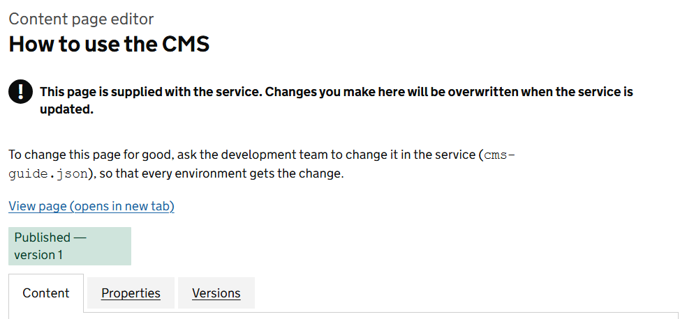

This guide shows you how to create and publish pages, keep them easy to find, and look after the content of the service. Every screenshot is taken from the service itself.

```widget
{ "type": "search", "props": { "label": "Search this guide", "placeholder": "For example, schedule a page", "action": "/search", "buttonText": "Search", "scope": "", "scopePageIds": "a969611f-33ad-518d-9ce5-dcd82a9b2656", "searchIn": "path", "instant": "true", "showButton": "true", "noResultsText": "Nothing in this guide matches" } }
```

## Start here

```cards
[
  { "title": "For editors", "body": "Create pages, build them from widgets, publish and schedule them, and edit the fixed text of the service.", "href": "for-editors.md" },
  { "title": "For administrators", "body": "Organise the site, move content between environments, read the search figures and decide who can do what.", "href": "for-administrators.md" }
]
```

```cards
[
  { "title": "If something looks wrong", "body": "A page that will not show, a change that has not appeared, a search that finds nothing.", "href": "troubleshooting.md" },
  { "title": "Words used in this guide", "body": "Region, widget, content block, draft, live and the rest, in plain English.", "href": "glossary.md" }
]
```

## I want to

| I want to | Go to |
|---|---|
| Add a new page | [Create a page](creating-a-page.md) |
| Change the words on a page | [Build a page from regions and widgets](editing-with-widgets.md) |
| Know which widget to use | [Widgets: what each one does](widget-reference.md) |
| Change a page's title or address, or hide it from the menu | [Page properties](page-properties.md) |
| Make a change go live, now or later | [Drafts, publishing and versions](managing-versions.md) |
| Go back to how a page was last week | [Drafts, publishing and versions](managing-versions.md) |
| Change the home page, the footer or the contact page | [Content blocks](content-blocks.md) |
| Put a search box on a page | [Search](search.md) |
| Make a page easier to find | [Search](search.md) |
| Move a page to a different part of the site | [Organise the page tree](organising-the-page-tree.md) |
| Get a deleted page back | [Organise the page tree](organising-the-page-tree.md) |
| Copy content from one environment to another | [Move content between environments](importing-and-exporting.md) |
| See what people search for and cannot find | [Search analytics and feedback](search-analytics.md) |
| Give a colleague access | [Roles and access](managing-roles.md) |

## How the CMS is organised

The public pages of the service come from 2 places.

**Pages** are the pages you create. They live in a tree that starts with 4 sections: Support, Wiki, Help and Guidance. You build each page from widgets, and you decide when it is published.

**Content blocks** are pieces of text built into the fixed pages of the service, such as the home page, the contact page and the footer. You can change the words. You cannot move or delete them.

Everything else in this guide is a tool for working with one of those two.

## Who can use the CMS

You need one of 2 roles, which are given to you in DfE Sign-in.

| Role | What you can do |
|---|---|
| Content editor | Create, edit, publish, move, copy and delete pages. Edit content blocks. Export and import content. |
| Administrator | Everything an editor can do, plus search analytics, search feedback, system settings, role settings, logs and the audit log. |

An administrator can change what each role is allowed to do. An administrator who also writes content needs both roles. See [Roles and access](managing-roles.md).

## About this guide

This guide is part of the service. It is created automatically in every environment and brought up to date with each release, so it always describes the version you are using.

It is itself a set of CMS pages, built with the widgets it describes. Open any page of it in the editor to see how it is put together.

> **Warning** Do not edit these pages to change the guide. A release that brings a newer version of the guide overwrites every page of it, and your changes are lost. If you find a mistake, tell the development team so that the fix reaches every environment.

The editor reminds you. Open a page of this guide, or any other page supplied with the service, and a warning at the top says that your changes will be overwritten.


