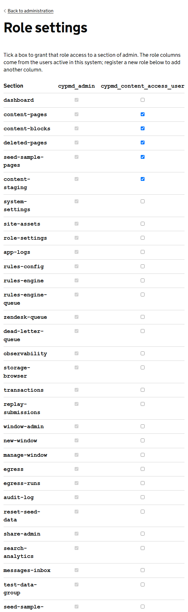

Access to the admin area is decided in 2 places. **DfE Sign-in** decides which role a person has. **Role settings**, in this service, decides what each role can use.

## The two roles

| Role | Its name in DfE Sign-in | What it is for |
|---|---|---|
| Administrator | `cypmd_admin` | Runs the service. Can use every part of the admin area. |
| Content editor | `cypmd_content_access_user` | Writes and publishes content. |

There is no list of users in this service. To give someone access, or take it away, change their role in DfE Sign-in.

Someone without a role that grants a section does not see it in the menu. If they go to its address, they get the *Page not found* page.

## What a content editor can use to begin with

- Pages
- Content blocks
- Deleted pages
- Content staging import/export
- Seed sample CMS pages

Everything else is for administrators only until you grant it.

## Change what a role can use

Go to **Admin**, **System administration**, then **Role settings**.

Each row is a section of the admin area. Each column is a role. Tick a box to let that role use that section, then select **Save role access**. The screen confirms with *Role access saved.* The change takes effect within a minute.

The administrator column is ticked throughout and cannot be changed, so an administrator can never lock themselves out.

## Two things Role settings does not control

The preview of an unpublished page at its own address, and the pencils beside content blocks on public pages, are shown to people with the content editor role itself. Ticking boxes here does not change that.

An administrator who writes content should be given both roles in DfE Sign-in. Without the content editor role they can still do everything from the admin area.

## Sections that matter for the CMS

| Section | What it opens |
|---|---|
| `content-pages` | Pages: create, edit, publish, move, copy and delete |
| `content-blocks` | Content blocks |
| `deleted-pages` | Deleted pages, and restoring them |
| `content-staging` | Content staging import/export |
| `search-analytics` | Search analytics |
| `messages-inbox` | Search feedback |
| `system-settings` | System settings |
| `site-assets` | Site CSS and JavaScript. Administrators only, even if you tick it for another role. |
| `role-settings` | This screen |
| `app-logs` | View logs |
| `audit-log` | Audit log |
| `seed-sample-pages` | The Seed sample CMS pages tool |

> A common change is to tick `search-analytics` and `messages-inbox` for content editors, so the people who write the content can see what readers cannot find.

> **Warning** Think before granting `content-staging`. An import can overwrite any page in the environment, so anyone with it can replace the whole site's content.

## Add another role

If your organisation uses a role that is not in the grid, add it under **Register a new role**. Type the role's name exactly as it appears in DfE Sign-in and save. It gets a column with nothing ticked. Tick the sections it should have and select **Save role access**.

The **Admin** link in the header is shown to administrators and content editors only. People with a role you have added reach the admin area by going to `/admin`.
