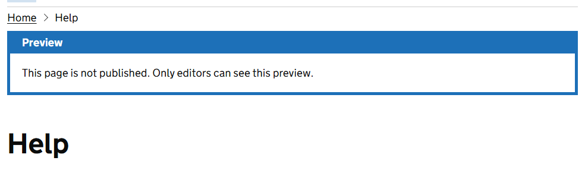
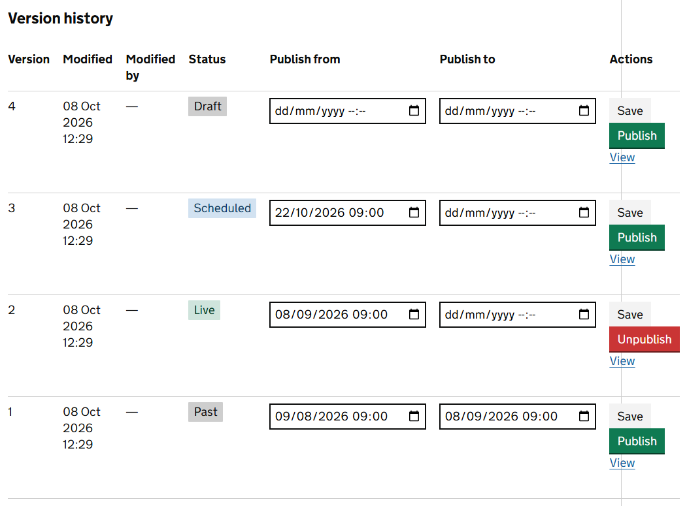

The CMS keeps every version of a page. One version at most is *live*, meaning visitors can see it. You can work on a draft for as long as you like without changing the live page.

## Draft and live

When you edit a published page, the CMS starts a draft. From then on the page has 2 versions that matter:

- the **live** version, which visitors see
- your **draft**, which only editors see

The tags at the top of the editor show both, for example *Published — version 2* and *Draft — version 3*. A draft is numbered with the version it will become when you publish it.

## Publish now

Select **Publish draft** under the content. Your draft becomes the live page straight away and the previous live version is kept in the history.

## Check a page before you publish it

Open the **Versions** tab and select **View** on your draft's row. It opens that version in a new tab.

**View page**, at the top of the editor, opens the page's address. That shows the live version while there is one, so it is the way to check what visitors see, not what you have just changed.

If a page has no live version, its address shows your draft to content editors with a *Preview* banner. Everyone else sees the *Page not found* page.

## The Versions tab

The **Versions** tab lists every version, newest first, with who changed it and when.

| Status | What it means |
|---|---|
| Live | The version visitors see now. |
| Scheduled | Has a **Publish from** date in the future. |
| Past | Has been published and is not the live version now. Kept so that you can go back to it. |
| Draft | Has no publishing dates. It has never been published, or it has been unpublished. |

The statuses are worked out when someone publishes, unpublishes or edits the page. They do not change by themselves when a date passes. See *Publish at a future date* below.

Each version has these actions.

| Action | What it does |
|---|---|
| **Save** | Saves the **Publish from** and **Publish to** dates you have entered for that version. |
| **Publish** | Makes that version live now, with no end date. It ignores the date fields. |
| **Unpublish** | Shown on the live version. Takes it off the site. |
| **View** | Opens that version in a new tab so you can read it. |

## Publish at a future date

1. Finish your draft. Every change you make in the editor is saved as you make it.
2. Open the **Versions** tab.
3. On your draft's row, enter the date and time in **Publish from**.
4. Select **Save** on that row. Its status changes to *Scheduled*.

From that time, anyone who goes to the page's address sees the new version. You do not need to be signed in.

> The rest of the service does not catch up by itself. Until someone next publishes or edits the page, the **Versions** tab still shows the old version as *Live*, and search still finds the page by its old text. A page that had no live version before stays out of search and menus. Once the time has passed, open the **Versions** tab and select **Publish** on the new version to bring everything into line.

> **Warning** Do not select **Publish** on a version you mean to schedule. **Publish** always means now, whatever dates are in the fields.

> Times are in UTC, not UK time. From late March to late October the UK is one hour ahead of UTC, so for a page to go live at 9am UK time in summer, enter 08:00. In winter the two are the same.

## Take a page down at a set time

Enter a date and time in **Publish to** on the live version's row and select **Save**. From that time, the page's address stops showing that version.

What visitors see instead depends on the other versions. If an earlier version was published and has no **Publish to** date, that version is shown again. If there is none, visitors see the *Page not found* page.

Use this for content with an end date, such as a notice about a checking exercise.

> As with scheduling, the rest of the service does not catch up by itself. After the time has passed, the page is still listed in menus and search, and the **Versions** tab still shows the version as *Live*. Select **Unpublish** to finish the job.

## Take a page down now

Select **Unpublish**, either under the content or on the live version's row. That version comes off the site at once. Nothing is deleted: every version is still on the **Versions** tab and you can publish again at any time.

> **Warning** Unpublishing removes one version, not the page. If an earlier version was published and has no **Publish to** date, it becomes the live version again. Look at the **Versions** tab afterwards. If a version is still *Live*, select **Unpublish** on it too, and repeat until none is.

## Go back to an earlier version

Find the version you want on the **Versions** tab, check it with **View**, then select **Publish** on its row. It becomes the live page again. The version it replaces stays in the history, so you can change your mind.

Going back changes what visitors see. It does not change what the editor holds: the **Content** tab still shows your newest content, and your next change starts from that.

## Good to know

- You cannot compare two versions side by side. Open each with **View** in its own tab.
- Version numbers are whole numbers and only ever go up.
- A page with no live version is never in search results.
- A draft cannot be thrown away. To abandon one, leave it unpublished and edit it back to what you want.
- Every change to a version is recorded in the audit log, with who made it.
