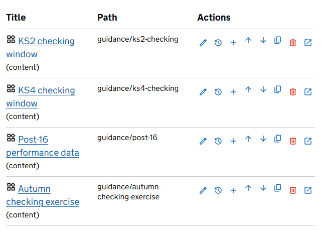
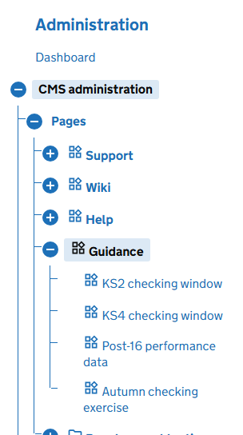
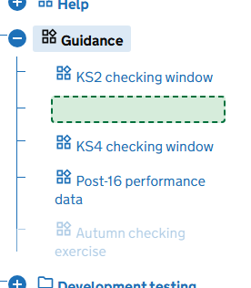
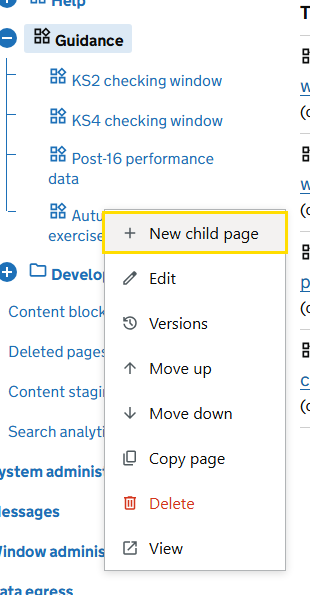
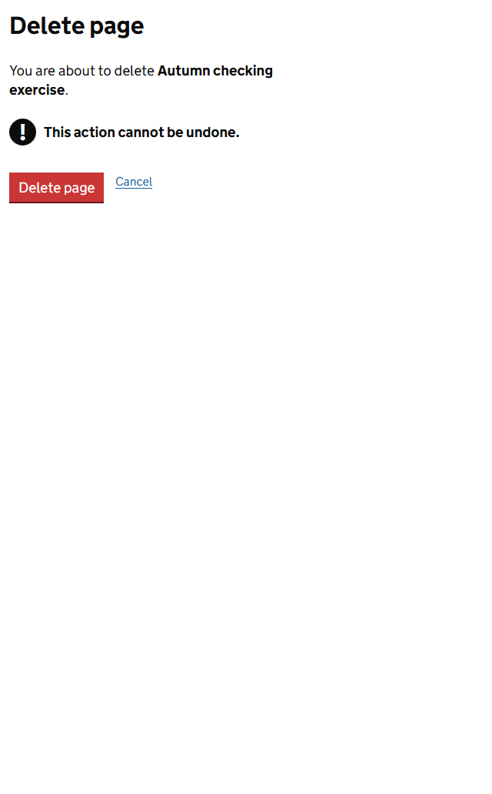

The pages of the site form a tree. Where a page sits in the tree decides its address and where it appears in menus. Editors and administrators can both reorganise it.

## The Pages screen

Go to **Admin**, then **Pages**. The screen shows the pages at one level. Select a title to go down a level, and use the breadcrumb at the top to come back up.

The icons, from left to right:

| Icon | Name | What it does |
|---|---|---|
| Pencil | Edit | Opens the page in the editor |
| Clock | Versions | Opens the page in the editor. Select the **Versions** tab. |
| Plus | Add child page | Creates a page beneath this one |
| Up arrow | Move up | Moves the page one place earlier among the pages beside it |
| Down arrow | Move down | Moves it one place later |
| Two sheets | Copy | Makes a copy beside the original |
| Bin | Delete | Opens the delete confirmation |
| Arrow leaving a box | View | Opens the page as visitors see it |

To find a page at the level you are on, type part of its title or URL segment in **Search pages in this section** and select **Search**.

## The tree in the menu

On every admin screen, the **Pages** entry in the menu on the left opens into the whole site as a tree. Select the plus beside a page to open it. The tree opens by itself to the page you are working on.

## Move a page by dragging

In the tree, drag a page to its new place. A green slot opens to show where it will land.

- Drop it **above or below** another page to put it beside that page.
- Drop it **onto** another page to put it beneath that page.

When you let go, the page moves at once and the screen shows it in its new place.

> **Warning** Moving a page beneath a different parent changes its address, and the address of every page beneath it. Links to the old addresses stop working and are not redirected. Reordering pages under the same parent changes nothing but the order.

| Message | What it means |
|---|---|
| Cannot move a page under itself. | You dropped a page onto one of the pages beneath it. |
| Another page already exists at the target URL. | The new parent already has a page with the same URL segment. Rename one of them first. |

## The right-click menu

Press the right mouse button on any page in the tree for the same actions as the icons.

Press Esc to close the menu. Dragging and the right-click menu need JavaScript. Without it, use the icons on the Pages screen.

## Change the order of pages

The order of pages in the tree is the order they appear in menus on the public site. Change it with **Move up** and **Move down**, or by dragging.

## Copy a page

Select **Copy**. The copy is added after the last page at the same level, with `-copy` added to its address. A copy of a content page opens on its Properties tab so that you can give it a proper title and address.

A copy takes every version of the original with it, publishing dates included, so a copy of a published page is published at once. Open its **Versions** tab and select **Unpublish** if it should not be. The pages beneath the original are not copied.

## Delete a page

Select **Delete** and confirm with **Delete page**.

The page disappears from the site, from menus and from search.

You cannot delete a page that has pages beneath it. The screen says *This page has child pages. Remove or move the child pages before deleting this page.* Move or delete those first.

> The confirmation says *This action cannot be undone*. In fact the page is kept, with all its versions, on the Deleted pages screen. Treat that as a safety net, not as a place to keep things.

## Restore a deleted page

Go to **Admin**, then **Deleted pages**.

Each deleted page is listed with its path, who deleted it and when. Select **Restore** to bring the page back at the address it had, with its content and versions. The screen confirms with *Page restored.* Check first that the page it sat beneath still exists and that nothing new has been created at its address.

## The sections the service creates

Support, Wiki, Help and Guidance are created by the service when it starts, along with the *Page not found* page at `/help/not-found`. If you delete one by mistake, restore it from **Deleted pages**.

The *Page not found* page is an ordinary page. Edit it to change what visitors see when they follow a link that goes nowhere.
