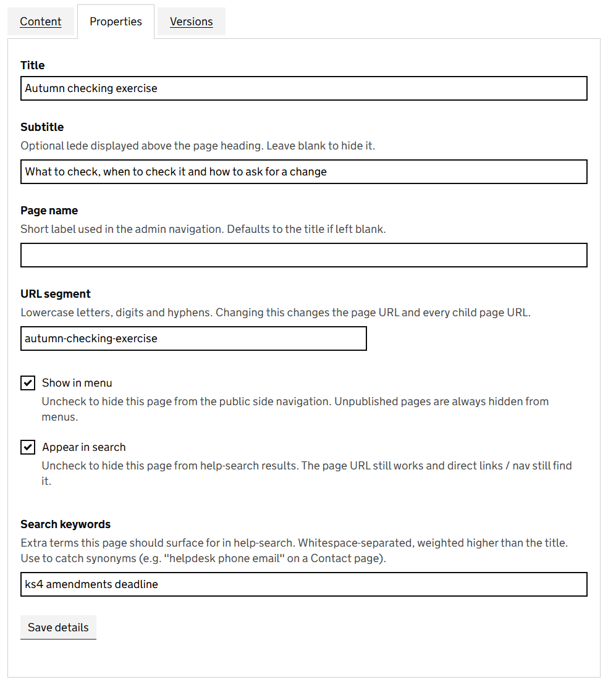
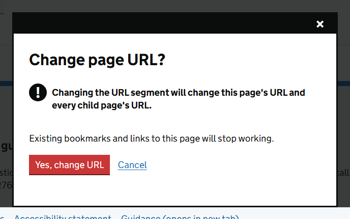

The **Properties** tab of the editor holds everything about a content page that is not its content. Wiki pages and folders do not have one: their title and address are fixed when they are created.

Make your changes and select **Save details**. A *Page details* message confirms with *Saved.*

> Properties are not part of a draft. A change here takes effect as soon as you save it, on the published page as well.

## What each property does

| Property | What it does |
|---|---|
| Title | The main heading of the page. Also what search results show, and what menus show unless you give a page name. |
| Subtitle | An optional line shown above the title in lighter text. Leave it blank to show none. |
| Page name | A shorter name for menus, used in the admin menu and in Page navigation widgets. Leave it blank to use the title. |
| URL segment | The last part of the page's address. Lowercase letters, numbers and hyphens. |
| Show in menu | Untick to leave the page out of Page navigation menus that list a named section. The page still works for anyone with the link. A folder's own list of its pages, and the menu beside a wiki page, still show it. |
| Appear in search | Untick to leave the page out of search results. The page still works for anyone with the link. |
| Search keywords | Extra words the page should be found for. See below. |

## Help people find the page: search keywords

People do not always search for the words you wrote. A page called *Contact the helpline* will not be found by someone who types *phone number* unless those words are on the page.

**Search keywords** fixes that. Type the extra words, separated by spaces, for example `helpdesk phone email`. A keyword counts for more than the title, so a page comes near the top for its keywords.

Good keywords are:

- other names for the same thing, such as `KS4` for *key stage 4*
- words people use that you would not, such as `login` for *sign in*
- common misspellings

> Administrators can see what people search for and do not find. Ask them for the list: it tells you which keywords to add. See [Search analytics and feedback](search-analytics.md).

## Hide a page without unpublishing it

**Show in menu** and **Appear in search** are separate, so you can choose how hidden a page is.

| You want | Show in menu | Appear in search |
|---|---|---|
| A normal page | Ticked | Ticked |
| A page people reach only by searching | Unticked | Ticked |
| A page in the menu that should not clutter search results | Ticked | Unticked |
| A page only for people you send the link to | Unticked | Unticked |

Neither setting is security. Anyone with the address can read a published page.

## Change a page's address

Changing the **URL segment** changes the address of the page and of every page beneath it. Links and bookmarks to the old addresses stop working, so the CMS asks you to confirm.

> **Warning** The old address is not redirected. Before you change the address of a published page, search the site for links to it and be ready to update them.

> **Warning** Confirming a change of address saves the title, subtitle, page name and URL segment only. The page's **Search keywords** are cleared, and a change to **Show in menu** or **Appear in search** made at the same time is lost. Change the address on its own, then come back to this tab and set the rest.

Search boxes you have limited to chosen pages keep working after a rename or a move. They remember the page itself, not its address.

| Message | What it means |
|---|---|
| URL segment must not be empty and cannot contain '/'. | Enter a single segment, without slashes. |
| Another page already uses that URL. | A page beside this one already has that segment. |

To move a page to a different part of the site, rather than rename it, see [Organise the page tree](organising-the-page-tree.md).
