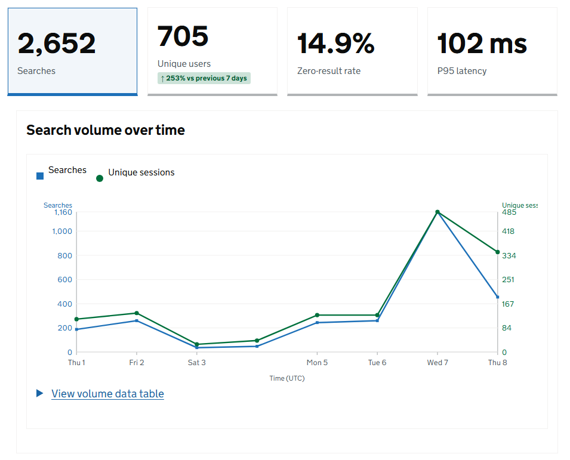
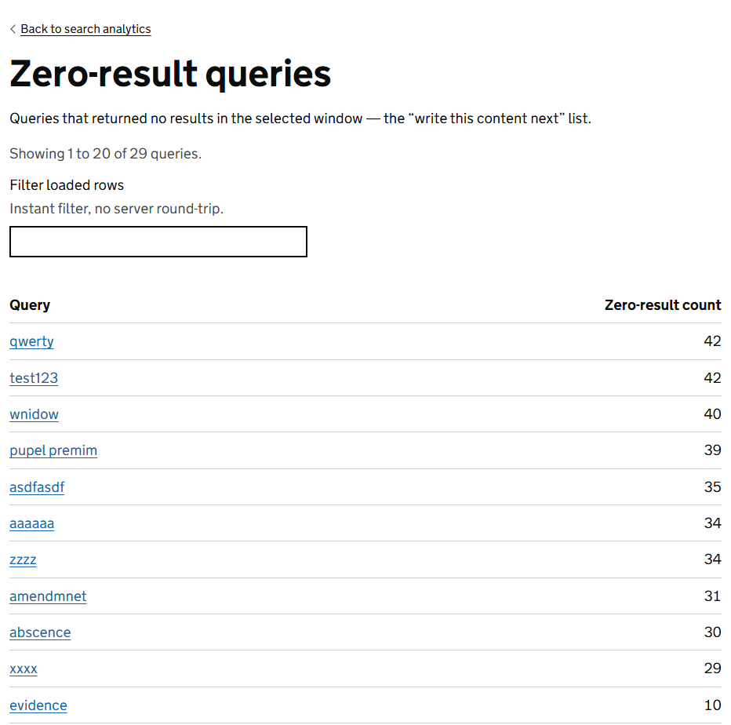
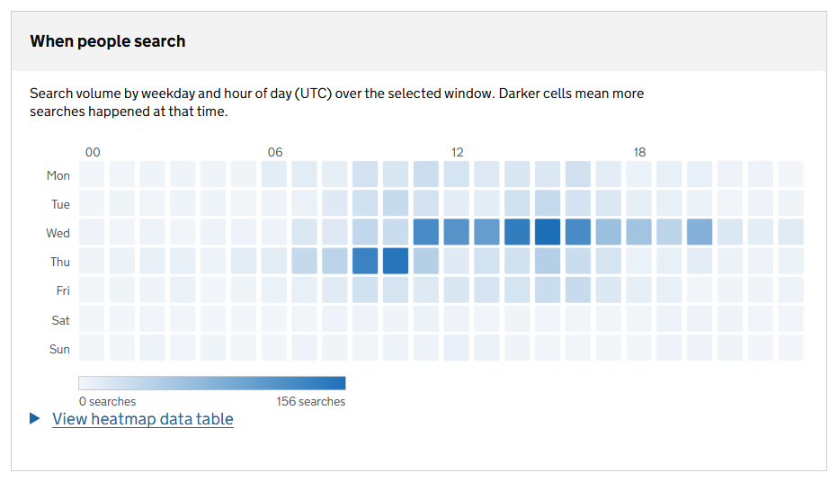
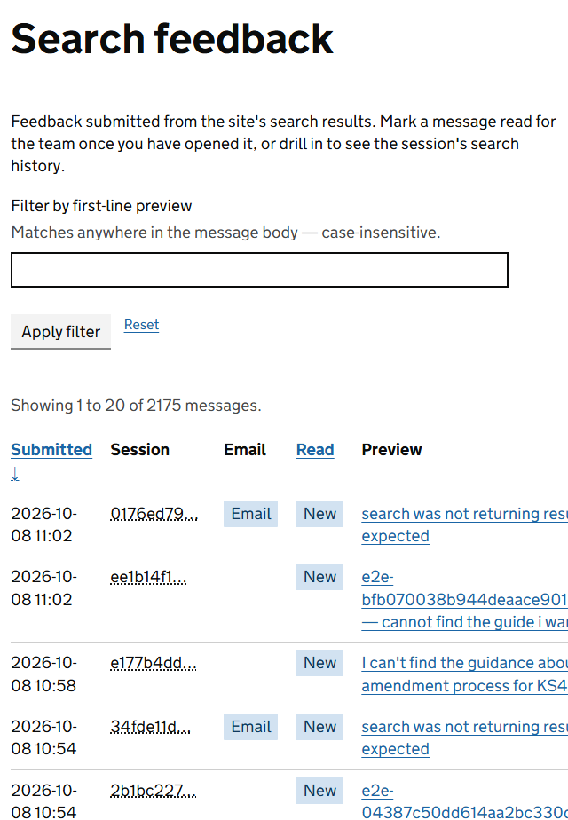

Every search on the service is counted. Search analytics turns those counts into a picture of what people want from the site, and the feedback inbox holds the notes they send when search lets them down.

No personal data is stored with a search. Searches are grouped by an anonymous session, not by person.

## Open Search analytics

Go to **Admin**, **CMS administration**, then **Search analytics**. Only administrators have it to begin with.

## The four headline figures

| Tile | What it tells you |
|---|---|
| Searches | How many searches were made. |
| Unique users | How many separate sessions made them. |
| Zero-result rate | The share of searches that found nothing. This is the one to watch. |
| P95 latency | How long the slower searches took. 95 in every 100 were faster than this. |

Under a figure, a small label compares it with the period before when it has changed by a tenth or more. Select a tile to see that figure charted over time.

## Choose what the figures cover

The filters at the top of the screen apply to everything below them. Select **Apply filters** after changing them.

| Filter | What it does |
|---|---|
| Time window | Last 24 hours, 7 days, 30 days or 90 days, or a range of your own. Dates are in UTC. |
| Chart bucket size | How finely the charts are divided, from 15 minutes to 1 month. |
| Aggregate to a typical week | Folds the period into one average week, to show the weekly pattern. |
| Search surface | Which kinds of search to count: searches someone submitted, instant searches of the site or a section, and instant searches of a single page. |

**Reset to last 7 days** puts the filters back.

## Find the gaps in your content

Scroll down to **Top zero-result queries** and select **View all zero-result queries**. This is the most useful screen in the CMS for deciding what to write next.

Each line is something people looked for and did not find. For each one, ask:

- **Is the content there under another name?** Add the word people used to that page's **Search keywords**. See [Page properties](page-properties.md).
- **Is the content missing?** That is a page to write.
- **Is it something this service does not cover?** Consider a short page that says so and points people to the right place.

Select a query to run the same search on the live site and see what the visitor saw.

The **Zero-result outcomes** panel shows what people did next: tried different words, sent a note, or gave up. A high share giving up is the strongest sign that content is missing.

## See when people search

**When people search** is a grid of the days of the week against the hours of the day. Darker squares mean more searches.

Use it to choose when to publish changes, and to see whether a checking exercise is driving people to the help pages. Select a square to list the searches made in that hour.

## The other panels

| Panel | What it shows |
|---|---|
| Top queries | What people search for most. Make sure the best page comes first for each. |
| Single-page search | Searches made with a search box set to *This page*. |
| Top pages | The pages that appear most often in results. |
| Top content blocks | The content blocks that appear most often in results. |

Every panel has a **View all** link to a full list, with a box to filter the rows.

## Read the notes people send

Go to **Admin**, **Messages**, then **Search feedback**. The number beside **Messages** in the header counts the notes nobody has read yet, together with any messages in the dead letter queue.

Select a note to read it. You see what the person was looking for, what they got instead, and the last search they made. **View this session's searches** lists everything they searched for in that visit, which often shows the words they tried before giving up.

Select **Mark as read** once someone has dealt with the note.

## How long the figures are kept

Searches are kept for 90 days and feedback notes for 365 days, then deleted automatically. An administrator can change both under [CMS settings and site styling](settings-and-site-assets.md).

To delete one visitor's data sooner, open their session from a note, or from an hour on the *When people search* grid, and select **Delete this session's data**. It deletes their searches and any notes they sent. The deletion is recorded in the audit log.

## Try the screens with sample data

A new environment has no searches to show. In development and test environments, **Seed sample search data**, under **System administration** then **Test data**, fills the screens with made-up searches so you can see how they work. The same screen removes them again. It is available in development, review and QA environments only.
