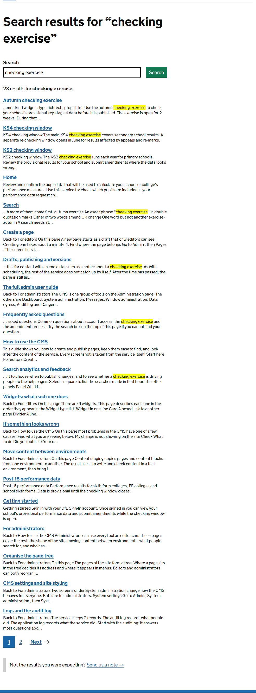
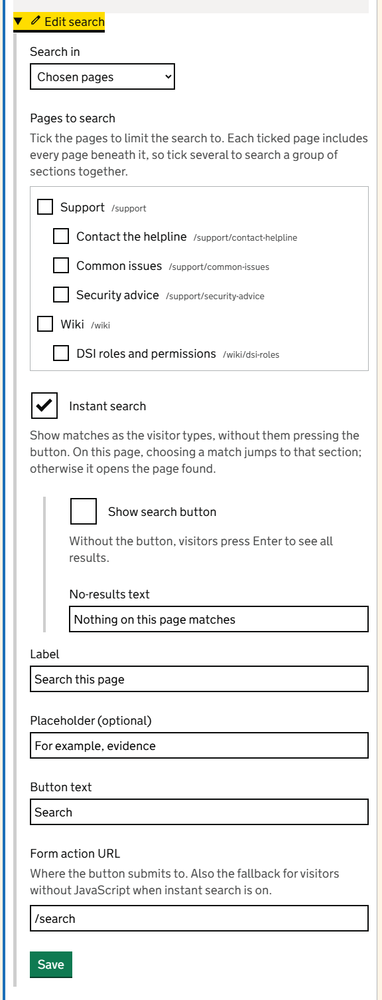
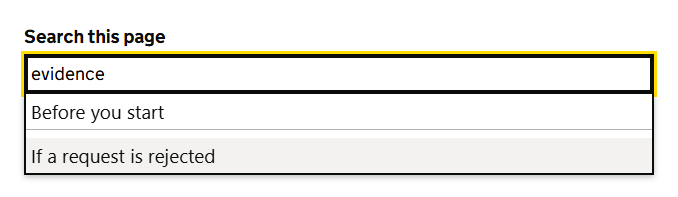
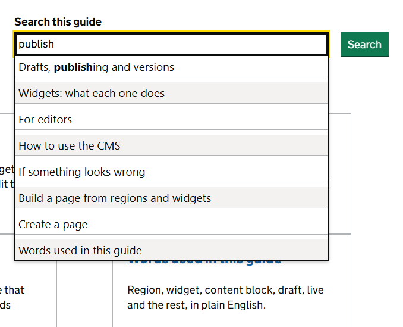
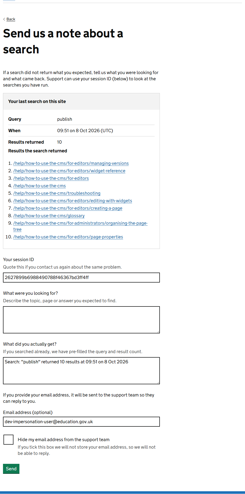

Visitors can search every published page, and the content blocks on the home page, the *Check your pupil data* page, Guidance and CMS pages. As an editor you control 2 things: where search boxes appear and what they search, and how easily your own pages are found.

## How search works

The search page is at `/search`. It looks through pages and content blocks together and lists the best matches first.

What decides the order, strongest first:

1. the page's **Search keywords**
2. its title
3. its subtitle
4. the text of the page

Search understands word endings, so *check* also finds *checking* and *checked*. It ignores very common words such as *the* and *of*.

Search leaves out:

- pages that are not published
- folders
- pages and content blocks with **Appear in search** unticked

## Tips to pass on to visitors

| To find | Type |
|---|---|
| Pages with any of these words. Pages with more of them come first. | `autumn exercise` |
| An exact phrase | `"checking exercise"` in double quotation marks |
| Either of two words | `amend OR change` |
| One word but not another | `exercise -autumn` |

A search needs at least 2 characters.

## Add a search box to a page

Add a **Search** widget, then choose what it searches with **Search in**.

| Search in | What it searches | Use it for |
|---|---|---|
| The whole site | Everything | A general search box, for example on a landing page |
| Chosen pages | The pages you tick, and every page beneath each one | Searching one section, or several sections together |
| This page | Only the page the box is on | Helping people find a section of one long page |

With **Chosen pages**, tick the pages under **Pages to search**. Ticking a page includes everything beneath it, so tick *Guidance* to search all the guidance. Tick several to search them as a group.

> The box remembers the pages themselves, not their addresses. If someone later renames or moves a page you ticked, the search box keeps working.

The other settings:

| Setting | What it does |
|---|---|
| Label | The text above the box. Say what it searches, such as *Search the guidance*. |
| Placeholder (optional) | Pale example text inside the box. |
| Button text | The text on the button. |
| Form action URL | The page that shows the results. Leave it as `/search` unless you have built a results page of your own. |

## Show matches as people type: instant search

Tick **Instant search** and the box suggests matches while the visitor is still typing. Choosing a suggestion takes them straight there.

What a suggestion does depends on **Search in**:

- **This page**: the suggestions are sections of the page. Choosing one jumps to that section and highlights the words searched for.
- **The whole site** or **Chosen pages**: the suggestions are pages, up to 10. Choosing one opens that page.

Two more settings appear when Instant search is ticked.

| Setting | What it does |
|---|---|
| Show search button | Untick to show the box alone. Visitors then press Enter to see the full list of results. |
| No-results text | What the list says when nothing matches. It starts as *No results found*. |

Instant search needs JavaScript. Without it the box still works as an ordinary search box, so nobody is locked out. A box set to *This page* then searches the page and the pages beneath it.

The search box at the top of this guide is a Search widget set to **Chosen pages**, with this guide ticked and **Instant search** on.

## Build your own results page

For most pages the standard results page is all you need. Build your own when you want results to appear inside a section, with that section's menu and wording around them.

1. Create a page, for example `guidance/search`.
2. Add a **Search results** widget. Tick the sections it should show results from, or leave everything unticked for the whole site.
3. On the page with the search box, set the Search widget's **Form action URL** to the address of your results page, for example `/guidance/search`.

The number of results on a page is 20 unless an administrator changes the `CMS:PageLength` setting.

## Make your page easy to find

- **Put the words people use in the title.** The title counts for more than the text.
- **Add search keywords** for other names, abbreviations and common misspellings. See [Page properties](page-properties.md).
- **Use headings.** They let instant search take people to the right part of a long page.
- **Check it.** Search for the words you expect people to type. If your page is not near the top, add keywords.

## When someone cannot find what they need

Under the results on the search page at `/search` is the link *Not the results you were expecting? Send us a note*. A results page you have built yourself does not have it. It opens a short form that asks what the person was looking for and what they got instead.

The notes go to administrators, along with figures for every search that found nothing. Both are a list of content waiting to be written. See [Search analytics and feedback](search-analytics.md).
