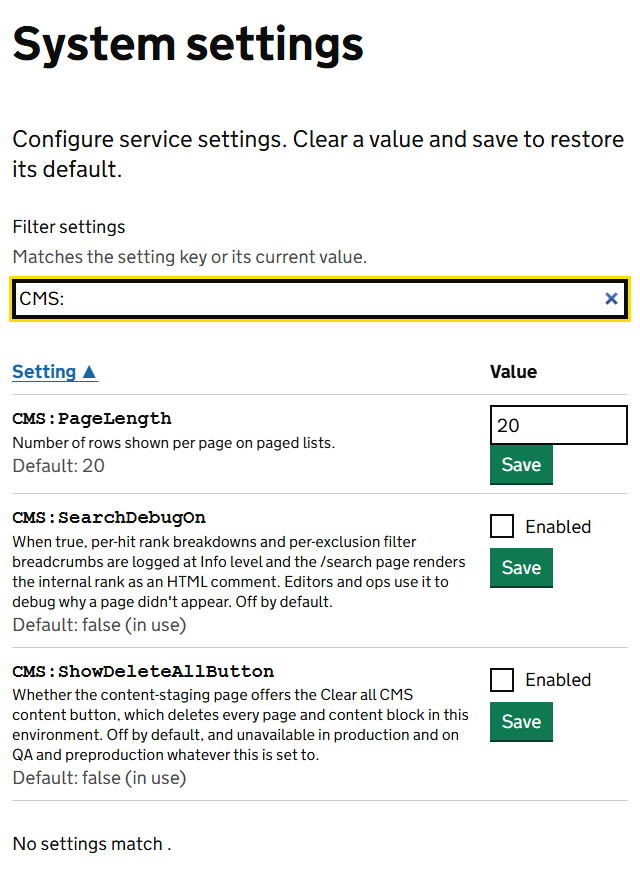
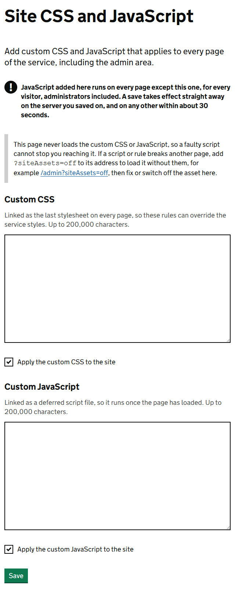

Two screens under **System administration** change how the CMS behaves for everyone. Both are for administrators.

## System settings

Go to **Admin**, **System administration**, then **System settings**. Type `CMS:` in **Filter settings** to see the CMS ones.

Each setting has its own **Save** button and takes effect when you select it. To go back to the default, clear the value and save.

| Setting | What it does | Default |
|---|---|---|
| `CMS:PageLength` | How many rows a list shows before it splits into pages. This covers search results and the lists in the admin area. | 20 |
| `CMS:SearchDebugOn` | Records why each search result was ranked where it was. Turn it on while you investigate why a page is not being found, then turn it off again. | Off |
| `CMS:ShowDeleteAllButton` | Shows the **Clear all CMS content** button on the Content staging screen. Works in development environments only. | Off |

Type `SearchAnalytics:` in the filter for the settings behind [Search analytics and feedback](search-analytics.md).

| Setting | What it does | Default |
|---|---|---|
| `SearchAnalytics:RetentionDays` | How long searches are kept before they are deleted. | 90 |
| `SearchAnalytics:MessageRetentionDays` | How long feedback notes are kept. | 365 |

The other `SearchAnalytics:` settings are technical: how long a session lasts, how often old data is cleared, and aids for the development team. Leave them alone unless the development team asks you to change them.

## Site CSS and JavaScript

Go to **Admin**, **System administration**, then **Site CSS and JavaScript**. This screen adds your own styles and scripts to every page of the service, including the admin area.

- **Custom CSS** is loaded after the service's own styles, so your rules win.
- **Custom JavaScript** runs on every page once it has loaded.
- Each has an **Apply** tick box. Untick it to switch your CSS or JavaScript off without deleting it.

Select **Save**. The change reaches every visitor within about 30 seconds.

> **Warning** JavaScript added here runs for every visitor on every page. A mistake can break the whole service. Ask a developer to check anything you add, and try it in a test environment first.

Only administrators can use this screen. Ticking it for another role on the Role settings screen does not open it.

### If a change breaks the site

This screen never loads the custom CSS or JavaScript, so you can always get back to it.

1. Go straight to `/admin/site-assets`.
2. Untick **Apply the custom CSS to the site** or **Apply the custom JavaScript to the site**.
3. Select **Save**.

To open any other page without the custom CSS and JavaScript, add `?siteAssets=off` to the end of its address, for example `/admin?siteAssets=off`.

### When to use it, and when not to

Use it for small, temporary adjustments that cannot wait for a release, such as hiding a banner. For anything lasting, ask the development team to make the change in the service itself, where it is tested and reviewed.
