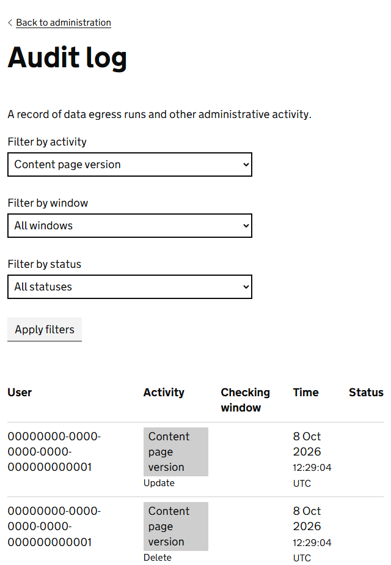
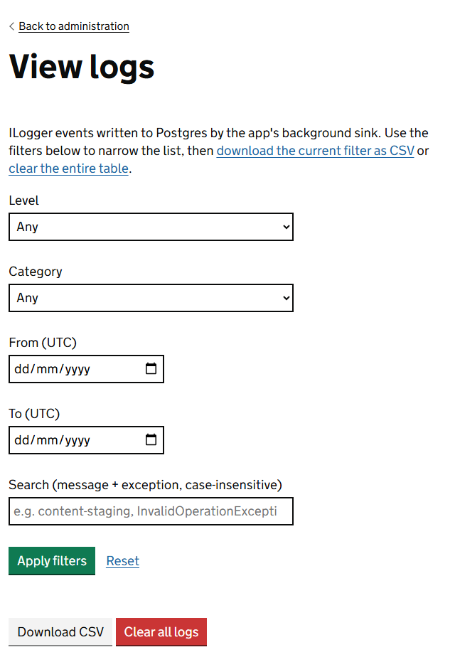

The service keeps 2 records. The **audit log** records what people did. The **application log** records what the service did. Start with the audit log: it answers most questions about content.

## The audit log: who changed what

Go to **Admin**, then **Audit log**.

Each row shows who did something, the kind of thing it was, whether it was an insert, an update or a delete, and when. It does not name the page or say what changed, so use it to answer "who was working on content at that time?" and then ask them.

Choose a kind of activity in **Filter by activity** and select **Apply filters**. Leave **Filter by status** on *All statuses*: status belongs to data egress and checking windows, and choosing one hides every CMS row. Select **Export log as CSV** to open the list in a spreadsheet.

The kinds of activity that come from the CMS are:

| Activity | Recorded when |
|---|---|
| Content page | A page is created, renamed, moved, copied, deleted or restored, or its properties change. A delete and a move both show as an update. |
| Content page version | A version is created, changed, published, scheduled or unpublished. Every change to a widget is recorded. |
| Content block | A block is created or edited, or is shown on a different page for the first time. |
| Content block version | A block is saved or reverted. |
| Content import | A file is imported through Content staging. |
| Content staging session | A file is uploaded for review before an import. |
| Feedback message | A visitor sends a search feedback note, or someone reads or deletes one. |

### Questions the audit log answers

- **Who was changing pages yesterday afternoon?** Filter by *Content page version* and look at the times.
- **Why has a lot of content changed at once?** Look for a *Content import*. An import that overwrites can change many pages together.
- **Was a page deleted?** Filter by *Content page* around the time it went missing, then look in **Deleted pages**, where it can be [restored](organising-the-page-tree.md).

## The application log: what the service did

Go to **Admin**, **System administration**, then **View logs**.

This is a technical record, mostly of use to the development team. You are most likely to open it because they have asked you to, or to look for errors around the time something went wrong.

| Filter | What it does |
|---|---|
| Level | How serious the entry is. Choose *Warning* or *Error* to see only problems. |
| Category | Which part of the service wrote the entry. |
| From and To | The period to look at. Times are in UTC. |
| Search | Words to look for in the entries. |

You can download what you have filtered, to send to the development team.

> **Warning** The screen can also clear the whole log. That removes the evidence the development team needs to investigate a problem. Do not clear it unless they ask you to.

## When to use which

| You want to know | Look in |
|---|---|
| Who was changing content, and when | Audit log |
| Whether an import happened | Audit log |
| Why a page shows an error | View logs |
| What a visitor searched for | [Search analytics and feedback](search-analytics.md) |
