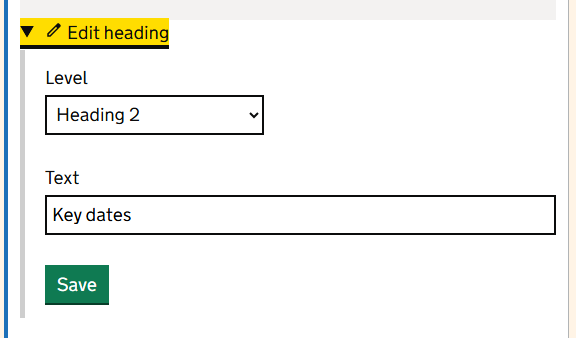
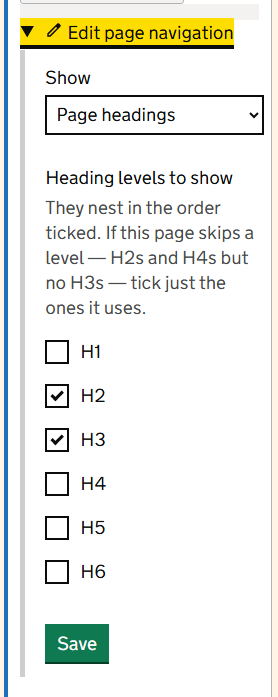
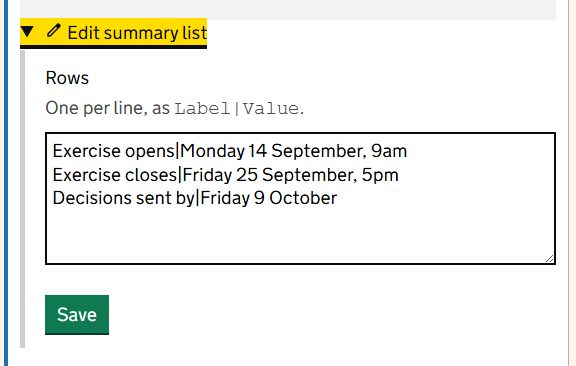

There are 9 widgets. This page describes each one in the order they appear in the **Widget type** list.

| Widget | In one line |
|---|---|
| [Card](#card) | A boxed link to another page |
| [Divider](#divider) | A line between sections |
| [Heading](#heading) | A section heading that also feeds the contents list |
| [Page navigation](#page-navigation) | A contents list, or a menu of the pages beneath a page |
| [Published callout](#published-callout) | A blue banner for review dates |
| [Rich text](#rich-text) | Formatted text, lists, tables, links and pictures |
| [Search](#search) | A search box |
| [Search results](#search-results) | The list of results for a search |
| [Summary list](#summary-list) | Pairs of labels and values, such as key dates |

## Card

A box with a heading and a short description. If you give it a link, the heading becomes the link.

| Setting | What to enter |
|---|---|
| Title | The heading of the card. Keep it to a few words. |
| Body | One or two sentences saying what the reader will find. |
| Link (optional) | Where the card goes, for example `/guidance/ks4-checking`. |

Put cards in a *Halves*, *Thirds* or *Quarters* region, one card to a column. Cards in the same row are made the same height automatically. Use them on landing pages to send people to the right section. A card cannot hold a picture.

## Divider

A horizontal line that separates one part of a page from the next, with space above and below it. It has no settings. Screen readers ignore it, so never rely on it to carry meaning: use a heading as well.

Inside a column, the line is as wide as the column. For a line across the whole page, put the Divider in a *Single* region of its own. This guide has a Divider before each section.

## Heading

A heading on its own, from Heading 1 to Heading 6.

Use a Heading widget rather than a heading typed inside Rich text when the heading starts a main section of the page. Heading widgets are what the Page navigation widget lists, and each one gets its own link so that other pages can point straight to it.

> A page already shows its title as Heading 1. Start your own headings at Heading 2. If you add a Heading 1 widget, it replaces the automatic title and subtitle, so use it only when you want to lay the top of the page out yourself.

## Page navigation

A menu in the style of a contents list. It works in 2 ways, chosen with **Show**.

**Page headings** lists the headings on this page, so readers can jump to a section. Tick the heading levels to include, from H1 to H6. H2 and H3 are ticked to begin with. If the page uses H2 and H4 but no H3, tick only the levels it uses.

**Child pages** lists the pages beneath a page, so readers can move around a section.

| Setting | What to enter |
|---|---|
| Parent path for children | The path of the page whose children to list, for example `help`. Leave it blank to list the pages beneath this one. |
| Show a search box above the list | Tick to add a search box. |
| Search label | The label of that search box. |
| Search scope path | Limits that search to one section, for example `help`. Leave it blank to search the whole site. |

When you enter a parent path, the list leaves out folders, pages that are not published, and pages with **Show in menu** turned off. Each page is listed by its **Page name** if it has one, otherwise by its title.

> If you leave the parent path blank, every page beneath this one is listed by its title, including folders, unpublished pages and pages hidden from menus. To leave those out, enter this page's own path.

Put this widget in the narrow column of a *OneThirdTwoThirds* or *TwoThirdsOneThird* region. The menu on the left of this guide is a Page navigation widget set to **Child pages**.

> For a search box above a menu, a separate Search widget gives you more control than **Show a search box above the list**: it can suggest matches as people type, and it can put its button below the box so that the box stays wide enough to type in.

## Published callout

A blue banner headed *Published*. It has one setting, **Message**. Use it to say when a page was last reviewed and when it is due for review, for example *Last reviewed 1 September. Next review due 1 March.*

The banner does not update itself. Change the message whenever you review the page.

## Rich text

The widget you will use most. It holds formatted text: paragraphs, headings, lists, links, tables and pictures. [Build a page from regions and widgets](editing-with-widgets.md) explains the text editor and its styles.

Anything unsafe, such as scripts, is removed before the page is shown.

## Search

A search box. It can search the whole site, a group of sections you choose, or only the page it sits on. It can also show matches while the visitor is still typing. [Search](search.md) explains how to set it up and when to use each option.

## Search results

The list of results for a search, with page numbers when there are more than fit on one page. Put it on a page of its own and point a Search widget at that page.

| Setting | What to enter |
|---|---|
| Pages to show results from (optional) | Tick sections to limit the results to them. Leave everything unticked to show results from the whole site. |
| Empty-state text | What to say when nothing matches. It starts as *No results found.* |

The number of results on each page is set by an administrator. See [Search](search.md).

## Summary list

Pairs of labels and values in 2 columns. Use it for facts people look up, such as dates, contact details or deadlines.

Type one row to a line, with a vertical bar between the label and the value:

`Exercise opens|Monday 14 September, 9am`

## Which widget should I use?

| I want to show | Use |
|---|---|
| Paragraphs, lists, a table or a picture | Rich text |
| The start of a main section | Heading |
| Dates, deadlines or contact details | Summary list |
| Links to the main parts of a section | Cards in a Halves or Thirds region |
| A contents list for a long page | Page navigation, set to Page headings |
| A menu of the pages in a section | Page navigation, set to Child pages |
| A way to find something on a long page | Search, set to This page |
| When the page was last checked | Published callout |
